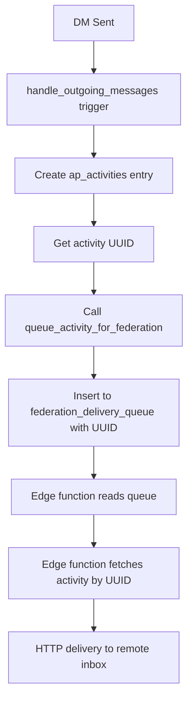

# 🚀 **DM Federation Fix - Migration 074 (FINAL SOLUTION)**

## **🔴 Root Cause Identified**

Your DM federation is failing because the `handle_outgoing_messages()` function is using an **incorrect federation flow**:

### **❌ Current (Broken) Flow:**
```sql
INSERT INTO federation_delivery_queue (
    activity_uuid,        -- ❌ Column doesn't exist
    activity,             -- ❌ Column doesn't exist  
    target_inbox,         -- ❌ Column doesn't exist
    ...
) VALUES (
    gen_random_uuid(),    -- ❌ Not connected to ap_activities
    v_activity,           -- ❌ Missing activity lookup
    v_inbox_url,          -- ❌ Wrong schema
    ...
);
```

**Result**: Edge function gets `activity_id: null` → `Error: Activity not found: null`

### **✅ Correct Flow (Used by Posts):**
```sql
-- 1. Insert into ap_activities first
INSERT INTO ap_activities (...) RETURNING id INTO v_activity_uuid;

-- 2. Call queue_activity_for_federation
PERFORM queue_activity_for_federation(v_activity_uuid, target_domains, priority, immediate);
```

**Result**: Edge function gets proper UUID → Finds activity → Successful delivery

---

## **🛠️ The Complete Fix**

### **Step 1: Apply Migration 074**

**File**: `db_migrations/074_fix_dm_federation_activity_flow.sql` (already created)

**What it fixes**:
1. **Proper Federation Flow**: Uses `ap_activities` table first, then `queue_activity_for_federation()`
2. **Correct Notification Function**: Uses `send_notification_to_user()` instead of `create_notification_structured()`
3. **Domain Validation**: Prevents "debug" values from breaking federation
4. **Proper ActivityPub Format**: Ensures DMs have correct `to`/`cc` addressing

### **Step 2: Apply the Migration**

**Option A**: If you have database access:
```bash
psql -h YOUR_DB_HOST -U postgres -d YOUR_DB_NAME -f db_migrations/074_fix_dm_federation_activity_flow.sql
```

**Option B**: If using Supabase Dashboard:
1. Go to SQL Editor in Supabase Dashboard
2. Copy content from `db_migrations/074_fix_dm_federation_activity_flow.sql`
3. Run the migration

**Option C**: Using your application's migration system (if available):
- Add the migration to your system and run it

---

## **🔍 Verification Steps**

After applying the migration, test DM federation:

### **1. Check Database Flow**
```sql
-- Send a test DM, then check:

-- A) Verify ap_activities entry was created
SELECT ap_id, ap_type, actor_ap_id, object_id, status 
FROM ap_activities 
WHERE ap_type = 'Create' AND created_at > NOW() - INTERVAL '5 minutes'
ORDER BY created_at DESC LIMIT 5;

-- B) Verify federation_delivery_queue entry has activity_id
SELECT id, activity_id, target_domain, status, actor_username 
FROM federation_delivery_queue 
WHERE created_at > NOW() - INTERVAL '5 minutes'
ORDER BY created_at DESC LIMIT 5;
```

### **2. Check Edge Function Logs**
After sending a test DM, you should see:
```
✅ 🚀 Delivering activity [UUID] to https://misskey.io/users/.../inbox
✅ 📄 Getting activity data for [UUID]...
✅ ✅ Got activity data: type=Create, actor=https://har.mony.lol/users/...
```

Instead of:
```
❌ 🚀 Delivering activity null to https://misskey.io/users/.../inbox
❌ ❌ Activity not found: null
```

---

## **📋 What the Fix Changes**

### **Before (Broken)**
1. ❌ Direct insertion to `federation_delivery_queue` with wrong schema
2. ❌ `activity_id` set to NULL
3. ❌ Edge function can't find activity
4. ❌ `create_notification_structured()` function call fails

### **After (Fixed)**  
1. ✅ Insert to `ap_activities` table first (proper ActivityPub storage)
2. ✅ Get UUID back from `ap_activities`
3. ✅ Call `queue_activity_for_federation()` with UUID
4. ✅ Edge function finds activity and delivers successfully
5. ✅ Local notifications work with `send_notification_to_user()`

---

## **🎯 Expected Results**

After applying this fix:

### **✅ DM Federation Will Work**
- ✅ DMs to Misskey users will be delivered
- ✅ DMs to Mastodon users will be delivered  
- ✅ DMs to other ActivityPub instances will be delivered
- ✅ Proper mention tagging for DM recipients
- ✅ Correct ActivityPub addressing (`to`/`cc`)

### **✅ Local Notifications Will Work**
- ✅ Local users receive DM notifications
- ✅ Proper notification structure and data

### **✅ Error Logs Will Be Clean**
- ✅ No more "Activity not found: null" errors
- ✅ No more "function send_notification(...) does not exist" errors
- ✅ Clean federation delivery logs

---

## **🔧 Technical Details**

### **New Federation Flow**


### **ActivityPub Compliance**
- **Direct Addressing**: DMs use `"to": ["https://domain/users/recipient"]`
- **Empty CC**: DMs use `"cc": []` for privacy
- **Mention Tags**: Recipients automatically added as mention tags
- **Proper Actor URLs**: Uses `federated_id` when available

---

## **🚨 IMPORTANT**

**This migration MUST be applied to fix DM federation.** Without it:
- DMs to federated users will continue to fail silently
- Edge function will keep getting NULL activity IDs
- Local notifications may fail with function errors

**After applying**, test with a federated user (like @tester004@misskey.io) to verify the fix works.