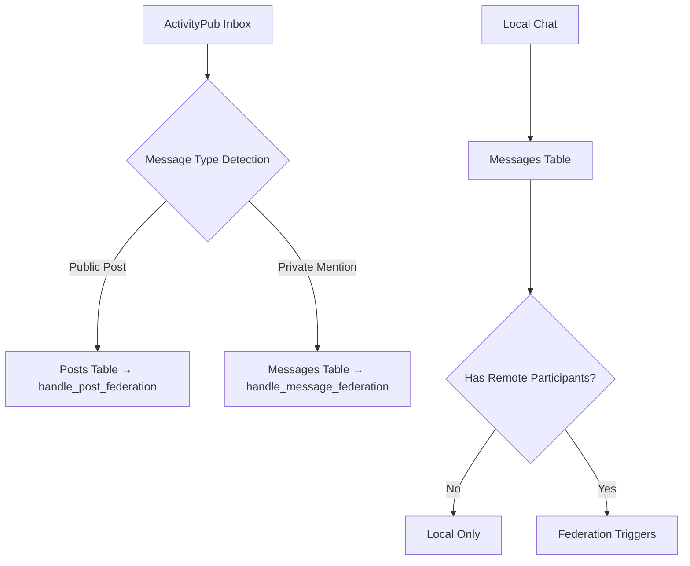

# 🏗️ **Federated Messaging Architecture - Enterprise Solution**

## 🎯 **Executive Summary**

**Objective**: Enable seamless handling of federated private mentions (ActivityPub DMs) while maintaining clean separation between chat (local-only) and DM (federation-capable) systems.

**Current Challenge**: When a federated remote user privately mentions a local user (ActivityPub style), the system needs to route this to the messages table (DM system) rather than the posts table, with proper incoming/outgoing determination.

**Solution**: Professional, enterprise-grade architecture with clean separation of concerns, DRY principles, and local-first design.

---

## 🏛️ **Architecture Principles**

### **1. Domain Separation**
- **Chat Messages**: Server-based, local-only, never federated
- **DM Messages**: Conversation-based, federation-capable when remote participants exist
- **ActivityPub Posts**: Public/unlisted social content, always federated

### **2. Content Flow Boundaries**


### **3. Trigger Responsibility Matrix**
| Content Type | Table | Trigger Function | Federation Behavior |
|--------------|-------|------------------|-------------------|
| **Server Chat** | `messages` | `handle_message_federation` | Never federates (local-only) |
| **Local DMs** | `messages` | `handle_message_federation` | Never federates (all local users) |
| **Federated DMs** | `messages` | `handle_message_federation` | Federates to remote participants |
| **ActivityPub Posts** | `posts` | `handle_post_federation` | Always federates based on visibility |

---

## 🔧 **Technical Implementation**

### **Phase 1: Enhanced Inbox Message Classification**

#### **1.1 Private Mention Detection**
```typescript
// Enhanced inbox logic (edge function)
interface ActivityClassification {
  type: 'public_post' | 'private_mention' | 'group_message'
  recipients: string[]
  isDirectMessage: boolean
  confidence: number
}

function classifyActivityPubActivity(activity: ActivityPubActivity): ActivityClassification {
  const object = activity.object
  const to = object.to || []
  const cc = object.cc || []
  const allRecipients = [...to, ...cc]
  
  // Rule 1: Contains 'Public' in 'to' → Public Post
  if (to.includes('https://www.w3.org/ns/activitystreams#Public')) {
    return { type: 'public_post', recipients: allRecipients, isDirectMessage: false, confidence: 1.0 }
  }
  
  // Rule 2: Contains 'Public' in 'cc' → Unlisted Post (still public)
  if (cc.includes('https://www.w3.org/ns/activitystreams#Public')) {
    return { type: 'public_post', recipients: allRecipients, isDirectMessage: false, confidence: 1.0 }
  }
  
  // Rule 3: Contains followers collection URL → Followers-only Post
  const hasFollowersUrl = allRecipients.some(addr => 
    typeof addr === 'string' && addr.includes('/followers')
  )
  if (hasFollowersUrl) {
    return { type: 'public_post', recipients: allRecipients, isDirectMessage: false, confidence: 1.0 }
  }
  
  // Rule 4: Only specific actor URLs → Direct Message
  // Per ActivityPub spec: no Public, no followers collection = direct message
  const hasLocalRecipients = allRecipients.some(addr => 
    typeof addr === 'string' && addr.includes(ourDomain)
  )
  
  if (hasLocalRecipients) {
    return { type: 'private_mention', recipients: allRecipients, isDirectMessage: true, confidence: 1.0 }
  }
  
  // Rule 5: No local recipients → Not our concern
  return { type: 'public_post', recipients: allRecipients, isDirectMessage: false, confidence: 0.1 }
}
```

#### **1.2 Inbox Routing Logic**
```typescript
// Enhanced inbox processing
const classification = classifyActivityPubActivity(activity)

if (classification.type === 'private_mention') {
  // Route to DM system
  await processPrivateMessage(activity, classification.recipients)
} else {
  // Route to posts system  
  await processPublicPost(activity)
}
```

### **Phase 2: Unified Message Federation Architecture**

#### **2.1 Message Federation Determination**
```sql
-- Enhanced message federation function
CREATE OR REPLACE FUNCTION determine_message_federation_type(
  p_message_id UUID
) RETURNS TEXT
LANGUAGE plpgsql
AS $$
DECLARE
  v_message_type TEXT;
  v_channel_id UUID;
  v_conversation_id UUID;
  v_remote_participant_count INTEGER := 0;
BEGIN
  -- Get message context
  SELECT channel_id, conversation_id 
  INTO v_channel_id, v_conversation_id
  FROM messages 
  WHERE id = p_message_id;
  
  -- Classification logic
  IF v_channel_id IS NOT NULL THEN
    -- Server chat message → Never federate
    v_message_type := 'chat_local_only';
    
  ELSIF v_conversation_id IS NOT NULL THEN
    -- DM message → Check for remote participants
    SELECT COUNT(DISTINCT cp.user_id)
    INTO v_remote_participant_count
    FROM conversation_participants cp
    JOIN profiles p ON cp.user_id = p.id
    WHERE cp.conversation_id = v_conversation_id
      AND NOT p.is_local
      AND cp.left_at IS NULL;
    
    IF v_remote_participant_count > 0 THEN
      v_message_type := 'dm_federated';
    ELSE
      v_message_type := 'dm_local_only';
    END IF;
    
  ELSE
    -- Orphaned message
    v_message_type := 'unknown';
  END IF;
  
  RETURN v_message_type;
END;
$$;
```

#### **2.2 Unified Message Trigger**
```sql
-- Professional message federation trigger
CREATE OR REPLACE FUNCTION handle_message_federation()
RETURNS TRIGGER
LANGUAGE plpgsql
SECURITY DEFINER
AS $$
DECLARE
  v_federation_type TEXT;
  v_is_federated_incoming BOOLEAN;
  v_sender_profile profiles%ROWTYPE;
BEGIN
  -- Determine federation type
  v_federation_type := determine_message_federation_type(NEW.id);
  
  -- Check if this is an incoming federated message
  v_is_federated_incoming := (NEW.metadata->>'federated' = 'true');
  
  -- Get sender profile
  SELECT * INTO v_sender_profile FROM profiles WHERE id = NEW.user_id;
  
  -- Process based on federation type and direction
  CASE v_federation_type
    WHEN 'chat_local_only' THEN
      -- Local chat: notifications only, no federation
      PERFORM process_local_chat_notifications(NEW);
      
    WHEN 'dm_local_only' THEN
      -- Local DM: notifications only, no federation
      PERFORM process_local_dm_notifications(NEW);
      
    WHEN 'dm_federated' THEN
      IF v_is_federated_incoming THEN
        -- Incoming federated DM: notifications only
        PERFORM process_incoming_dm_notifications(NEW);
      ELSE
        -- Outgoing federated DM: notifications + federation
        PERFORM process_local_dm_notifications(NEW);
        PERFORM process_outgoing_dm_federation(NEW, v_sender_profile);
      END IF;
      
    ELSE
      -- Unknown type: log and skip
      RAISE WARNING 'Unknown message federation type: % for message %', v_federation_type, NEW.id;
  END CASE;
  
  RETURN NEW;
EXCEPTION
  WHEN OTHERS THEN
    -- Graceful degradation: log error but don't block message saving
    RAISE WARNING 'Message federation processing failed for %: %', NEW.id, SQLERRM;
    RETURN NEW;
END;
$$;
```

### **Phase 3: Incoming Message Processing**

#### **3.1 Private Message Handler**
```sql
-- Professional incoming private message processor
CREATE OR REPLACE FUNCTION process_incoming_private_message(
  p_activity_id UUID,
  p_activity_data JSONB,
  p_actor_profile profiles%ROWTYPE,
  p_instance_domain TEXT
) RETURNS VOID
LANGUAGE plpgsql
SECURITY DEFINER
AS $$
DECLARE
  v_object JSONB;
  v_content JSONB;
  v_local_recipients TEXT[];
  v_recipient_username TEXT;
  v_local_user profiles%ROWTYPE;
  v_conversation_id UUID;
  v_message_id UUID;
BEGIN
  -- Extract message object
  v_object := p_activity_data->'object';
  
  -- Extract local recipients from addressing
  WITH recipient_extraction AS (
    SELECT jsonb_array_elements_text(
      COALESCE(v_object->'to', '[]'::jsonb) || 
      COALESCE(v_object->'cc', '[]'::jsonb)
    ) AS recipient_url
  ),
  local_recipients AS (
    SELECT DISTINCT
      CASE 
        WHEN recipient_url LIKE 'https://' || p_instance_domain || '/users/%' THEN
          substring(recipient_url from 'https://' || p_instance_domain || '/users/([^/]+)')
        WHEN recipient_url LIKE 'https://' || p_instance_domain || '/social/profile/%' THEN  
          substring(recipient_url from 'https://' || p_instance_domain || '/social/profile/([^/]+)')
        ELSE NULL
      END AS username
    FROM recipient_extraction
  )
  SELECT array_agg(username)
  INTO v_local_recipients
  FROM local_recipients 
  WHERE username IS NOT NULL;
  
  -- Validate recipients exist
  IF v_local_recipients IS NULL OR array_length(v_local_recipients, 1) = 0 THEN
    RAISE WARNING 'Private message from %@% has no valid local recipients - skipping',
      p_actor_profile.username, p_actor_profile.domain;
    RETURN;
  END IF;
  
  -- Convert ActivityPub content to unified format
  v_content := convert_ap_to_jsonb(
    v_object->>'content',
    v_object->'tag'
  );
  
  -- Process each local recipient
  FOREACH v_recipient_username IN ARRAY v_local_recipients LOOP
    -- Get local user profile
    SELECT * INTO v_local_user
    FROM profiles 
    WHERE username = v_recipient_username 
      AND domain = p_instance_domain 
      AND is_local = true;
      
    IF NOT FOUND THEN
      RAISE WARNING 'Local recipient not found: %@%', v_recipient_username, p_instance_domain;
      CONTINUE;
    END IF;
    
    -- Get or create conversation
    v_conversation_id := get_or_create_dm_conversation(
      p_actor_profile.id,
      v_local_user.id
    );
    
    -- Insert the federated message
    INSERT INTO messages (
      conversation_id,
      user_id,
      content,
      created_at,
      metadata
    ) VALUES (
      v_conversation_id,
      p_actor_profile.id,
      v_content,
      COALESCE((v_object->>'published')::timestamptz, NOW()),
      jsonb_build_object(
        'federated', true,
        'ap_id', v_object->>'id',
        'ap_type', 'Note',
        'from_domain', p_actor_profile.domain,
        'activity_id', p_activity_id,
        'original_url', COALESCE(v_object->>'url', v_object->>'id')
      )
    ) RETURNING id INTO v_message_id;
    
    RAISE NOTICE 'Saved federated private message %: %@% → %',
      v_message_id, p_actor_profile.username, p_actor_profile.domain, v_recipient_username;
  END LOOP;
END;
$$;
```

### **Phase 4: Enhanced Service Layer Integration**

#### **4.1 Service Layer Responsibilities**
```typescript
// Clean service layer architecture
class MessageService {
  // LOCAL-FIRST OPERATIONS (immediate UI updates)
  async sendDMMessage(conversationId: string, content: MessagePart[]): Promise<Message> {
    // 1. Insert message immediately (local-first)
    const message = await coreMessageService.sendDMMessage(conversationId, content)
    
    // 2. Database triggers handle federation automatically
    // 3. Return immediately for responsive UI
    return message
  }
  
  async sendChannelMessage(channelId: string, content: MessagePart[]): Promise<Message> {
    // 1. Insert message immediately (local-first)  
    const message = await coreMessageService.sendChannelMessage(channelId, content)
    
    // 2. No federation for chat messages (local-only by design)
    // 3. Return immediately for responsive UI
    return message
  }
}
```

#### **4.2 Edge Function Integration**
```typescript
// Enhanced inbox processing
switch (activity.type) {
  case 'Create':
    const classification = classifyActivityPubActivity(activity)
    
    if (classification.isDirectMessage) {
      // Route to private message system
      await supabase.rpc('process_incoming_private_message', {
        p_activity_id: activityId,
        p_activity_data: activity,
        p_actor_profile_id: actorProfile.id,
        p_instance_domain: ourDomain
      })
    } else {
      // Route to public post system
      await supabase.rpc('process_incoming_public_post', {
        p_activity_id: activityId,
        p_activity_data: activity,
        p_actor_profile_id: actorProfile.id,
        p_instance_domain: ourDomain
      })
    }
    break
}
```

---

## 📊 **Performance & Scalability**

### **Database Optimizations**
- **Indexed Lookups**: Conversation participant queries optimized with proper indexes
- **Trigger Efficiency**: Early exit conditions for non-federated content
- **Batch Processing**: Edge functions process activities in batches during high load

### **Caching Strategy**
- **Conversation Cache**: Frequently accessed DM conversations cached
- **Profile Cache**: Remote actor profiles cached with TTL
- **Federation Status**: User federation preferences cached

### **Federation Throttling**
- **Rate Limiting**: Per-domain federation rate limits to prevent abuse
- **Priority Queuing**: DMs get higher priority than public posts
- **Graceful Degradation**: Local functionality preserved when federation fails

---

## 🛡️ **Security & Privacy**

### **Content Filtering**
- **Spam Prevention**: Rate limiting and content analysis for incoming messages
- **Privacy Controls**: User-level federation enable/disable settings
- **Block/Mute**: Domain and user-level blocking integrated with federation

### **Data Protection**
- **Metadata Minimization**: Only essential federation data stored
- **Encryption at Rest**: Sensitive DM content encrypted in database
- **Audit Logging**: Federation activities logged for compliance

---

## 🔄 **Migration Strategy**

### **Phase 1: Database Updates** (Week 1)
1. Deploy enhanced inbox detection functions
2. Update message federation triggers  
3. Add private message processing functions
4. Test with existing DM flows

### **Phase 2: Edge Function Updates** (Week 2)
1. Update inbox classification logic
2. Add private message routing
3. Test ActivityPub compatibility with major platforms
4. Performance optimization

### **Phase 3: Service Layer Cleanup** (Week 3)
1. Simplify service methods to trust database triggers
2. Remove unnecessary federation logic from frontend
3. Update UI components for better error handling
4. End-to-end testing

### **Phase 4: Production Deployment** (Week 4)
1. Gradual rollout with feature flags
2. Monitor federation metrics
3. User acceptance testing
4. Documentation and training

---

## ✅ **Success Criteria**

### **Functional Requirements**
- ✅ **Private Mentions**: Remote users can send private ActivityPub messages to local users
- ✅ **Message Routing**: Private mentions create DMs, not posts
- ✅ **Bi-directional**: Local users can reply to federated DMs
- ✅ **Chat Isolation**: Server chat remains local-only
- ✅ **Performance**: No degradation in message sending/receiving speed

### **Technical Requirements**  
- ✅ **Enterprise Architecture**: Clean separation of concerns
- ✅ **DRY Principles**: Reusable components and functions
- ✅ **Professional Naming**: Clear, enterprise-grade identifiers
- ✅ **Scalability**: Handles high message volume
- ✅ **Maintainability**: Easy to debug and extend

### **Federation Compatibility**
- ✅ **Mastodon**: Private mentions work correctly
- ✅ **Pleroma**: Custom emoji and reactions federate
- ✅ **Misskey**: Extended ActivityPub features supported
- ✅ **Other Platforms**: Standards-compliant ActivityPub support

---

## 🎯 **Next Steps**

1. **Review & Approval**: Technical review of architecture document
2. **Detailed Implementation Plan**: Break down into specific tasks
3. **Development Environment Setup**: Test infrastructure preparation
4. **Pilot Implementation**: Start with Phase 1 database updates
5. **Stakeholder Communication**: Keep all teams informed of progress

This architecture provides a professional, enterprise-grade solution that maintains your excellent existing federation infrastructure while adding the missing private mention functionality in a clean, maintainable way.