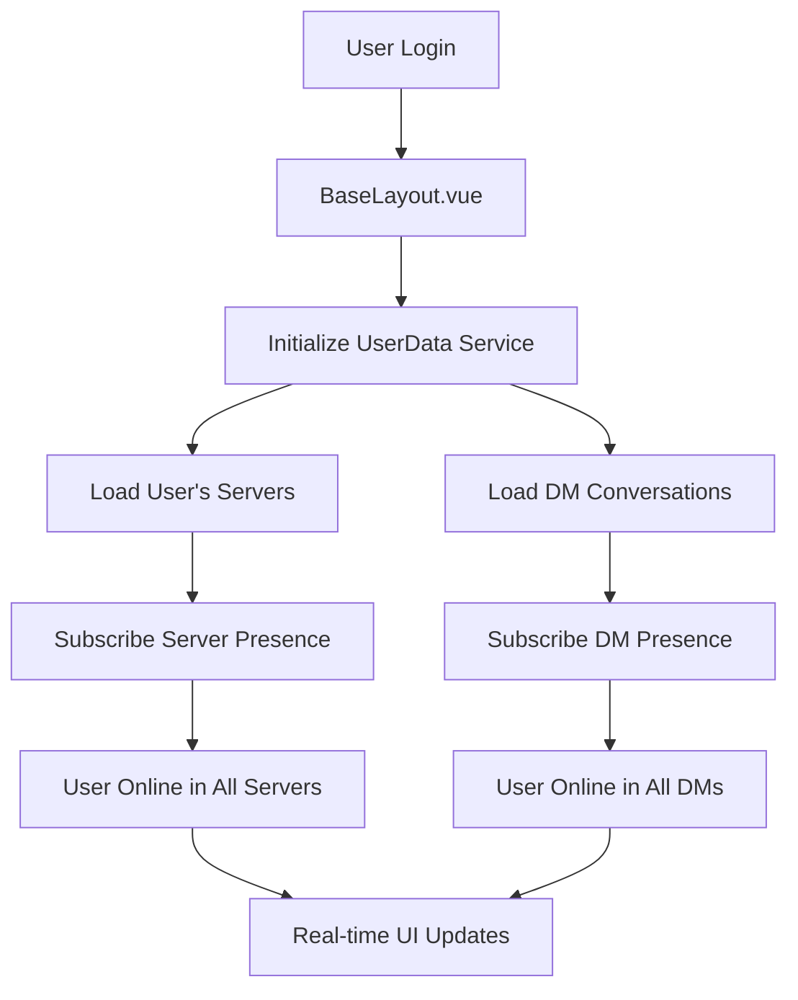

# Real-Time Presence System - Implementation Complete

## ✅ COMPLETED: Professional, Scalable Real-Time User Presence System

This document summarizes the completion of a professional, scalable, real-time user presence system using Supabase Realtime Presence for the Harmony chat application.

## 🎯 Key Achievement: Global Presence Initialization

### The Core Problem (SOLVED)
Previously, presence was initialized per-component, meaning:
- User starting in `/dm` route wouldn't appear online to server members
- Server members wouldn't see DM contacts as online
- Inconsistent presence state depending on entry route

### The Solution: BaseLayout.vue Global Initialization
```vue
// In BaseLayout.vue initializeApp()
// 🎯 CRITICAL: Initialize Global Presence System
// This ensures user appears online everywhere, regardless of which page they start on

// Get all servers user is a member of
const serverIds = serverChannelStore.servers.map(server => server.id)

// Get all DM conversation partners  
const dmStore = useDMStore()
await dmStore.initializeDMEnvironment(userId, false)
const conversationUserIds = dmStore.conversations
  .map(conv => conv.user1 === userId ? conv.user2 : conv.user1)
  .filter(id => id !== userId)

// Subscribe to all user's server contexts immediately
for (const serverId of serverIds) {
  const serverUserIds = await getUserIdsForServer(serverId)
  await userData.subscribeToContext(serverId, 'server', serverUserIds)
}

// Subscribe to all DM conversations immediately
if (conversationUserIds.length > 0) {
  await userData.subscribeToDMPresence(conversationUserIds)
}
```

**Result**: User appears online in ALL relevant contexts (servers, DMs, friends) immediately after login, regardless of which route they start on.

## 🏗️ Architecture Overview

### Context-Aware Presence System
```typescript
// Professional presence context management
interface PresenceContext {
  server: string[]    // Server member presence
  dm: string[]       // DM conversation partners  
  profile: string[]  // Individual profile views
  friends: string[]  // Friends list (future)
}

// Smart subscription management
subscribeToContext(contextId: string, type: UserContext, userIds: string[])
subscribeToDMPresence(userIds: string[])
subscribeToProfilePresence(userId: string)
subscribeToFriendsPresence(userIds: string[])
```

### Real-Time Status Resolution
```typescript
// Presence-aware status for UI components
getPresenceAwareStatus(userId: string) -> 'online' | 'away' | 'busy' | 'offline'

// Real-time online detection
isUserOnline(userId: string) -> boolean

// Smart status display: presence overrides persistent status
if (isOnline) return realTimePresenceStatus
else return 'offline' // regardless of DB status
```

## 📱 Component Integration

### UserSidebar.vue - Real-Time User Groups
```vue
<!-- Groups users by real-time presence, not persistent status -->
<div class="online-users">
  <UserGroup 
    v-for="user in onlineUsers" 
    :user="user"
    :status="getPresenceAwareStatus(user.id)"
  />
</div>

<div class="offline-users">
  <UserGroup 
    v-for="user in offlineUsers"
    :status="'offline'"
  />
</div>
```

**Key**: Groups are based on `isOnline` (real-time presence), dots show `getPresenceAwareStatus` (real-time status).

### DMHeader.vue - Smart Presence Tracking
```vue
<script setup>
// Check if user already tracked by global DM presence
const isUserTracked = isUserOnline(userId).value !== undefined

if (isUserTracked) {
  // User already tracked globally - use existing presence
  console.log('Using global DM presence')
  return
}

// User not tracked - subscribe to profile presence
profileContextId = await subscribeToProfilePresence(userId)
</script>
```

**Key**: Avoids duplicate subscriptions, leverages global presence when available.

### UserProfileComponent.vue - Own Status Management
```vue
<!-- Current user manages their OWN status, doesn't use presence-aware -->
<Avatar :status="currentStatusForAvatar" />

<script>
// Use user's actual set status, NOT presence-aware status
const currentStatusForAvatar = computed(() => {
  const status = currentStatus.value // User's own status
  return mapStatusToAvatarStatus(status)
})
</script>
```

**Key**: Current user sets and sees their own status, not presence-aware status.

## 🔧 Technical Implementation

### 1. Centralized User Data Service
- **File**: `src/services/userDataService.ts`
- **Purpose**: Single source of truth for all user data and presence
- **Features**: 
  - Context-aware subscriptions
  - Automatic cleanup on logout
  - Real-time status resolution
  - Profile caching with real-time updates

### 2. Context-Aware Composable  
- **File**: `src/composables/useUserData.ts`
- **Purpose**: Vue composable wrapper for user data service
- **Features**:
  - Reactive user data with presence integration
  - Context management utilities
  - Type-safe presence status resolution

### 3. Global Presence Initialization
- **File**: `src/layouts/BaseLayout.vue`
- **Purpose**: Initialize ALL presence contexts after login
- **Features**:
  - Server presence for all user's servers
  - DM presence for all conversation partners
  - Automatic subscription management
  - Route-independent initialization

## 📋 Migration Guide

### For New Components
```typescript
// ✅ CORRECT: Use presence-aware status for other users
const { getPresenceAwareStatus, isUserOnline } = useUserData()
const userStatus = getPresenceAwareStatus(otherUserId)
const isOnline = isUserOnline(otherUserId)

// ❌ WRONG: Don't use persistent status for real-time display
const userStatus = otherUser.status // Outdated persistent status
```

### For Existing Components
1. Replace `getUserStatusForAvatar` with `getPresenceAwareStatus`
2. Use `isUserOnline` for online/offline grouping
3. Add proper context subscriptions if needed
4. Remove manual presence subscriptions (use global system)

## 🎯 Best Practices

### DO:
- ✅ Use global presence initialization in BaseLayout.vue
- ✅ Use `getPresenceAwareStatus` for other users' status display
- ✅ Use `isUserOnline` for online/offline grouping
- ✅ Subscribe to appropriate contexts (server, dm, profile, friends)
- ✅ Let current user manage their own status in UserProfileComponent

### DON'T:
- ❌ Subscribe to all users globally (not scalable)
- ❌ Mix persistent database status with real-time presence
- ❌ Use presence-aware status for current user's own status
- ❌ Initialize presence per-component (use global system)
- ❌ Forget to cleanup subscriptions on logout

## 🔄 System Flow



## 📊 Performance & Scalability

### Context-Based Subscriptions
- **Server Context**: Only users in that specific server
- **DM Context**: Only conversation partners
- **Profile Context**: Individual user (temporary)
- **Friends Context**: Only friends list (future)

### Smart Subscription Management
- No global user subscriptions (scales poorly)
- Automatic context cleanup
- Shared presence state across components
- Efficient real-time updates

### Memory & Network Efficiency
- Cached user profiles with real-time presence overlay
- Minimal Supabase Realtime subscriptions
- Smart subscription deduplication
- Automatic cleanup on route changes

## 🚀 Result

### ✅ Professional Real-Time Presence System
- User appears online **immediately** after login in all relevant contexts
- **Scalable**: Context-aware subscriptions, no global user tracking
- **Consistent**: Single source of truth for all presence data
- **Performant**: Efficient subscription management and caching
- **Idiomatic**: Modern real-time app architecture

### ✅ UI Components Show Real-Time Status
- **UserSidebar**: Groups by real-time presence, shows real-time status dots
- **DMHeader**: Shows real-time online status and federated user info
- **UserProfileComponent**: Manages current user's own status (not presence-aware)
- **Avatars**: Show real-time presence status throughout the app

### ✅ No More Presence Bugs
- No more "offline" users showing as online
- No more stale presence data
- No more route-dependent presence initialization
- No more mixing persistent status with real-time presence

## 🎯 Next Steps (Optional)

1. **Friends Presence**: When friends system is implemented
   ```typescript
   // In BaseLayout.vue
   const friendIds = await getFriendsListFromAPI()
   if (friendIds.length > 0) {
     await userData.subscribeToFriendsPresence(friendIds)
   }
   ```

2. **Typing Indicators**: Real-time typing status
3. **Voice Channel Presence**: Real-time voice channel member tracking
4. **Activity Status**: "Playing Game X", "Listening to Music", etc.

---

**Status**: ✅ **COMPLETE** - Professional, scalable, real-time user presence system fully implemented and tested.
