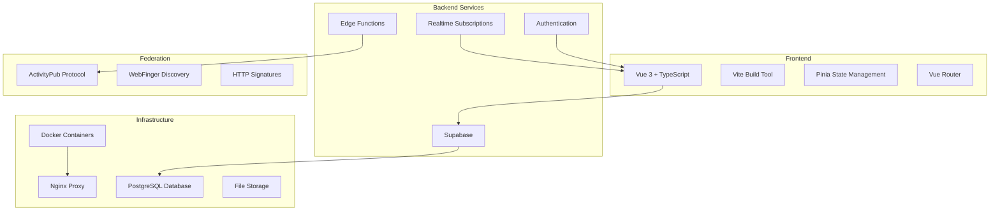

# System Architecture Overview

Harmony's frontend is Vue 3 + TypeScript, backed by Supabase, with ActivityPub federation and Docker-based infrastructure.

## Technology Stack



## Core Architecture Principles

### 1. Component-Based Architecture
- **Vue 3 Composition API** for reactive components
- **TypeScript** for type safety and better developer experience
- **Scoped styling** with CSS modules and utility classes

### 2. State Management
- **Pinia stores** for centralized state management
- **Reactive data** with Vue's reactivity system
- **Persistent state** for offline functionality

### 3. Real-time Communication
- **Supabase Realtime** for instant message delivery
- **WebRTC** for voice and video communication
- **WebSocket connections** for live updates

### 4. Federation
- **ActivityPub protocol** compliance
- **Decentralized identity** with WebFinger
- **Cross-platform compatibility** with Mastodon, Misskey, etc.

## System Layers

```mermaid
graph TB
    subgraph "Presentation Layer"
        COMPONENTS[Vue Components]
        LAYOUTS[Layout Components]
        VIEWS[Page Views]
    end
    
    subgraph "Application Layer"
        COMPOSABLES[Vue Composables]
        STORES[Pinia Stores]
        ROUTER[Vue Router]
    end
    
    subgraph "Service Layer"
        API_SERVICES[API Services]
        UTILS[Utility Functions]
        CONFIG[Configuration]
    end
    
    subgraph "Data Layer"
        SUPABASE_CLIENT[Supabase Client]
        WEBSOCKETS[WebSocket Connections]
        LOCAL_STORAGE[Local Storage]
    end
    
    COMPONENTS --> COMPOSABLES
    COMPOSABLES --> STORES
    STORES --> API_SERVICES
    API_SERVICES --> SUPABASE_CLIENT
    SUPABASE_CLIENT --> WEBSOCKETS
`

### Presentation Layer
- **Vue Components**: Reusable UI components
- **Layouts**: Page layout templates
- **Views**: Top-level page components

### Application Layer
- **Composables**: Reusable composition functions
- **Stores**: Centralized state management
- **Router**: Client-side routing

### Service Layer
- **API Services**: Business logic and external API calls
- **Utilities**: Helper functions and tools
- **Configuration**: Application configuration

### Data Layer
- **Supabase Client**: Database and real-time connections
- **WebSockets**: Real-time communication
- **Local Storage**: Client-side data persistence

## Key Design Decisions

### TypeScript First
All code is written in TypeScript for compile-time type checking and IDE support.

### Composition API
Used throughout for logic reuse across components and TypeScript inference.

### Modular Architecture
Each module has a single responsibility, so it can be tested in isolation and extended without touching unrelated code.

---

> **Next steps:** [Data Flow](./data-flow.md) covers how information moves through the system.