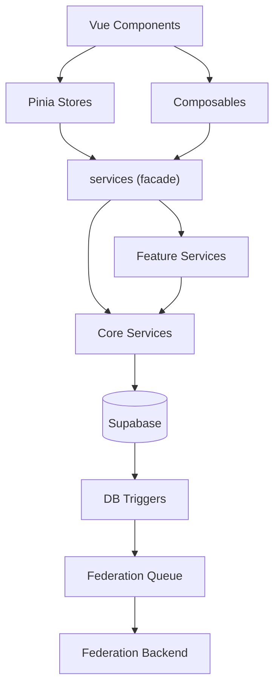
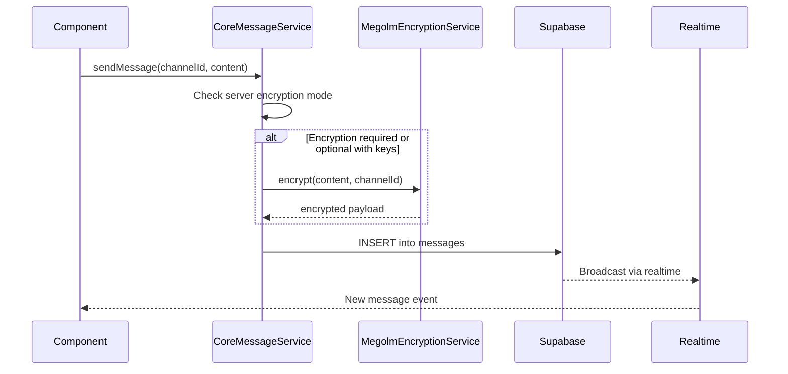

# Service Layer

The service layer in `src/services/` encapsulates all business logic, keeping components and stores thin. Services interact with Supabase directly and are consumed by Pinia stores and composables.

## Architecture



## Service Facade

`src/services/index.ts` exports a unified `services` object that provides access to all service instances:

```typescript
services.messages   // CoreMessageService
services.posts      // CorePostService
services.profiles   // CoreProfileService
services.interactions // CoreInteractionService
```

This facade pattern keeps imports clean and allows swapping implementations.

## Core Services (`src/services/core/`)

Core services handle pure local database operations with no federation side effects. Federation is triggered automatically by database triggers after the local operation succeeds.

| Service | Responsibilities |
|---------|-----------------|
| `CoreMessageService` | Send/edit/delete messages, reactions, pagination, encryption decision |
| `CorePostService` | Create/edit/delete posts, favorites, reblogs, bookmarks, timeline queries |
| `CoreProfileService` | Profile CRUD, avatar/banner updates |
| `CoreInteractionService` | Follow/unfollow, block/unblock, mute/unmute, relationship queries |

All core services:
- Use `AuthContextService` for the current user context
- Are singletons via `getInstance()`
- Validate inputs strictly before database calls
- Return typed results (e.g., `SendMessageData`, `CreatePostData`, `FollowResult`)

### Message Send Flow



## Feature Services

Higher-level services that may coordinate multiple core services or external integrations:

| Service | Purpose |
|---------|---------|
| `PostService` | Wraps `CorePostService`, adds ActivityPub context |
| `MessageService` | Wraps `CoreMessageService`, adds thread/DM logic |
| `InteractionService` | Wraps `CoreInteractionService` |
| `ActivityPubService` | Timeline queries, federation interactions, follows |
| `AdminService` | System stats, user management, federation management |
| `InviteService` | Server invite creation and validation |
| `SearchService` | Message and user search |
| `ThreadService` | Thread messages (bypasses encryption, sent as plaintext) |
| `FileService` | File upload and management |
| `TrendingService` | Trending hashtags and posts |
| `NotificationService` | Notification delivery and management |
| `ProfileService` | Full profile operations including federation triggers |

## Encryption Services (`src/services/encryption/`)

| Service | Purpose |
|---------|---------|
| `MegolmService` | Low-level Megolm session management (create, encrypt, decrypt) |
| `MegolmMessageEncryptionService` | High-level message encryption/decryption singleton |
| `RecoveryKeyService` | Mnemonic derivation, key wrapping, recovery |
| `SecureSessionKeyStore` | IndexedDB storage for non-extractable CryptoKeys |
| `MegolmKeyBackupService` | Server-side key backup and restore |
| `WebRTCEncryptionService` | Signal Protocol encryption for WebRTC streams |

## Federation Services (`src/services/federation/`)

| Service | Purpose |
|---------|---------|
| `FederationActivityService` | ActivityPub activity creation and delivery |
| `FederationServerService` | Federated server discovery and management |
| `FederationDecisionService` | Policy decisions for federation (trust, blocking) |

## Infrastructure Services

| Service | Purpose |
|---------|---------|
| `AuthContextService` | Cached auth user/profile ID resolution (singleton) |
| `RealtimeConnectionManager` | Supabase Realtime wrapper with auto-reconnect |
| `userDataService` | Cached user profile lookups with presence tracking |
| `ServiceWorkerManager` | PWA service worker and push notification management |
| `LoggingService` | Structured logging with configurable levels |
| `AppInitService` | Application boot sequence and route-aware initialization |
| `SessionHeartbeat` | Periodic session keepalive |
| `StatePersistence` | State serialization to localStorage |

## Voice/Video Services

| Service | Purpose |
|---------|---------|
| `webrtcManager` | Mode switching between SFU (LiveKit) and P2P |
| `livekitWebRTC` | LiveKit SFU integration with E2EE support |
| `unifiedWebRTC` | P2P mesh via Supabase Realtime signaling |
| `SpatialAudio` | 2D spatial audio positioning via Web Audio API |
| `VoiceSettingsService` | Device selection and audio settings |
| `DMCallSignaling` | DM call setup and teardown |

## Patterns

### Singleton Access

Most services use a `getInstance()` static method:

```typescript
const messageService = CoreMessageService.getInstance()
```

### Local-First with Federation Triggers

Services write to the local database only. Federation is handled by PostgreSQL triggers that call `queue_federation_job()`, which feeds the pg-boss job queue consumed by the federation backend. This ensures local operations are fast and federation failures don't block the user.

### Request Deduplication

`RequestDeduplicator` (`src/utils/requestDeduplicator.ts`) prevents duplicate concurrent requests for the same resource, used by `userDataService` and other services that may receive rapid repeated calls.

---

> **Note**: This page is protected from auto-generation. Edit the content in `docs-source/guide/architecture/services.md` and run `npm run docs:generate-guide` to update.
