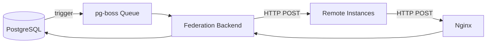

# Federation Deployment

The federation backend enables ActivityPub interoperability with Mastodon, Pleroma, Misskey, and other fediverse platforms.

## Architecture



Local operations (posts, follows, reactions) insert into the database. PostgreSQL triggers call `queue_federation_job()` to enqueue federation activities. The federation backend consumes the queue and delivers activities to remote instances via signed HTTP requests.

## Setup

### 1. Configure Environment

```bash
cd federation-backend
cp env.template .env
```

Required variables:

| Variable | Description |
|----------|-------------|
| `SUPABASE_URL` | Supabase API URL |
| `SUPABASE_ANON_KEY` | Supabase anonymous key |
| `SUPABASE_SERVICE_ROLE_KEY` | Service role key (admin access) |
| `INSTANCE_DOMAIN` | Your domain (e.g., `har.mony.lol`) |
| `CORS_ORIGIN` | Frontend origin |

For reliable delivery (recommended):

| Variable | Description |
|----------|-------------|
| `DATABASE_URL` | Direct PostgreSQL connection string |
| `USE_PGBOSS_QUEUE` | Set to `true` |

### 2. Nginx Configuration

The nginx config must proxy ActivityPub endpoints to the federation backend (port 3001). Key routes:

| Path | Purpose |
|------|---------|
| `/.well-known/webfinger` | User discovery |
| `/.well-known/nodeinfo` | Instance metadata |
| `/nodeinfo/2.0`, `/nodeinfo/2.1` | NodeInfo details |
| `/users/{handle}` | Actor profiles (content-negotiated) |
| `/users/{handle}/inbox` | User inbox |
| `/users/{handle}/outbox` | User outbox |
| `/users/{handle}/followers` | Followers collection |
| `/users/{handle}/following` | Following collection |
| `/servers/{id}/*` | Server (Group) federation |
| `/inbox` | Shared inbox |
| `/outbox` | Shared outbox |

User profile URLs (`/users/{handle}`) use content negotiation:
- ActivityPub clients (Accept: `application/activity+json`) get JSON from the federation backend
- Browsers get redirected to `/social/profile/{handle}` on the frontend

All proxied requests must forward the `Signature`, `Date`, and `Digest` headers for HTTP signature verification.

See `dev/nginx-harmony.template.conf` for the complete app configuration and `dev/nginx-docs.template.conf` for the documentation site.

### 3. Domain Requirements

Federation requires:

- A publicly accessible domain with HTTPS
- DNS pointing to your server
- Port 443 open for inbound federation traffic
- SSL certificate (Let's Encrypt recommended)

### 4. Start the Backend

**Development:**

```bash
cd federation-backend
npm install
npm run dev
```

**Docker:**

```bash
docker compose -f docker-compose.prod.yml up -d
```

### 5. Verify

Check the health endpoint:

```bash
curl https://your-domain.com/api/federation/health
```

Test WebFinger discovery:

```bash
curl "https://your-domain.com/.well-known/webfinger?resource=acct:username@your-domain.com"
```

## Job Queue (pg-boss)

When `USE_PGBOSS_QUEUE=true`, federation activities are processed through a PostgreSQL-based job queue:

- Activities are queued by database triggers via `queue_federation_job()`
- The federation backend's `QueueManager` consumes jobs
- Failed deliveries are retried with backoff
- The queue function has a fallback for environments where pg-boss tables don't exist yet (`insufficient_privilege` handling)

Without pg-boss (`USE_PGBOSS_QUEUE=false`), federation events are processed synchronously through database listeners, which is simpler but less reliable.

## Federation Features

- **WebFinger**: Standard user discovery protocol
- **NodeInfo**: Instance metadata for the fediverse
- **HTTP Signatures**: Signed requests for authenticity
- **Actor endpoints**: User profiles, inboxes, outboxes
- **Group federation**: Servers represented as ActivityPub Groups
- **Content types**: Posts, replies, favorites, reblogs, follows, blocks

## Security

| Setting | Description |
|---------|-------------|
| `REQUIRE_VALID_SIGNATURES` | Enforce HTTP signature verification on incoming activities |
| Instance blocking | Admin panel can block specific instances |
| Instance trust | Admin-only flag (`federated_instances.is_trusted`). Currently a UI badge + filter for trending/instance lists; delivery-priority gating in the federation backend is on the roadmap, not yet shipped. |
| Rate limiting | `RATE_LIMIT_WINDOW_MS` and `RATE_LIMIT_MAX_REQUESTS` |

---

> **Note**: This page is protected from auto-generation. Edit the content in `docs-source/guide/deployment/federation.md` and run `npm run docs:generate-guide` to update.
