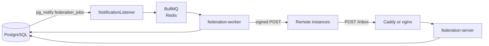

# Federation Deployment

The federation backend (`federation-backend/`) speaks ActivityPub with Mastodon, Misskey, Pleroma and other Harmony instances, and serves Harmony's own server-side API: push subscriptions, link previews, the GIF proxy, LiveKit tokens, presence and typing, and attachment URLs for other instances. The self-host stack runs and routes it; this page covers what that setup provides.

## Architecture


```mermaid
graph LR
    DB[(PostgreSQL)] -->|pg_notify federation_jobs| Listener[NotificationListener]
    Listener --> Queue[BullMQ<br/>Redis]
    Queue --> Worker[federation-worker]
    Worker -->|signed POST| Remote[Remote instances]
    Remote -->|POST /inbox| Proxy[Caddy or nginx]
    Proxy --> Server[federation-server]
    Server --> DB
    Worker --> DB
```

Local actions write to the database. Triggers call `queue_federation_job()`, which publishes the job on the `federation_jobs` channel with `pg_notify`. The worker's `NotificationListener` holds a `LISTEN` connection and turns each notification into a BullMQ job in Redis; `BullMQManager` runs the handlers, retrying a failed job up to five times with exponential backoff. Deliveries carry HTTP Signatures. A 60 s sweep re-queues work whose notification was missed, and a 30 s retry processes `federation_delivery_queue`.

Inbound activities reach the server's inboxes, which verify their HTTP Signatures.

## Process modes

One image (`ghcr.io/y4my4my4m/harmony-federation`) serves every role through `FEDERATION_MODE`:

| Mode | Runs |
|---|---|
| `server` | HTTP on `PORT` (3001): inboxes, actors, WebFinger, NodeInfo, the API |
| `worker` | Queues, the `LISTEN` bridge, delivery, push sending, voice reconciliation; no HTTP |
| `unified` | Both in one process (the default, and `npm run dev`) |

Production runs a server and a worker apart (`harmony-federation-server`, `harmony-federation-worker`), so a heavy delivery batch never delays inbound requests.

## Configuration

Required: `SUPABASE_URL`, `SUPABASE_ANON_KEY`, `SUPABASE_SERVICE_ROLE_KEY`, `INSTANCE_DOMAIN`. For the queue:

| Variable | Meaning |
|---|---|
| `REDIS_URL` | Redis for BullMQ, e.g. `redis://:<password>@redis:6379` |
| `USE_BULLMQ_QUEUE` | `true` (default). `false` processes events through a Supabase Realtime subscription: no job persistence, and events raised while the worker is down are missed |
| `FEDERATION_LISTENER_URL` | Session-mode Postgres URL with the `harmony_listener` role, for instant pickup. Unset, the 60 s sweep picks jobs up |
| `REQUIRE_VALID_SIGNATURES` | `true` (default); `false` is refused with `NODE_ENV=production` |
| `TRUST_PROXY` | Peers trusted to set `X-Real-IP`, on which rate limits key |

[Environment Variables](../environment) lists the rest.

## Routing

The backend expects these paths on the public domain. `self-host/Caddyfile` and `dev/nginx-harmony.template.conf` route them identically:

| Path | Upstream path |
|---|---|
| `/.well-known/webfinger`, `/.well-known/host-meta`, `/.well-known/host-meta.json`, `/.well-known/nodeinfo` | unchanged |
| `/nodeinfo/2.0`, `/nodeinfo/2.1` | unchanged |
| `/inbox` (shared inbox), `/oembed` | unchanged |
| `/users/{name}/inbox`, `outbox`, `followers`, `following`, `featured` | unchanged |
| `/users/{name}` with `Accept: application/activity+json`, `ld+json` or `json` | unchanged; browsers are redirected to `/social/profile/{name}` |
| `/servers/*` | unchanged (servers as ActivityPub Groups) |
| `/posts/{id}`, `/posts/{id}/likes`, `/posts/{id}/replies` | unchanged; `/posts/{id}` answers browsers with an HTML page |
| `/health*`, `/link-preview*` | unchanged |
| `/api/livekit/*` | unchanged |
| `/webhooks/*` | unchanged (Ko-fi, Stripe) |
| `/api/federation/*` | prefix stripped: `/api/federation/push/vapid-key` reaches `/push/vapid-key` |

The backend mounts most routes at the root only, so nginx strips the prefix with a trailing slash on both sides:

```nginx
location /api/federation/ {
    proxy_pass http://localhost:3001/;
}
```

Every proxied location sets `X-Real-IP` to the client address, and passes the `Signature`, `Date`, `Digest` and `Accept` headers through unchanged.

## Domain

- Federation needs a public domain with HTTPS on port 443.
- `INSTANCE_DOMAIN` and `instance_config.domain` hold the same domain.
- Actor ids embed the domain. Changing it later leaves every remote copy of the instance's accounts on the old one, so the domain is chosen once.

## Verifying

```bash
curl https://chat.example.com/api/federation/health
curl "https://chat.example.com/.well-known/webfinger?resource=acct:alice@chat.example.com"
curl https://chat.example.com/.well-known/nodeinfo
curl -H 'Accept: application/activity+json' https://chat.example.com/users/alice
```

`/health` answers `"status": "healthy"` with the database, Redis and queue state. From another fediverse server, a search for `@alice@chat.example.com` finds the account.

## Security

| Control | Where |
|---|---|
| HTTP Signature verification on inbound activities | `REQUIRE_VALID_SIGNATURES` |
| Instance blocks | Admin panel, Federation; cached by the backend |
| Domain moderation (`limit`) | Admin panel, Federation |
| Instance trust (`federated_instances.is_trusted`) | Admin panel; a badge and filter in instance lists and trending |
| Rate limits | `RATE_LIMIT_WINDOW_MS`, `RATE_LIMIT_MAX_REQUESTS`, keyed on `X-Real-IP` from a `TRUST_PROXY` peer |
| Outbound fetches | Deliveries, actor and WebFinger lookups, link previews, instance probes and push endpoints go through the SSRF guard (`federation-backend/src/utils/ssrfProtection.ts`) |

---

> **Note**: This page is protected from auto-generation. Edit the content in `docs-source/guide/deployment/federation.md` and run `npm run docs:generate-guide` to update.
