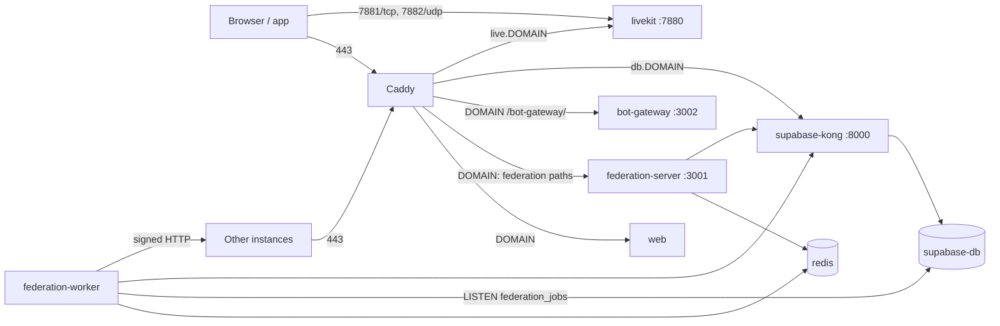

# Production Deployment

Harmony runs in production in one of two ways:

- **The self-host stack** (`self-host/`): one command on a blank Linux server installs Caddy, the web app, the federation server and worker, Redis and Supabase, plus LiveKit, the bot gateway and Discord bridge hosting when chosen, all in Docker from prebuilt images. [Self-Hosting](/self-hosting) is the guide.
- **Your own Supabase and reverse proxy**: the root `docker-compose.prod.yml` or `docker-compose.full.yml`, or the services run on the host, behind nginx. [Docker](./docker) describes the compose files; the requirements below apply to every manual setup.

## Install

```bash
curl -fsSL https://raw.githubusercontent.com/y4my4my4m/harmony/master/self-host/install.sh | bash
```

The installer puts Harmony in `/opt/harmony`, checks DNS, asks for the domain, admin email, admin username and password, instance name, voice, bots, Discord bridge hosting, optional SMTP and registration (open, invite or closed), then starts the stack and creates the admin account. From a checkout, `bash self-host/install.sh` does the same.

## Architecture



The browser talks to Supabase through Kong at `db.DOMAIN` and to everything else at `DOMAIN`. Database triggers queue federation and push jobs; the worker picks them up, builds link previews, sends push notifications and delivers activities to other instances.

## Requirements

- A Linux server (x86_64 or arm64) with Docker Engine and Compose 2.24.4 or later; the installer offers to install Docker when it is missing. Node and Python are not needed on the host.
- DNS records pointing at the server: `DOMAIN` and `db.DOMAIN`, plus `live.DOMAIN` with voice.
- Inbound ports: 80/tcp and 443/tcp (Let's Encrypt validates through both), 443/udp for HTTP/3, and with voice 7881/tcp and 7882/udp.
- TLS: Caddy obtains Let's Encrypt certificates when `CADDY_TLS` is a contact email, or uses its own CA when it is `internal` (LAN or NAS without public DNS).

## Containers

| Container | Profile | Port | Role |
|---|---|---|---|
| `harmony-caddy` | | 80, 443, 443/udp (published) | Reverse proxy and TLS |
| `harmony-web` | | 80 (internal) | The SPA; writes `/config.json` at start |
| `harmony-federation-server` | | 3001 (internal) | ActivityPub, WebFinger, NodeInfo, push, link previews, GIFs, LiveKit tokens |
| `harmony-federation-worker` | | none | Queues, delivery, push sending, maintenance |
| `harmony-redis` | | 6379 (internal) | BullMQ, cache, presence, rate limits, LiveKit state |
| `harmony-bot-gateway` | `bots` | 3002 (internal) | Bot REST API and WebSocket gateway |
| `harmony-discord-bridge-host` | `discord` | none | Hosted Discord bridges |
| `harmony-livekit` | `voice` | 7880 (through Caddy), 7881/tcp, 7882/udp (published) | Voice and video SFU |

Supabase runs as `supabase-db`, `supabase-auth`, `supabase-rest`, `realtime-dev.supabase-realtime`, `supabase-storage`, `supabase-imgproxy`, `supabase-kong`, `supabase-meta`, `supabase-studio`, `supabase-analytics` and `supabase-vector`, from the upstream Supabase Docker stack with `self-host/supabase-overrides.yml` merged over it. None of them publishes a port; Edge Functions and Supavisor stay defined but never start.

`COMPOSE_PROFILES` in `self-host/.env` lists the enabled profiles.

## Images

| Image | Built from |
|---|---|
| `ghcr.io/y4my4my4m/harmony-web` | `self-host/web.Dockerfile` |
| `ghcr.io/y4my4my4m/harmony-federation` | `federation-backend/Dockerfile` (server and worker) |
| `ghcr.io/y4my4my4m/harmony-bot-gateway` | `bot-gateway/Dockerfile` |

`.github/workflows/images.yml` publishes them for `linux/amd64` and `linux/arm64`. A release tag `vX.Y.Z` produces `X.Y.Z`, `X.Y` and `latest`; master produces `edge` and `sha-<short>`. `HARMONY_VERSION` in `self-host/.env` selects the tag. `HARMONY_BUILD=1 bash configure.sh` adds `self-host/docker-compose.build.yml`, which builds the three images from the checkout instead.

The images run Node 24; the federation and bot gateway images run as uid 1000 (`node`). The web image carries no instance values: its environment (`SUPABASE_URL`, `SUPABASE_ANON_KEY`, `DOMAIN`, ...) becomes `/config.json` at start, so one image serves every instance.

## Operating an instance

The operator CLI is `self-host/harmony`, linked as `harmony` when installed as root:

| Command | Effect |
|---|---|
| `harmony install` | Install, or re-run the installation safely |
| `harmony status` | URL, version, profiles and container states |
| `harmony logs [service]` | Follow logs; `federation` is the server and the worker |
| `harmony doctor` | Check the instance |
| `harmony update [--version X.Y.Z]` | New code and images, a backup, pending migrations, then recreated containers |
| `harmony backup` | Database, configuration files (every secret) and uploads into `self-host/backups/<time>/` |
| `harmony restore <backup>` | Restore a backup |
| `harmony admin create`, `reset-password`, `invite` | Admin account, password reset, invite link |
| `harmony registration open\|invite\|closed` | Who can sign up |
| `harmony config` | Change the installation answers and apply them |

The configuration files (`self-host/.env`, `federation.env`, `bot-gateway.env`, `discord-bridge.env`, `livekit.yaml`, `supabase/.env`) hold the only copy of the instance's secrets.

## Manual setup requirements

A setup that does not use the self-host stack reproduces what it configures:

- **Reverse proxy**: `dev/nginx-harmony.template.conf` routes the app, the federation backend and the bot gateway for host nginx. nginx strips the `/api/federation` prefix, since the backend mounts most routes at the root:

  ```nginx
  location /api/federation/ {
      proxy_pass http://localhost:3001/;
  }
  ```

  Every location proxied to the backend sets `X-Real-IP`; the backend keys its rate limits on it (`TRUST_PROXY`).
- **Supabase API host**: include `dev/nginx-auth-logout.template.conf` in the server block of `db.DOMAIN`. It refuses `POST /auth/v1/logout` without `?scope=local`, which would otherwise sign every device out with only a password. Kong (8000), GoTrue (9999) and Postgres must not be reachable from outside.
- **Image cache**: a cache in front of `/storage/v1/render/image/public/` pins the `Accept` header, or one client's format is served to all:

  ```nginx
  proxy_set_header Accept "image/webp,*/*;q=0.8";
  ```

- **LiveKit**: `dev/nginx-livekit.template.conf` proxies `live.DOMAIN` to signalling on 7880. Media uses 7881/tcp and 7882/udp directly.
- **Schema and listener role**: `self-host/bootstrap.sh` applies `db_schema/migrations/` to the Postgres container and records them in `supabase_migrations.schema_migrations`; it creates the `harmony_listener` role when `self-host/federation.env` holds `__LISTENER_PW`. [Supabase Setup](./supabase) has the SQL for a database outside Docker.
- **Instance domain**: `instance_config.domain` holds the public domain. `bootstrap.sh` writes it on a new database when `DOMAIN` is set in `self-host/.env`; otherwise:

  ```sql
  UPDATE public.instance_config
     SET config_value = to_jsonb('chat.example.com'::text)
   WHERE config_key = 'domain';
  ```

---

> **Note**: This page is protected from auto-generation. Edit the content in `docs-source/guide/deployment/index.md` and run `npm run docs:generate-guide` to update.
