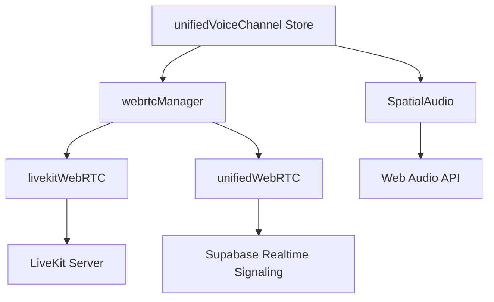

# Voice & Video

Harmony supports real-time voice and video communication through voice channels and direct calls, powered by WebRTC.

## Architecture

The voice system supports multiple transport modes configured via `WEBRTC_MODE`:

| Mode | Transport | Best For |
|------|-----------|----------|
| `sfu` | LiveKit server | Larger rooms, better scalability |
| `p2p` | Direct peer connections | Small groups, lower latency |
| `hybrid` | LiveKit with P2P fallback | Flexibility |

### Service Stack

## LiveKit (SFU Mode)

`livekitWebRTC` handles the LiveKit integration:

- Token generation via the federation backend (`/api/livekit/token`)
- Room connection and media track management
- Support for federated users with `federated:{id}` identity
- Optional E2EE via `ExternalE2EEKeyProvider`
- Automatic track subscription and participant events

## P2P Mode

`unifiedWebRTC` provides mesh P2P connections:

- Signaling via Supabase Realtime channels
- Audio/video with configurable quality (resolution, framerate, bitrate)
- Echo cancellation, noise suppression, automatic gain control
- Optional stream encryption via `WebRTCEncryptionService`

## Voice Channels

Server voice channels work like persistent rooms:

- Join/leave via the channel sidebar
- See who's currently in the channel
- Multiple layout options: grid, speaker view, gallery
- View modes: normal, maximized, fullscreen
- Draggable PIP (picture-in-picture) for multitasking

## DM Calls

Direct message calls use `DMCallSignaling`:

- Initiate call from DM view
- Incoming call modal (`IncomingCallModal`)
- Ring/accept/decline flow
- Global listener (`GlobalDMCallListener`) for receiving calls from any view

## Spatial Audio

`SpatialAudio` provides 2D positional audio:

- Web Audio API chain: Source -> Gain -> Convolver -> Panner -> Compressor -> Destination
- Users position themselves on a 2D canvas (`SpatialAudioPanel`)
- Reverb via impulse response convolution
- Position updates throttled at ~60fps
- Per-user volume and spatial position stored in `useSpatialAudioStore`

## Screen Sharing

- Share entire screen or individual windows/tabs
- Screen share appears in the voice overlay
- `ScreensharePIP` component for floating screen share view
- Configurable framerate and resolution

## Device Management

`DeviceSelector` and `VoiceSettingsService` handle:

- Input device selection (microphone)
- Output device selection (speakers/headphones)
- Video device selection (camera)
- Push-to-talk support (`usePushToTalk` composable)
- Per-user volume adjustment
- Voice settings persist across sessions

## Key Components

| Component | Purpose |
|-----------|---------|
| `UnifiedVoiceOverlay` | Main voice channel interface |
| `UnifiedVoiceDock` | Compact docked status bar |
| `VoiceChannelParticipants` | Participant grid/list |
| `VoiceChannelUserList` | User list in channel sidebar |
| `DeviceSelector` | Audio/video device picker |
| `SpatialAudioPanel` | 2D spatial audio canvas |
| `VoiceSettingsPanel` | Voice configuration |
| `RecentSpeakers` | Recent speaker indicators |
| `ScreensharePIP` | Screen share picture-in-picture |

## Configuration

Voice features require:

1. `VITE_ENABLE_VOICE=true` in the frontend `.env`
2. A LiveKit server (for SFU mode) with `LIVEKIT_*` env vars configured
3. The federation backend running (for token generation)

See [Environment Variables](../environment) for all voice-related settings.

---

> **Note**: This page is protected from auto-generation. Edit the content in `docs-source/guide/features/voice.md` and run `npm run docs:generate-guide` to update.
