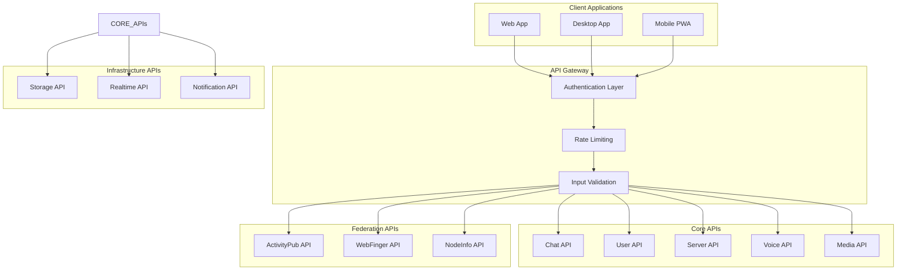

# API Reference

## Overview

This document provides comprehensive API documentation for Harmony's internal APIs, service interfaces, and integration points. The APIs are organized by domain and follow REST and GraphQL conventions where applicable.

## API Architecture



## Authentication API

### Base URL
```
https://har.mony.lol/api/v1/auth
```

### Endpoints

#### Login
```http
POST /auth/login
Content-Type: application/json

{
  "email": "user@example.com",
  "password": "securepassword"
}
```

**Response:**
```typescript
interface LoginResponse {
  success: boolean
  session: {
    access_token: string
    refresh_token: string
    expires_at: number
    user: {
      id: string
      email: string
      created_at: string
    }
  }
  profile: {
    id: string
    username: string
    display_name: string
    avatar: string | null
    bio: string | null
  }
}
```

#### Register
```http
POST /auth/register
Content-Type: application/json

{
  "email": "user@example.com",
  "password": "securepassword",
  "username": "username",
  "display_name": "Display Name"
}
```

#### Logout
```http
POST /auth/logout
Authorization: Bearer {access_token}
```

#### Refresh Token
```http
POST /auth/refresh
Content-Type: application/json

{
  "refresh_token": "refresh_token_here"
}
```

## User API

### Base URL
```
https://har.mony.lol/api/v1/users
```

### User Profile Endpoints

#### Get User Profile
```http
GET /users/{userId}
Authorization: Bearer {access_token}
```

**Response:**
```typescript
interface UserProfile {
  id: string
  username: string
  display_name: string
  bio: string | null
  avatar: string | null
  banner: string | null
  status: UserStatus
  presence: PresenceState
  created_at: string
  updated_at: string
  
  // Federation fields
  actor_id: string | null
  public_key: string | null
  private_key: string | null
  
  // Preferences
  preferences: {
    theme: string
    notifications: NotificationPreferences
    privacy: PrivacySettings
  }
}
```

#### Update Profile
```http
PATCH /users/{userId}
Authorization: Bearer {access_token}
Content-Type: application/json

{
  "display_name": "New Display Name",
  "bio": "Updated bio",
  "status": "online"
}
```

#### Upload Avatar
```http
POST /users/{userId}/avatar
Authorization: Bearer {access_token}
Content-Type: multipart/form-data

file: [image file]
```

**Response:**
```typescript
interface AvatarUploadResponse {
  success: boolean
  avatar_url: string
  cdn_url: string
}
```

### User Search
```http
GET /users/search?q={query}&limit={limit}
Authorization: Bearer {access_token}
```

**Response:**
```typescript
interface UserSearchResponse {
  users: UserProfile[]
  total: number
  has_more: boolean
}
```

## Server API

### Base URL
```
https://har.mony.lol/api/v1/servers
```

### Server Management

#### List User Servers
```http
GET /servers
Authorization: Bearer {access_token}
```

**Response:**
```typescript
interface ServerListResponse {
  servers: Server[]
}

interface Server {
  id: string
  name: string
  description: string
  icon: string | null
  owner: string
  public: boolean
  member_count: number
  created_at: string
  
  // User's role in this server
  user_role: {
    name: string
    permissions: Permission[]
    color: string
  }
}
```

#### Get Server Details
```http
GET /servers/{serverId}
Authorization: Bearer {access_token}
```

#### Create Server
```http
POST /servers
Authorization: Bearer {access_token}
Content-Type: application/json

{
  "name": "My Server",
  "description": "A great server",
  "public": true
}
```

#### Update Server
```http
PATCH /servers/{serverId}
Authorization: Bearer {access_token}
Content-Type: application/json

{
  "name": "Updated Server Name",
  "description": "Updated description"
}
```

#### Delete Server
```http
DELETE /servers/{serverId}
Authorization: Bearer {access_token}
```

### Channel Management

#### List Server Channels
```http
GET /servers/{serverId}/channels
Authorization: Bearer {access_token}
```

**Response:**
```typescript
interface ChannelListResponse {
  channels: Channel[]
  categories: Category[]
}

interface Channel {
  id: string
  name: string
  type: ChannelType // 0 = text, 1 = voice, 2 = video
  category_id: string | null
  position: number
  topic: string | null
  nsfw: boolean
  permissions: ChannelPermission[]
}

interface Category {
  id: string
  name: string
  position: number
  channels: string[] // channel IDs
}
```

#### Create Channel
```http
POST /servers/{serverId}/channels
Authorization: Bearer {access_token}
Content-Type: application/json

{
  "name": "general",
  "type": 0,
  "category_id": "category-id",
  "topic": "General discussion"
}
```

#### Update Channel
```http
PATCH /servers/{serverId}/channels/{channelId}
Authorization: Bearer {access_token}
Content-Type: application/json

{
  "name": "updated-channel-name",
  "topic": "Updated topic"
}
```

#### Delete Channel
```http
DELETE /servers/{serverId}/channels/{channelId}
Authorization: Bearer {access_token}
```

### Server Members

#### List Server Members
```http
GET /servers/{serverId}/members?limit={limit}&offset={offset}
Authorization: Bearer {access_token}
```

**Response:**
```typescript
interface ServerMembersResponse {
  members: ServerMember[]
  total: number
  online_count: number
}

interface ServerMember {
  user: UserProfile
  roles: Role[]
  joined_at: string
  nick: string | null
  presence: PresenceState
}
```

#### Join Server
```http
POST /servers/{serverId}/join
Authorization: Bearer {access_token}
```

#### Leave Server
```http
POST /servers/{serverId}/leave
Authorization: Bearer {access_token}
```

## Chat API

### Base URL
```
https://har.mony.lol/api/v1/chat
```

### Message Endpoints

#### Get Channel Messages
```http
GET /channels/{channelId}/messages?limit={limit}&before={messageId}
Authorization: Bearer {access_token}
```

**Response:**
```typescript
interface MessagesResponse {
  messages: Message[]
  has_more: boolean
  total: number
}

interface Message {
  id: string
  content: MessagePart[]
  author: {
    id: string
    username: string
    display_name: string
    avatar: string | null
  }
  channel_id: string
  created_at: string
  updated_at: string | null
  
  // Message metadata
  message_type: 'text' | 'system' | 'file' | 'embed'
  reply_to: string | null
  reactions: Reaction[]
  attachments: Attachment[]
  embeds: Embed[]
  
  // Federation
  activity_id: string | null
  federated: boolean
}
```

#### Send Message
```http
POST /channels/{channelId}/messages
Authorization: Bearer {access_token}
Content-Type: application/json

{
  "content": "Hello world!",
  "reply_to": "message-id-here",
  "attachments": ["attachment-id-1", "attachment-id-2"]
}
```

#### Edit Message
```http
PATCH /messages/{messageId}
Authorization: Bearer {access_token}
Content-Type: application/json

{
  "content": "Updated message content"
}
```

#### Delete Message
```http
DELETE /messages/{messageId}
Authorization: Bearer {access_token}
```

### Reactions

#### Add Reaction
```http
POST /messages/{messageId}/reactions
Authorization: Bearer {access_token}
Content-Type: application/json

{
  "emoji": "👍",
  "custom_emoji_id": "custom-emoji-id"
}
```

#### Remove Reaction
```http
DELETE /messages/{messageId}/reactions/{emoji}
Authorization: Bearer {access_token}
```

### File Uploads

#### Upload File
```http
POST /upload
Authorization: Bearer {access_token}
Content-Type: multipart/form-data

file: [file data]
channel_id: {channelId}
```

**Response:**
```typescript
interface FileUploadResponse {
  id: string
  filename: string
  size: number
  content_type: string
  url: string
  cdn_url: string
  thumbnail_url?: string
}
```

## Voice API

### Base URL
```
https://har.mony.lol/api/v1/voice
```

### Voice Channel Endpoints

#### Join Voice Channel
```http
POST /channels/{channelId}/join
Authorization: Bearer {access_token}
Content-Type: application/json

{
  "self_mute": false,
  "self_deaf": false
}
```

**Response:**
```typescript
interface VoiceJoinResponse {
  token: string
  session_id: string
  endpoint: string
  guild_id: string
  channel_id: string
  user_id: string
}
```

#### Leave Voice Channel
```http
POST /channels/{channelId}/leave
Authorization: Bearer {access_token}
```

#### Update Voice State
```http
PATCH /voice/state
Authorization: Bearer {access_token}
Content-Type: application/json

{
  "self_mute": true,
  "self_deaf": false
}
```

#### Get Voice Channel State
```http
GET /channels/{channelId}/voice
Authorization: Bearer {access_token}
```

**Response:**
```typescript
interface VoiceChannelState {
  channel_id: string
  participants: VoiceParticipant[]
  spatial_audio_enabled: boolean
}

interface VoiceParticipant {
  user: UserProfile
  self_mute: boolean
  self_deaf: boolean
  server_mute: boolean
  server_deaf: boolean
  speaking: boolean
  position?: {
    x: number
    y: number
  }
}
```

## ActivityPub Federation API

### Base URL
```
https://har.mony.lol/api/v1/activitypub
```

### Timeline Endpoints

#### Get Timeline
```http
GET /timeline/{timelineType}?limit={limit}&max_id={maxId}
Authorization: Bearer {access_token}
```

**Timeline Types:** `home`, `public`, `local`, `notifications`

**Response:**
```typescript
interface TimelineResponse {
  posts: ActivityPubPost[]
  has_more: boolean
  next_cursor: string | null
}

interface ActivityPubPost {
  id: string
  uri: string
  url: string
  content: string
  summary: string | null
  sensitive: boolean
  visibility: 'public' | 'unlisted' | 'private' | 'direct'
  created_at: string
  
  author: {
    id: string
    username: string
    display_name: string
    avatar: string | null
    acct: string // full handle including domain
  }
  
  media_attachments: MediaAttachment[]
  mentions: Mention[]
  tags: Tag[]
  
  replies_count: number
  reblogs_count: number
  favourites_count: number
  
  reblogged: boolean
  favourited: boolean
  bookmarked: boolean
  
  in_reply_to_id: string | null
  in_reply_to_account_id: string | null
  reblog: ActivityPubPost | null
}
```

#### Create Post
```http
POST /statuses
Authorization: Bearer {access_token}
Content-Type: application/json

{
  "status": "Hello, federated world!",
  "visibility": "public",
  "sensitive": false,
  "spoiler_text": "",
  "in_reply_to_id": "post-id",
  "media_ids": ["media-1", "media-2"]
}
```

#### Delete Post
```http
DELETE /statuses/{postId}
Authorization: Bearer {access_token}
```

### Interactions

#### Favorite Post
```http
POST /statuses/{postId}/favourite
Authorization: Bearer {access_token}
```

#### Unfavorite Post
```http
POST /statuses/{postId}/unfavourite
Authorization: Bearer {access_token}
```

#### Reblog Post
```http
POST /statuses/{postId}/reblog
Authorization: Bearer {access_token}
```

#### Unblog Post
```http
POST /statuses/{postId}/unreblog
Authorization: Bearer {access_token}
```

#### Bookmark Post
```http
POST /statuses/{postId}/bookmark
Authorization: Bearer {access_token}
```

### Following

#### Follow User
```http
POST /accounts/{accountId}/follow
Authorization: Bearer {access_token}
```

#### Unfollow User
```http
POST /accounts/{accountId}/unfollow
Authorization: Bearer {access_token}
```

#### Get Followers
```http
GET /accounts/{accountId}/followers?limit={limit}
Authorization: Bearer {access_token}
```

#### Get Following
```http
GET /accounts/{accountId}/following?limit={limit}
Authorization: Bearer {access_token}
```

## Notification API

### Base URL
```
https://har.mony.lol/api/v1/notifications
```

### Notification Endpoints

#### Get Notifications
```http
GET /notifications?limit={limit}&since_id={sinceId}
Authorization: Bearer {access_token}
```

**Response:**
```typescript
interface NotificationResponse {
  notifications: Notification[]
  unread_count: number
  has_more: boolean
}

interface Notification {
  id: string
  type: NotificationType
  created_at: string
  read: boolean
  
  // Related objects
  account?: UserProfile
  status?: ActivityPubPost
  reaction?: {
    emoji: string
    custom_emoji?: CustomEmoji
  }
  
  // Harmony-specific
  server?: Server
  channel?: Channel
  invite?: ServerInvite
}

type NotificationType = 
  | 'mention'
  | 'reblog' 
  | 'favourite'
  | 'follow'
  | 'follow_request'
  | 'poll'
  | 'status'
  | 'dm'
  | 'reaction'
  | 'server_invite'
  | 'voice_channel_activity'
```

#### Mark Notification as Read
```http
POST /notifications/{notificationId}/mark-read
Authorization: Bearer {access_token}
```

#### Mark All Notifications as Read
```http
POST /notifications/mark-all-read
Authorization: Bearer {access_token}
```

#### Update Notification Preferences
```http
PATCH /notifications/preferences
Authorization: Bearer {access_token}
Content-Type: application/json

{
  "mentions": true,
  "reblogs": true,
  "favourites": true,
  "follows": true,
  "dm": true,
  "voice_activity": false
}
```

## WebSocket API

### Connection
```javascript
const ws = new WebSocket('wss://har.mony.lol/api/v1/ws')

// Authenticate
ws.send(JSON.stringify({
  type: 'auth',
  token: 'bearer_token_here'
}))
```

### Subscriptions

#### Subscribe to Channel
```javascript
ws.send(JSON.stringify({
  type: 'subscribe',
  channel: 'chat',
  channel_id: 'channel-id-here'
}))
```

#### Subscribe to User Presence
```javascript
ws.send(JSON.stringify({
  type: 'subscribe',
  channel: 'presence',
  server_id: 'server-id-here'
}))
```

#### Subscribe to Voice Events
```javascript
ws.send(JSON.stringify({
  type: 'subscribe',
  channel: 'voice',
  channel_id: 'voice-channel-id'
}))
```

### Message Types

#### Incoming Message Events
```typescript
interface WebSocketMessage {
  type: 'message_create' | 'message_update' | 'message_delete'
  data: Message
}

interface PresenceUpdate {
  type: 'presence_update'
  data: {
    user_id: string
    status: UserStatus
    activity?: UserActivity
  }
}

interface VoiceStateUpdate {
  type: 'voice_state_update'
  data: VoiceParticipant
}
```

## Error Handling

### Standard Error Response
```typescript
interface APIError {
  error: {
    code: string
    message: string
    details?: any
  }
  status: number
  timestamp: string
  request_id: string
}
```

### Common Error Codes
```typescript
const ERROR_CODES = {
  // Authentication
  INVALID_TOKEN: 'INVALID_TOKEN',
  TOKEN_EXPIRED: 'TOKEN_EXPIRED',
  INSUFFICIENT_PERMISSIONS: 'INSUFFICIENT_PERMISSIONS',
  
  // Validation
  VALIDATION_ERROR: 'VALIDATION_ERROR',
  INVALID_INPUT: 'INVALID_INPUT',
  MISSING_FIELD: 'MISSING_FIELD',
  
  // Resources
  NOT_FOUND: 'NOT_FOUND',
  ALREADY_EXISTS: 'ALREADY_EXISTS',
  RESOURCE_CONFLICT: 'RESOURCE_CONFLICT',
  
  // Rate Limiting
  RATE_LIMITED: 'RATE_LIMITED',
  QUOTA_EXCEEDED: 'QUOTA_EXCEEDED',
  
  // Server
  INTERNAL_ERROR: 'INTERNAL_ERROR',
  SERVICE_UNAVAILABLE: 'SERVICE_UNAVAILABLE',
  
  // Federation
  FEDERATION_ERROR: 'FEDERATION_ERROR',
  INSTANCE_BLOCKED: 'INSTANCE_BLOCKED',
  SIGNATURE_INVALID: 'SIGNATURE_INVALID'
}
```

### Rate Limiting Headers
```http
X-RateLimit-Limit: 100
X-RateLimit-Remaining: 87
X-RateLimit-Reset: 1640995200
Retry-After: 3600
```

## API Testing

### Environment Setup
```bash
# Development
export API_BASE_URL=http://localhost:8000/api/v1
export WS_BASE_URL=ws://localhost:8000/api/v1/ws

# Production
export API_BASE_URL=https://har.mony.lol/api/v1
export WS_BASE_URL=wss://har.mony.lol/api/v1/ws
```

### Example Test Suite
```typescript
describe('Chat API', () => {
  let authToken: string
  
  beforeAll(async () => {
    const loginResponse = await fetch(`${API_BASE_URL}/auth/login`, {
      method: 'POST',
      headers: { 'Content-Type': 'application/json' },
      body: JSON.stringify({
        email: 'test@example.com',
        password: 'testpassword'
      })
    })
    
    const loginData = await loginResponse.json()
    authToken = loginData.session.access_token
  })
  
  it('should send a message', async () => {
    const response = await fetch(`${API_BASE_URL}/channels/test-channel/messages`, {
      method: 'POST',
      headers: {
        'Content-Type': 'application/json',
        'Authorization': `Bearer ${authToken}`
      },
      body: JSON.stringify({
        content: 'Test message'
      })
    })
    
    expect(response.status).toBe(201)
    const message = await response.json()
    expect(message.content).toBe('Test message')
  })
})
```

## SDK and Libraries

### JavaScript/TypeScript SDK
```typescript
import { HarmonyAPI } from '@harmony/sdk'

const harmony = new HarmonyAPI({
  baseURL: 'https://har.mony.lol/api/v1',
  token: 'your-auth-token'
})

// Send a message
const message = await harmony.chat.sendMessage('channel-id', {
  content: 'Hello from SDK!'
})

// Subscribe to real-time events
harmony.ws.subscribe('chat', 'channel-id', (message) => {
  console.log('New message:', message)
})
```

### Python SDK
```python
from harmony_sdk import HarmonyAPI

harmony = HarmonyAPI(
    base_url='https://har.mony.lol/api/v1',
    token='your-auth-token'
)

# Send a message
message = harmony.chat.send_message('channel-id', content='Hello from Python!')

# Get timeline
posts = harmony.activitypub.get_timeline('home', limit=20)
```

## Security Considerations

### Authentication
- All API endpoints require valid authentication tokens
- Tokens expire after 24 hours and must be refreshed
- Rate limiting is applied per user and per endpoint

### Input Validation
- All input is validated and sanitized
- File uploads are scanned for malware
- Content is filtered for spam and abuse

### CORS Policy
```http
Access-Control-Allow-Origin: https://har.mony.lol
Access-Control-Allow-Methods: GET, POST, PATCH, DELETE, OPTIONS
Access-Control-Allow-Headers: Authorization, Content-Type
Access-Control-Max-Age: 86400
```
