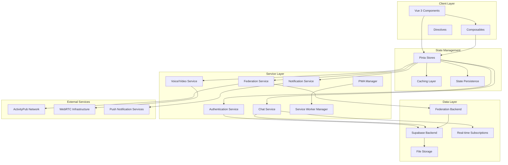
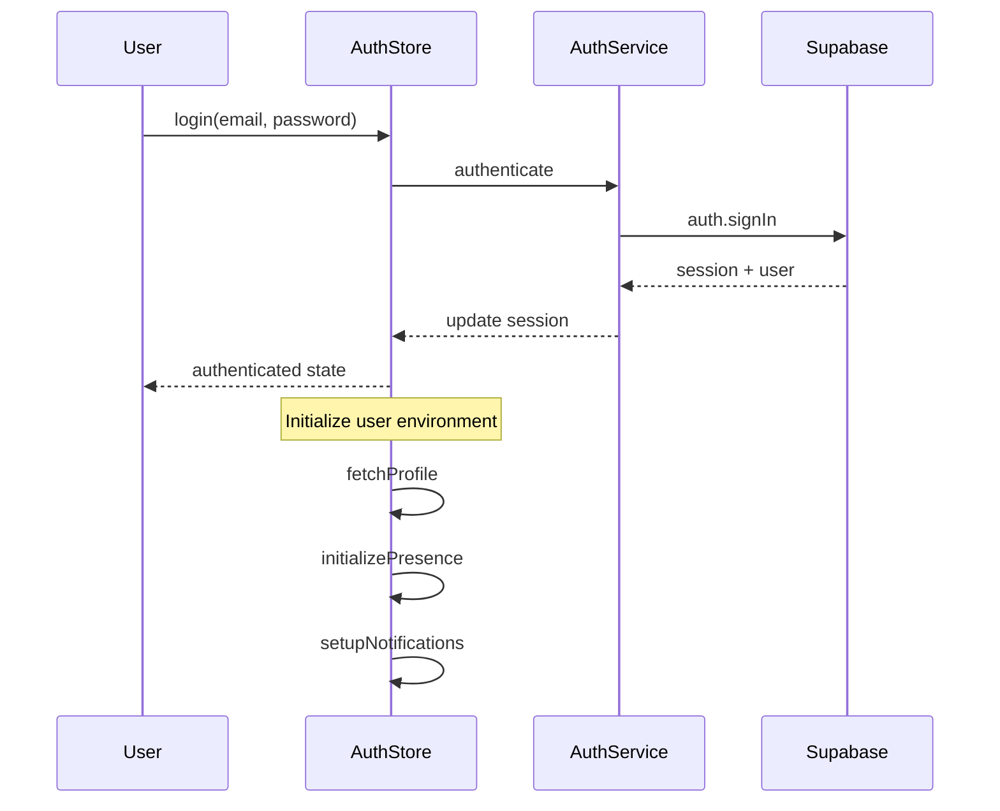
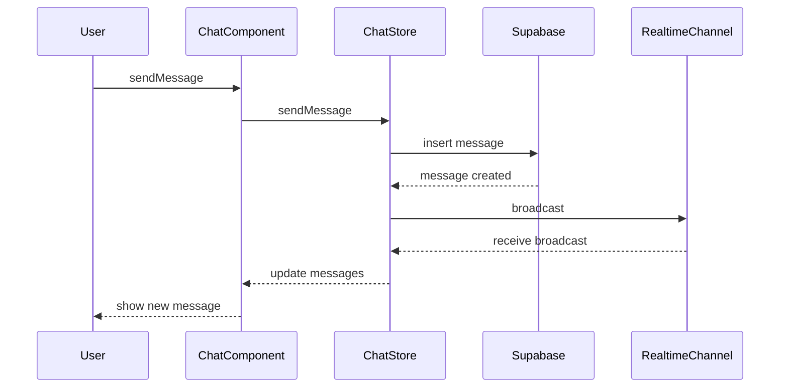
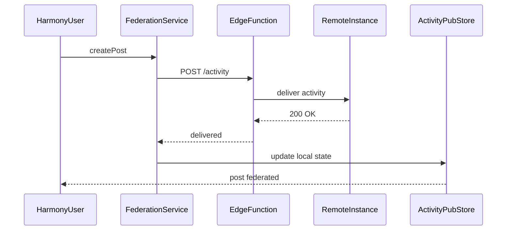

# Architecture Overview

## System Architecture

Harmony separates client, state, services, and data into the layers below:



## Core Architectural Principles

### 1. **Layered Architecture**
- **Presentation Layer**: Vue 3 components with TypeScript
- **Business Logic Layer**: Services and composables
- **Data Access Layer**: Pinia stores with Supabase integration
- **Infrastructure Layer**: Supabase backend services

### 2. **Domain-Driven Design**
- Clear domain boundaries (Chat, Federation, Voice, etc.)
- Domain-specific services and stores
- Shared utilities and types

### 3. **Event-Driven Architecture**
- Real-time subscriptions for live updates
- Event-based communication between components
- Reactive state management with Pinia

### 4. **Microservice-like Structure**
- Independent, focused services
- Loose coupling between domains
- Clear interfaces and contracts

## Key Components Flow

### Authentication Flow


### Chat Message Flow


### Federation Flow


## Directory Structure & Responsibilities

### `/src/components/`
Organized by feature and reusability:

```
components/
├── common/           # Shared UI components
│   ├── Avatar.vue
│   ├── Icon.vue
│   ├── Modal.vue
│   └── Button.vue
├── chat/            # Chat-specific components
│   ├── ChatComponent.vue
│   ├── MessageInput.vue
│   └── MessageDisplay.vue
├── voice/           # Voice/video components
│   ├── VoiceChannel.vue
│   └── VideoCall.vue
├── federation/      # ActivityPub components
│   ├── MonyPost.vue
│   └── MonyComposer.vue
└── settings/        # Settings and configuration
    ├── UserSettings.vue
    └── ServerSettings.vue
```

### `/src/stores/`
Domain-specific state management:

- **`auth.ts`**: Authentication and user session
- **`useChat.ts`**: Chat messages and channels
- **`useDM.ts`**: Direct messaging
- **`useActivityPub.ts`**: Federation and social features
- **`useNotification.ts`**: Notification system
- **`useTheme.ts`**: Theme and UI preferences

### `/src/services/`
Business logic and external integrations:

- **`professionalPresenceService.ts`**: User presence tracking
- **`unifiedContentProcessing.ts`**: Message and content processing
- **`PWAManager.ts`**: Progressive Web App features
- **`ServiceWorkerManager.ts`**: Background tasks and notifications
- **`AudioThemeService.ts`**: Audio theme system

### `/src/composables/`
Reusable composition functions:

- **`useUserData.ts`**: User data management
- **`useLayoutState.ts`**: UI layout state
- **`useProfessionalPresence.ts`**: Presence system interface
- **`useApplicationState.ts`**: App initialization state

## Data Flow Patterns

### 1. **Reactive State Pattern**
```typescript
// Store updates automatically trigger UI updates
const chatStore = useChatStore()
const messages = computed(() => chatStore.currentChannelMessages)

// Real-time updates flow through the same reactive system
chatStore.subscribeToChannel(channelId)
```

### 2. **Service Layer Pattern**
```typescript
// Components use stores, stores use services
export const useChatStore = defineStore('chat', {
  actions: {
    async sendMessage(content: string) {
      // Service handles business logic
      const message = await services.messages.sendMessage(content)
      // Store manages state
      this.messages.push(message)
    }
  }
})
```

### 3. **Event-Driven Updates**
```typescript
// Real-time subscriptions update state automatically
supabase
  .channel('messages')
  .on('postgres_changes', { event: 'INSERT' }, payload => {
    chatStore.addMessage(payload.new)
  })
  .subscribe()
```

## Technology Stack

### Frontend
- **Vue 3**: Composition API, TypeScript support
- **Pinia**: State management with TypeScript
- **Vue Router**: Client-side routing
- **Vite**: Build tool and development server

### Backend
- **Supabase**: PostgreSQL database with real-time features
- **Federation Backend**: Node.js backend for ActivityPub federation
- **BullMQ**: Redis-backed job queue for federation processing
- **Redis**: Caching, presence, typing indicators, rate limiting, and BullMQ persistence
- **Row Level Security**: Database-level security policies
- **Storage Buckets**: File and media storage

### Desktop
- **Tauri**: Cross-platform desktop app wrapper
- **WebView**: Native web rendering

### PWA Features
- **Service Worker**: Background sync and notifications
- **Web App Manifest**: Installation and app-like behavior
- **IndexedDB**: Client-side caching

## Performance Considerations

### 1. **Lazy Loading**
- Route-based code splitting
- Component-level lazy loading
- Dynamic imports for large features

### 2. **Efficient Caching**
- Two-tier caching: L1 in-memory (NodeCache) + L2 Redis
- User profile caching with TTL (5 min) via `ProfileCacheService`
- Message pagination and caching
- Asset caching via service worker

### 3. **Real-time Optimization**
- Consolidated `user:{profileId}` broadcast channels for notifications and unread counts
- Redis-backed presence with heartbeat TTL and invisible user filtering
- Redis-backed typing indicators with Pub/Sub
- Context-aware Supabase Realtime subscriptions (only for active views)
- Message debouncing and batching
- Efficient WebRTC connection management

### 4. **Job Processing**
- BullMQ (Redis) for federation job processing with automatic retries, backoff, and persistence
- LISTEN/NOTIFY bridge: DB triggers fire `pg_notify` which is bridged into BullMQ queues instantly
- Bull Board dashboard (standalone Docker container, `--profile monitoring`) for queue monitoring
- Repeatable scheduled maintenance jobs (keygen sweep, orphan cleanup)
- Periodic sweep safety net for missed DB trigger events

### 5. **Bundle Optimization**
- Tree shaking for unused code
- Dynamic imports for conditional features
- Optimized asset loading

## Security Architecture

### 1. **Authentication & Authorization**
- JWT-based session management
- Row Level Security policies
- Role-based access control

### 2. **Data Protection**
- Input sanitization and validation
- XSS protection
- CSRF protection via Supabase

### 3. **Federation Security**
- HTTP signature validation
- Actor verification
- Rate limiting and spam protection

## Scalability Design

### 1. **Horizontal Scaling**
- Stateless service design - federation workers scale by adding containers
- Database connection pooling via Supavisor (`DATABASE_POOL_URL`, port 6543)
- Redis-backed distributed rate limiting, caching, and job queues (BullMQ)
- CDN for asset delivery

### 2. **Voice/Video Scaling (LiveKit)**
- LiveKit supports multi-node clustering via Redis
- Additional LiveKit instances pointed at the same Redis auto-coordinate room routing
- UDP mux (single port 7882) handles all WebRTC media; scaling limits are CPU/bandwidth, not port count
- `webrtc/docker-compose.yml` runs LiveKit independently for dedicated-VPS deployments

### 3. **Modular Architecture**
- Feature-based code organization
- Plugin-like federation system
- Extensible service layer
- Federation server/worker split for independent scaling

### 4. **Performance Monitoring**
- Bull Board dashboard for BullMQ job queue monitoring
- Health endpoint with queue stats
- Error tracking and reporting
