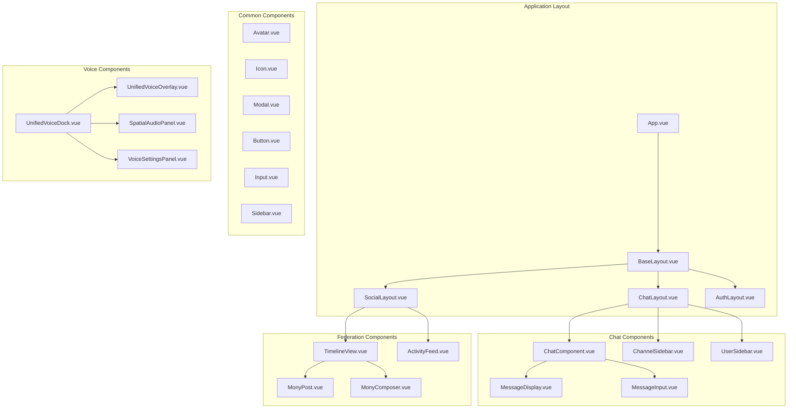

# Component Documentation

## Component Hierarchy

This document provides a comprehensive overview of Harmony's component architecture, organized by feature domain and reusability.

## Component Architecture



## Component Categories

### 1. Layout Components (`/src/layouts/`)

#### BaseLayout.vue
**Purpose**: Root application layout coordinator
**Responsibilities**:
- Global app initialization
- Layout state management
- Mobile gesture handling
- Authentication flow coordination

```typescript
interface BaseLayoutProps {
  // No props - manages global state
}

interface BaseLayoutEmits {
  showPublicServers: []
  switchToActivityPub: []
  switchToChat: []
}
```

#### ChatLayout.vue
**Purpose**: Chat-specific layout container
**Responsibilities**:
- Chat mode UI structure
- Server/channel sidebar management
- User list sidebar
- Voice dock integration

#### SocialLayout.vue  
**Purpose**: ActivityPub/Social mode layout
**Responsibilities**:
- Social timeline layout
- Federation-specific sidebars
- Social navigation

### 2. Common/Shared Components (`/src/components/common/`)

#### Avatar.vue
**Purpose**: User avatar display with presence indicators
**Features**:
- Presence status overlay
- Fallback avatar handling
- Size variants
- Click interactions

```typescript
interface AvatarProps {
  user: User | Profile
  size?: 'xs' | 'sm' | 'md' | 'lg' | 'xl'
  showPresence?: boolean
  clickable?: boolean
}
```

#### Icon.vue
**Purpose**: Unified icon system
**Features**:
- SVG icon library
- Dynamic sizing
- Theme-aware colors
- Accessibility support

#### Modal.vue
**Purpose**: Reusable modal container
**Features**:
- Backdrop click handling
- Escape key support
- Focus management
- Animation transitions

### 3. Chat Components (`/src/components/chat/`)

#### ChatComponent.vue
**Purpose**: Main chat interface
**Responsibilities**:
- Message display and pagination
- Message input handling
- File upload integration
- Emoji picker integration

```typescript
interface ChatComponentProps {
  serverId?: string
  channelId?: string
  isDM?: boolean
  conversationId?: string
}
```

#### MessageDisplay.vue
**Purpose**: Message display container
**Features**:
- Virtual scrolling for performance
- Message grouping by author
- Reply threading
- Reaction display

#### MessageInput.vue
**Purpose**: Message composition interface
**Features**:
- Rich text editing
- Mention autocomplete
- Emoji picker integration
- File attachment support

### 4. Voice/Video Components (`/src/components/voice/`)

#### UnifiedVoiceDock.vue
**Purpose**: Voice channel control panel
**Features**:
- Mute/deafen controls
- Video toggle
- Screen sharing
- Spatial audio controls

#### SpatialAudioPanel.vue
**Purpose**: Spatial audio positioning interface
**Features**:
- 2D user positioning grid
- Drag-and-drop positioning
- Audio distance visualization
- Settings panel

### 5. Federation Components (`/src/components/federation/`)

#### MonyPost.vue
**Purpose**: ActivityPub post display
**Features**:
- Rich content rendering
- Interaction buttons (like, boost, reply)
- Media attachment display
- Threading support

#### MonyComposer.vue
**Purpose**: ActivityPub post creation
**Features**:
- Rich text composition
- Media attachment
- Visibility settings
- Character counting

## Component Communication Patterns

### 1. Props Down, Events Up
```typescript
// Parent passes data down via props
<MessageList :messages="messages" :loading="loading" />

// Child emits events up to parent
<MessageInput @send-message="handleSendMessage" />
```

### 2. Store-Based Communication
```typescript
// Components access shared state via stores
const chatStore = useChatStore()
const messages = computed(() => chatStore.currentChannelMessages)
```

### 3. Event Bus for Cross-Component Communication
```typescript
// Global events for loosely coupled components
eventBus.emit('voice-state-changed', { muted: true })
eventBus.on('voice-state-changed', handleVoiceStateChange)
```

## Styling Conventions

### 1. CSS Module Pattern
```vue
<style module>
.container {
  /* Component-specific styles */
}
</style>
```

### 2. Design System Variables
```css
/* Use design system tokens */
background-color: var(--background-primary);
color: var(--text-primary);
border-radius: var(--radius-md);
```

### 3. Component Variants
```typescript
interface ButtonProps {
  variant?: 'primary' | 'secondary' | 'danger'
  size?: 'sm' | 'md' | 'lg'
}
```

## Testing Strategies

### 1. Unit Tests
```typescript
import { mount } from '@vue/test-utils'
import Avatar from '@/components/common/Avatar.vue'

describe('Avatar Component', () => {
  it('renders user avatar correctly', () => {
    const wrapper = mount(Avatar, {
      props: { user: mockUser }
    })
    expect(wrapper.find('img').exists()).toBe(true)
  })
})
```

### 2. Integration Tests
```typescript
// Test component interactions with stores
import { createTestingPinia } from '@pinia/testing'

const wrapper = mount(ChatComponent, {
  global: {
    plugins: [createTestingPinia()]
  }
})
```

## Performance Optimizations

### 1. Lazy Loading
```typescript
// Route-level code splitting
const ChatLayout = () => import('@/layouts/ChatLayout.vue')
```

### 2. Virtual Scrolling
```typescript
// For large lists (messages, users)
<VirtualList
  :items="messages"
  :item-height="50"
  :container-height="400"
/>
```

### 3. Memoization
```typescript
// Expensive computations
const processedMessages = computed(() => {
  return expensiveMessageProcessing(messages.value)
})
```

## Development Guidelines

### 1. Component Naming
- Use PascalCase for component files
- Use descriptive, feature-based names
- Prefix domain-specific components (ChatMessage, VoicePanel)

### 2. Props Interface
```typescript
// Always define explicit prop interfaces
interface ComponentProps {
  title: string
  optional?: boolean
  callback?: (data: any) => void
}

const props = defineProps<ComponentProps>()
```

### 3. Emit Events
```typescript
// Define typed emit events
interface ComponentEmits {
  (e: 'update', value: string): void
  (e: 'close'): void
}

const emit = defineEmits<ComponentEmits>()
```

### 4. Composition Pattern
```typescript
// Extract reusable logic into composables
const { loading, error, fetchData } = useAsyncData()
```

## Future Component Additions

### Planned Components
- **RichTextEditor**: Advanced text editing with formatting
- **FileManager**: File upload and management interface
- **NotificationCenter**: Centralized notification display
- **ThemeCustomizer**: Visual theme editing interface
- **PluginManager**: Extension and plugin management

### Extension Points
- **Component Slots**: For customizable content areas
- **Plugin Hooks**: For third-party component integration
- **Theme Variants**: For different visual styles
- **Accessibility Options**: For enhanced accessibility features
