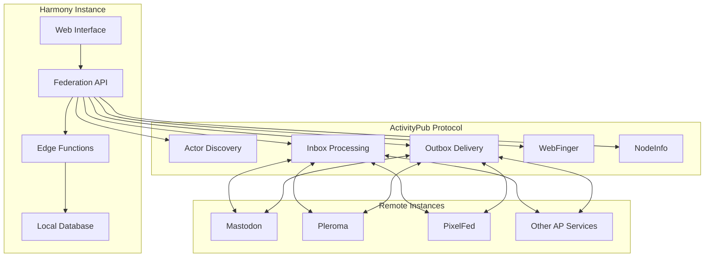

# Federation Documentation

## 📋 Overview

Harmony implements ActivityPub federation, enabling cross-platform communication with other federated platforms like Mastodon, Pleroma, and other ActivityPub-compatible services. This document covers the federation architecture, implementation details, and developer guidelines.

## 🌐 ActivityPub Implementation



## 🏗️ Federation Architecture

### Core Components

#### 1. Actor System
Every user and server in Harmony is represented as an ActivityPub Actor:

```typescript
interface ActivityPubActor {
  "@context": "https://www.w3.org/ns/activitystreams"
  type: "Person" | "Service" | "Group"
  id: string // https://har.mony.lol/users/username
  preferredUsername: string
  name: string
  summary?: string
  inbox: string
  outbox: string
  followers: string
  following: string
  publicKey: {
    id: string
    owner: string
    publicKeyPem: string
  }
  icon?: {
    type: "Image"
    url: string
  }
  endpoints?: {
    sharedInbox: string
  }
}
```

#### 2. Activity Types
Harmony supports the following ActivityPub activities:

```typescript
type SupportedActivityTypes = 
  | 'Create'    // Creating posts, messages
  | 'Update'    // Editing content
  | 'Delete'    // Removing content
  | 'Follow'    // Following users
  | 'Accept'    // Accepting follow requests
  | 'Reject'    // Rejecting follow requests
  | 'Undo'      // Undoing previous activities
  | 'Like'      // Favoriting posts
  | 'Announce'  // Boosting/reblogging
  | 'Block'     // Blocking users
  | 'Flag'      // Reporting content
```

#### 3. Object Types
Various content types are federated:

```typescript
type SupportedObjectTypes =
  | 'Note'      // Short posts (like tweets)
  | 'Article'   // Long-form content
  | 'Image'     // Image posts
  | 'Video'     // Video content
  | 'Audio'     // Audio content
  | 'Page'      // Web pages
  | 'Event'     // Events and announcements
  | 'Question'  // Polls and questions
```

## 🔧 Edge Functions Implementation

### WebFinger Endpoint (`/webfinger`)
**Purpose**: Actor discovery and verification

```typescript
// supabase/functions/webfinger/index.ts
export default async function webfinger(req: Request): Promise<Response> {
  const url = new URL(req.url)
  const resource = url.searchParams.get('resource')
  
  if (!resource || !resource.startsWith('acct:')) {
    return new Response('Invalid resource parameter', { status: 400 })
  }
  
  const [username, domain] = resource.replace('acct:', '').split('@')
  
  if (domain !== INSTANCE_DOMAIN) {
    return new Response('User not found', { status: 404 })
  }
  
  const user = await getUser(username)
  if (!user) {
    return new Response('User not found', { status: 404 })
  }
  
  return new Response(JSON.stringify({
    subject: resource,
    links: [
      {
        rel: 'self',
        type: 'application/activity+json',
        href: `https://${INSTANCE_DOMAIN}/users/${username}`
      }
    ]
  }), {
    headers: { 'Content-Type': 'application/jrd+json' }
  })
}
```

### Actor Endpoint (`/users/{username}`)
**Purpose**: Serve actor profiles in ActivityPub format

```typescript
// supabase/functions/actor/index.ts
export default async function actor(req: Request): Promise<Response> {
  const url = new URL(req.url)
  const username = url.pathname.split('/').pop()
  
  const user = await getUser(username)
  if (!user) {
    return new Response('Actor not found', { status: 404 })
  }
  
  const actor: ActivityPubActor = {
    '@context': 'https://www.w3.org/ns/activitystreams',
    type: 'Person',
    id: `https://${INSTANCE_DOMAIN}/users/${username}`,
    preferredUsername: username,
    name: user.display_name || username,
    summary: user.bio || '',
    inbox: `https://${INSTANCE_DOMAIN}/users/${username}/inbox`,
    outbox: `https://${INSTANCE_DOMAIN}/users/${username}/outbox`,
    followers: `https://${INSTANCE_DOMAIN}/users/${username}/followers`,
    following: `https://${INSTANCE_DOMAIN}/users/${username}/following`,
    publicKey: {
      id: `https://${INSTANCE_DOMAIN}/users/${username}#main-key`,
      owner: `https://${INSTANCE_DOMAIN}/users/${username}`,
      publicKeyPem: user.public_key
    },
    icon: user.avatar ? {
      type: 'Image',
      url: user.avatar
    } : undefined,
    endpoints: {
      sharedInbox: `https://${INSTANCE_DOMAIN}/inbox`
    }
  }
  
  return new Response(JSON.stringify(actor), {
    headers: { 'Content-Type': 'application/activity+json' }
  })
}
```

### Inbox Endpoint (`/inbox`)
**Purpose**: Receive and process incoming activities

```typescript
// supabase/functions/inbox/index.ts
export default async function inbox(req: Request): Promise<Response> {
  if (req.method !== 'POST') {
    return new Response('Method not allowed', { status: 405 })
  }
  
  // Verify HTTP signature
  const signature = req.headers.get('signature')
  if (!signature) {
    return new Response('Missing signature', { status: 401 })
  }
  
  const activity = await req.json()
  
  // Validate activity structure
  if (!isValidActivity(activity)) {
    return new Response('Invalid activity', { status: 400 })
  }
  
  try {
    // Verify signature
    await verifyHTTPSignature(req, activity)
    
    // Process activity based on type
    await processActivity(activity)
    
    return new Response('Accepted', { status: 202 })
  } catch (error) {
    console.error('Error processing activity:', error)
    return new Response('Internal server error', { status: 500 })
  }
}

async function processActivity(activity: Activity): Promise<void> {
  switch (activity.type) {
    case 'Create':
      await handleCreateActivity(activity)
      break
    case 'Follow':
      await handleFollowActivity(activity)
      break
    case 'Accept':
      await handleAcceptActivity(activity)
      break
    case 'Like':
      await handleLikeActivity(activity)
      break
    case 'Announce':
      await handleAnnounceActivity(activity)
      break
    case 'Undo':
      await handleUndoActivity(activity)
      break
    case 'Delete':
      await handleDeleteActivity(activity)
      break
    default:
      console.warn('Unsupported activity type:', activity.type)
  }
}
```

### NodeInfo Endpoint (`/.well-known/nodeinfo`)
**Purpose**: Provide instance metadata and statistics

```typescript
// supabase/functions/nodeinfo/index.ts
export default async function nodeinfo(req: Request): Promise<Response> {
  const url = new URL(req.url)
  
  if (url.pathname === '/.well-known/nodeinfo') {
    // NodeInfo discovery
    return new Response(JSON.stringify({
      links: [
        {
          rel: 'http://nodeinfo.diaspora.software/ns/schema/2.0',
          href: `https://${INSTANCE_DOMAIN}/nodeinfo/2.0`
        }
      ]
    }), {
      headers: { 'Content-Type': 'application/json' }
    })
  }
  
  if (url.pathname === '/nodeinfo/2.0') {
    // Actual NodeInfo
    const stats = await getInstanceStats()
    
    return new Response(JSON.stringify({
      version: '2.0',
      software: {
        name: 'harmony',
        version: '1.0.0'
      },
      protocols: ['activitypub'],
      services: {
        outbound: [],
        inbound: []
      },
      usage: {
        users: {
          total: stats.totalUsers,
          activeMonth: stats.activeUsersMonth,
          activeHalfyear: stats.activeUsersHalfYear
        },
        localPosts: stats.localPosts,
        localComments: stats.localComments
      },
      openRegistrations: true,
      metadata: {
        description: 'The first federated Discord-like platform',
        features: [
          'real-time-chat',
          'voice-channels',
          'spatial-audio',
          'activitypub-federation'
        ]
      }
    }), {
      headers: { 'Content-Type': 'application/json' }
    })
  }
  
  return new Response('Not found', { status: 404 })
}
```

## 🔐 HTTP Signature Verification

### Signature Generation
```typescript
async function generateHTTPSignature(
  privateKey: string,
  keyId: string,
  method: string,
  path: string,
  headers: Record<string, string>,
  body?: string
): Promise<string> {
  const date = new Date().toUTCString()
  const host = new URL(path).host
  
  headers['date'] = date
  headers['host'] = host
  
  if (body) {
    headers['digest'] = `SHA-256=${await generateSHA256Digest(body)}`
  }
  
  const headersToSign = ['(request-target)', 'host', 'date']
  if (body) headersToSign.push('digest')
  
  const signingString = headersToSign
    .map(header => {
      if (header === '(request-target)') {
        return `(request-target): ${method.toLowerCase()} ${new URL(path).pathname}`
      }
      return `${header}: ${headers[header]}`
    })
    .join('\n')
  
  const signature = await signString(signingString, privateKey)
  
  return `keyId="${keyId}",headers="${headersToSign.join(' ')}",signature="${signature}"`
}
```

### Signature Verification
```typescript
async function verifyHTTPSignature(request: Request, body: any): Promise<boolean> {
  const signature = request.headers.get('signature')
  if (!signature) return false
  
  const signatureParams = parseSignatureHeader(signature)
  const keyId = signatureParams.keyId
  
  // Fetch public key
  const publicKey = await fetchPublicKey(keyId)
  if (!publicKey) return false
  
  // Reconstruct signing string
  const signingString = reconstructSigningString(request, signatureParams.headers)
  
  // Verify signature
  return await verifySignature(signingString, signatureParams.signature, publicKey)
}
```

## 🔄 Activity Processing

### Create Activity Handler
```typescript
async function handleCreateActivity(activity: CreateActivity): Promise<void> {
  const object = activity.object
  
  if (object.type === 'Note') {
    // Handle federated post
    await createFederatedPost({
      id: object.id,
      content: object.content,
      actor: activity.actor,
      published: object.published,
      to: object.to,
      cc: object.cc,
      inReplyTo: object.inReplyTo
    })
  }
  
  // Send notifications to mentioned users
  if (object.tag) {
    for (const tag of object.tag) {
      if (tag.type === 'Mention') {
        await sendMentionNotification(tag.href, activity)
      }
    }
  }
}
```

### Follow Activity Handler
```typescript
async function handleFollowActivity(activity: FollowActivity): Promise<void> {
  const follower = activity.actor
  const followee = activity.object
  
  // Check if followee is local user
  const localUser = await getLocalUserByActorId(followee)
  if (!localUser) return
  
  // Create follow request
  const followRequest = await createFollowRequest({
    follower_id: follower,
    followee_id: localUser.id,
    activity_id: activity.id
  })
  
  // Auto-accept or require approval based on user settings
  if (localUser.auto_accept_follows) {
    await acceptFollowRequest(followRequest.id)
  } else {
    await notifyFollowRequest(localUser.id, followRequest)
  }
}
```

### Like Activity Handler
```typescript
async function handleLikeActivity(activity: LikeActivity): Promise<void> {
  const actor = activity.actor
  const object = activity.object
  
  // Find local post
  const post = await getLocalPostByActivityId(object)
  if (!post) return
  
  // Create like record
  await createFederatedLike({
    post_id: post.id,
    actor_id: actor,
    activity_id: activity.id
  })
  
  // Send notification to post author
  await sendLikeNotification(post.author_id, actor, post.id)
}
```

## 🚀 Delivery System

### Activity Delivery
```typescript
class ActivityDeliveryService {
  async deliverActivity(activity: Activity, recipients: string[]): Promise<void> {
    const deliveryPromises = recipients.map(async (recipient) => {
      try {
        await this.deliverToInbox(activity, recipient)
        await this.recordDeliverySuccess(activity.id, recipient)
      } catch (error) {
        await this.recordDeliveryFailure(activity.id, recipient, error)
        await this.scheduleRetry(activity.id, recipient)
      }
    })
    
    await Promise.allSettled(deliveryPromises)
  }
  
  private async deliverToInbox(activity: Activity, recipient: string): Promise<void> {
    // Get recipient's inbox URL
    const inboxUrl = await this.getInboxUrl(recipient)
    
    // Sign request
    const signature = await this.generateSignature(activity, inboxUrl)
    
    // Send HTTP POST request
    const response = await fetch(inboxUrl, {
      method: 'POST',
      headers: {
        'Content-Type': 'application/activity+json',
        'Signature': signature,
        'Date': new Date().toUTCString()
      },
      body: JSON.stringify(activity)
    })
    
    if (!response.ok) {
      throw new Error(`Delivery failed: ${response.status} ${response.statusText}`)
    }
  }
  
  private async scheduleRetry(activityId: string, recipient: string): Promise<void> {
    // Exponential backoff retry schedule
    const retryDelays = [1, 5, 15, 60, 300, 1800] // minutes
    
    for (const delay of retryDelays) {
      await this.scheduleDelayedRetry(activityId, recipient, delay)
    }
  }
}
```

## 📊 Federation Statistics

### Instance Statistics
```typescript
interface FederationStats {
  // Local statistics
  totalUsers: number
  activeUsersDay: number
  activeUsersWeek: number
  activeUsersMonth: number
  localPosts: number
  localComments: number
  
  // Federation statistics
  knownInstances: number
  connectedInstances: number
  blockedInstances: number
  totalFederatedUsers: number
  totalFederatedPosts: number
  
  // Activity statistics
  inboxActivitiesDay: number
  outboxActivitiesDay: number
  deliverySuccessRate: number
  averageDeliveryTime: number
}

async function getInstanceStats(): Promise<FederationStats> {
  const [
    userStats,
    postStats,
    federationStats,
    activityStats
  ] = await Promise.all([
    getUserStatistics(),
    getPostStatistics(),
    getFederationStatistics(),
    getActivityStatistics()
  ])
  
  return {
    ...userStats,
    ...postStats,
    ...federationStats,
    ...activityStats
  }
}
```

## 🛡️ Security Considerations

### 1. Input Validation
```typescript
function validateActivity(activity: any): boolean {
  // Check required fields
  if (!activity.type || !activity.actor || !activity.id) {
    return false
  }
  
  // Validate actor URI format
  if (!isValidActorUri(activity.actor)) {
    return false
  }
  
  // Check activity type is supported
  if (!SUPPORTED_ACTIVITY_TYPES.includes(activity.type)) {
    return false
  }
  
  // Validate object if present
  if (activity.object && !validateObject(activity.object)) {
    return false
  }
  
  return true
}
```

### 2. Rate Limiting
```typescript
class FederationRateLimiter {
  private readonly limits = new Map<string, RateLimit>()
  
  async checkRateLimit(actorId: string): Promise<boolean> {
    const now = Date.now()
    const windowSize = 3600000 // 1 hour
    const maxRequests = 100
    
    const limit = this.limits.get(actorId)
    
    if (!limit) {
      this.limits.set(actorId, {
        count: 1,
        resetTime: now + windowSize
      })
      return true
    }
    
    if (now > limit.resetTime) {
      limit.count = 1
      limit.resetTime = now + windowSize
      return true
    }
    
    if (limit.count >= maxRequests) {
      return false
    }
    
    limit.count++
    return true
  }
}
```

### 3. Content Filtering
```typescript
async function filterContent(content: string, actor: string): Promise<string> {
  // Check for blocked instances
  const domain = new URL(actor).hostname
  if (await isInstanceBlocked(domain)) {
    throw new Error('Content from blocked instance')
  }
  
  // Sanitize HTML content
  const sanitized = DOMPurify.sanitize(content, {
    ALLOWED_TAGS: ['p', 'br', 'a', 'strong', 'em', 'ul', 'ol', 'li'],
    ALLOWED_ATTR: ['href', 'rel']
  })
  
  // Check for spam patterns
  if (await isSpamContent(sanitized)) {
    throw new Error('Spam content detected')
  }
  
  return sanitized
}
```

## 🔧 Administration Tools

### Instance Management
```typescript
interface InstanceManagement {
  // Block/unblock instances
  blockInstance(domain: string, reason: string): Promise<void>
  unblockInstance(domain: string): Promise<void>
  
  // Manage federation settings
  updateFederationSettings(settings: FederationSettings): Promise<void>
  
  // Monitor federation health
  getFederationHealth(): Promise<FederationHealth>
  
  // Manual instance discovery
  discoverInstance(domain: string): Promise<InstanceInfo>
  
  // Activity monitoring
  getActivityLog(filters: ActivityLogFilters): Promise<ActivityLogEntry[]>
}
```

### Moderation Tools
```typescript
interface ModerationTools {
  // Content moderation
  reviewReportedContent(reportId: string): Promise<ReportedContent>
  moderateContent(contentId: string, action: ModerationAction): Promise<void>
  
  // User moderation
  suspendFederatedUser(actorId: string, reason: string): Promise<void>
  unsuspendFederatedUser(actorId: string): Promise<void>
  
  // Domain-level moderation
  silenceInstance(domain: string): Promise<void>
  limitInstance(domain: string, limits: InstanceLimits): Promise<void>
}
```

## 📈 Future Enhancements

### Planned Features
1. **Server-to-Server Messaging**: Direct server communication
2. **Advanced Content Types**: Polls, events, rich media
3. **Improved Discovery**: Better instance and user discovery
4. **Performance Optimizations**: Caching, batch processing
5. **Enhanced Security**: Advanced spam detection, security monitoring
6. **Federated E2EE — Phase 1 (Harmony ↔ Harmony)**: Extend Harmony's existing Megolm-style encryption to work across Harmony instances. Adds device-key publishing on AP Actors, an `EncryptedMessage` activity type, Olm-style pairwise key sharing between remote devices, and cross-user verification UX. Doesn't depend on any external standard. See [`E2EE_IMPLEMENTATION.md` → Roadmap: Federated E2EE](./E2EE_IMPLEMENTATION.md#roadmap-federated-e2ee).
7. **Federated E2EE — Phase 2 (Harmony ↔ other AP clients)**: Either implement the [MLS-on-ActivityPub draft](https://swicg.github.io/activitypub-e2ee/mls) for interop with Sup and future MLS-AP clients, or publish Harmony's Phase-1 protocol as a [FEP](https://codeberg.org/fediverse/fep) for ecosystem adoption. Phase 1 is the prerequisite either way.

### Experimental Features
1. **Nostr Protocol Support**: Dual-protocol support
2. **Decentralized Identity**: DID-based user identity
3. **Blockchain Integration**: Optional blockchain features
4. **AI-Powered Moderation**: Automated content moderation

### Already Shipped
- **Cross-Instance Voice**: federated voice channels via LiveKit (`allow_federated_voice` setting, `federated_voice_calls` table) — see `federation-backend/src/services/LiveKitService.ts`.
