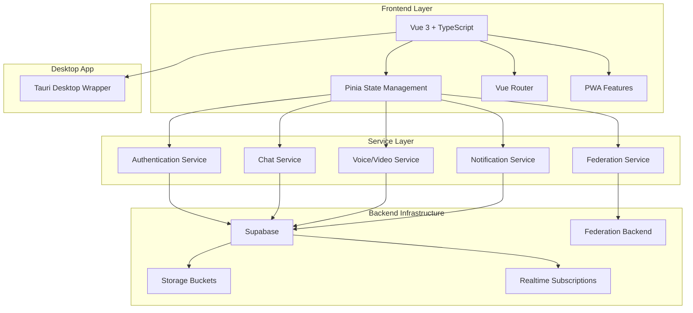

# 📚 Harmony Documentation System

## Quick Start - VitePress Documentation

Your modern documentation system is now ready! 

```bash
npm run docs:dev
```

Visit: `http://localhost:3001` (set in `docs/.vitepress/config.ts`; do not run at the same time as `federation-backend`, which also uses port 3001 unless you change one of the ports).

---

## How documentation is built

| What | Where to edit | Regenerate |
|------|----------------|------------|
| Guide (hand-written) | `docs-source/guide/` at repo root | `npm run docs:generate-guide` → writes `docs/guide/` |
| API reference | Generated from TypeScript | `npm run docs:generate-api` |
| Components | Generated from Vue | `npm run docs:generate-components` |
| Typedoc bundle | `typedoc.json` | `npm run docs:generate` |
| VitePress nav/sidebar | After changing generated trees | `npm run docs:sync-config` |

Full pipeline (guides + API + components + sync + typedoc + static build): `npm run docs:generate-all`. Setup details: [VITEPRESS_SETUP.md](./VITEPRESS_SETUP.md).

**Do not edit `docs/guide/` by hand** - change `docs-source/guide/` and run `docs:generate-guide`.

---

## Documentation Index

- [Architecture Overview](./ARCHITECTURE.md)
- [Development Guide](./DEVELOPMENT.md)
- [API Reference](./API_REFERENCE.md)
- [Federation System](./FEDERATION.md)
- [Component Library](./COMPONENTS.md)
- [State Management](./STATE_MANAGEMENT.md)
- [Service Layer](./SERVICES.md)
- [E2EE Implementation](./E2EE_IMPLEMENTATION.md)
- [Bot API](./BOT_API.md)
- [Plugin System](./PLUGIN_SYSTEM.md)
- [ActivityPub Extensions](./ACTIVITYPUB_EXTENSIONS.md)
- [Self-Hosting Guide](./HOW_TO_SELF_HOST.md)
- [Push Notifications](./PUSH_NOTIFICATIONS.md)
- [OpenStatus Setup](./OPENSTATUS_SETUP.md)

## 🏗️ Quick Architecture Overview

Harmony is a Discord-like chat application with ActivityPub federation support, built with modern web technologies:



## 🚀 Quick Start (app)

```bash
# Install dependencies
npm install

# Start development server
npm run dev

# Build for production
npm run build

# Desktop app (Tauri)
npm run tauri:dev
```

You can use **Bun** instead of npm if you prefer (`bun install`, `bun run dev`, etc.); the repo’s scripts are written for npm.

## 📁 Project Structure

```
harmony/
├── src/
│   ├── components/        # Vue components organized by feature
│   ├── layouts/          # Application layout components
│   ├── views/            # Route-level components
│   ├── stores/           # Pinia state stores
│   ├── services/         # Business logic services
│   ├── composables/      # Vue composition functions
│   ├── utils/            # Utility functions
│   ├── types/            # TypeScript type definitions
│   └── assets/           # Static assets and styles
├── docs/                 # VitePress site + generated API/component docs
├── docs-source/          # Source for guide pages (see “How documentation is built” above)
├── db_schema/           # Database schema and migrations
├── federation-backend/  # Node.js ActivityPub backend
├── bot-gateway/         # Bot API gateway
├── src-tauri/           # Tauri desktop app configuration
└── public/              # Public assets
```

## 🎯 Core Features

- **Real-time Chat**: Discord-like servers, channels, and DMs
- **Voice & Video**: WebRTC-based communication with spatial audio
- **ActivityPub Federation**: Cross-platform social networking
- **Progressive Web App**: Mobile-first design with offline support
- **Desktop App**: Cross-platform desktop application via Tauri
- **Rich Media**: File uploads, emojis, reactions, and embeds
- **Advanced UI**: Dark/light themes, audio themes, haptic feedback

## 🔗 External Links

- [Live Application](https://har.mony.lol)
- [GitHub Repository](https://github.com/y4my4my4m/harmony)
- [Supabase Dashboard](https://supabase.com/dashboard)
- [Tauri Documentation](https://tauri.app/)
