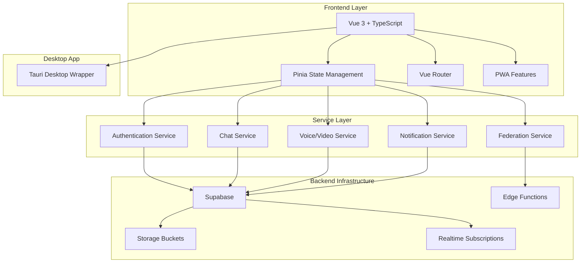

# 📚 Harmony Documentation System

## Quick Start - VitePress Documentation

Your modern documentation system is now ready! 

```bash
npm run docs:dev
```

Visit: `http://localhost:3001`

---

## 📋 Legacy Documentation Index

- [Architecture Overview](./ARCHITECTURE.md)
- [Getting Started](./GETTING_STARTED.md)
- [Development Guide](./DEVELOPMENT.md)
- [API Reference](./API_REFERENCE.md)
- [Database Schema](./DATABASE.md)
- [Federation System](./FEDERATION.md)
- [Component Library](./COMPONENTS.md)
- [State Management](./STATE_MANAGEMENT.md)
- [Service Layer](./SERVICES.md)
- [Security](./SECURITY.md)
- [Performance](./PERFORMANCE.md)
- [Deployment](./DEPLOYMENT.md)

## 🏗️ Quick Architecture Overview

Harmony is a Discord-like chat application with ActivityPub federation support, built with modern web technologies:


```mermaid
graph TB
    subgraph "Frontend Layer"
        VUE[Vue 3 + TypeScript]
        PINIA[Pinia State Management]
        ROUTER[Vue Router]
        PWA[PWA Features]
    end
    
    subgraph "Service Layer"
        AUTH[Authentication Service]
        CHAT[Chat Service]
        VOICE[Voice/Video Service]
        FED[Federation Service]
        NOTIF[Notification Service]
    end
    
    subgraph "Backend Infrastructure"
        SUPA[Supabase]
        EDGE[Edge Functions]
        STORAGE[Storage Buckets]
        REALTIME[Realtime Subscriptions]
    end
    
    subgraph "Desktop App"
        TAURI[Tauri Desktop Wrapper]
    end
    
    VUE --> PINIA
    VUE --> ROUTER
    VUE --> PWA
    PINIA --> AUTH
    PINIA --> CHAT
    PINIA --> VOICE
    PINIA --> FED
    PINIA --> NOTIF
    AUTH --> SUPA
    CHAT --> SUPA
    VOICE --> SUPA
    FED --> EDGE
    NOTIF --> SUPA
    SUPA --> STORAGE
    SUPA --> REALTIME
    VUE --> TAURI
```

## 🚀 Quick Start

```bash
# Install dependencies
bun install

# Start development server
bun dev

# Build for production
bun build

# Start desktop app development
bun tauri dev
```

## 📁 Project Structure

```
harmony/
├── src/
│   ├── components/        # Vue components organized by feature
│   ├── layouts/          # Application layout components
│   ├── views/            # Route-level components
│   ├── stores/           # Pinia state stores
│   ├── services/         # Business logic services
│   ├── composables/      # Vue composition functions
│   ├── utils/            # Utility functions
│   ├── types/            # TypeScript type definitions
│   └── assets/           # Static assets and styles
├── docs/                 # Documentation (this directory)
├── db_schema/           # Database schema and migrations
├── supabase/            # Supabase edge functions
├── src-tauri/           # Tauri desktop app configuration
└── public/              # Public assets
```

## 🎯 Core Features

- **Real-time Chat**: Discord-like servers, channels, and DMs
- **Voice & Video**: WebRTC-based communication with spatial audio
- **ActivityPub Federation**: Cross-platform social networking
- **Progressive Web App**: Mobile-first design with offline support
- **Desktop App**: Cross-platform desktop application via Tauri
- **Rich Media**: File uploads, emojis, reactions, and embeds
- **Advanced UI**: Dark/light themes, audio themes, haptic feedback

## 🔗 External Links

- [Live Application](https://har.mony.lol)
- [GitHub Repository](https://github.com/y4my4m/harmony)
- [Supabase Dashboard](https://supabase.com/dashboard)
- [Tauri Documentation](https://tauri.app/)
