# Service Layer Documentation

## 📋 Overview

The service layer in Harmony encapsulates business logic, external API interactions, and complex operations. Services are designed to be stateless, reusable, and testable, following professional software engineering principles.

## 🏗️ Service Architecture

```mermaid
graph TB
    subgraph "Authentication Services"
        AUTH_SVC[AuthenticationService]
        PROFILE_SVC[ProfileService]
        PERMISSION_SVC[PermissionService]
    end
    
    subgraph "Communication Services"
        CHAT_SVC[ChatService]
        DM_SVC[DirectMessageService]
        VOICE_SVC[VoiceChannelService]
        WEBRTC_SVC[UnifiedWebRTC]
    end
    
    subgraph "Federation Services"
        ACTIVITYPUB_SVC[ActivityPubService]
        FEDERATION_SVC[FederationService]
        DELIVERY_SVC[DeliveryService]
    end
    
    subgraph "Infrastructure Services"
        PWA_SVC[PWAManager]
        SW_SVC[ServiceWorkerManager]
        AUDIO_SVC[AudioThemeService]
        PRESENCE_SVC[ProfessionalPresenceService]
    end
    
    subgraph "Data Services"
        USER_DATA_SVC[UserDataService]
        STATE_PERSIST[StatePersistenceService]
        CACHE_SVC[CacheService]
        CONTENT_SVC[UnifiedContentProcessing]
    end
    
    subgraph "External APIs"
        SUPABASE[Supabase Client]
        WEBRTC_API[WebRTC APIs]
        PUSH_API[Push Notification APIs]
        MEDIA_API[Media APIs]
    end
    
    AUTH_SVC --> SUPABASE
    PROFILE_SVC --> SUPABASE
    CHAT_SVC --> SUPABASE
    DM_SVC --> SUPABASE
    VOICE_SVC --> WEBRTC_API
    WEBRTC_SVC --> WEBRTC_API
    ACTIVITYPUB_SVC --> SUPABASE
    PWA_SVC --> SW_SVC
    SW_SVC --> PUSH_API
    AUDIO_SVC --> MEDIA_API
    PRESENCE_SVC --> SUPABASE
    USER_DATA_SVC --> SUPABASE
    STATE_PERSIST --> CACHE_SVC
```



## 🔐 Authentication Services

### AuthenticationService
**Purpose**: Handles user authentication and session management

```typescript
class AuthenticationService {
  /**
   * Authenticate user with email and password
   */
  async login(email: string, password: string): Promise<AuthResult> {
    try {
      const { data, error } = await supabase.auth.signInWithPassword({
        email,
        password
      })
      
      if (error) throw new AuthenticationError(error.message)
      
      return {
        success: true,
        session: data.session,
        user: data.user
      }
    } catch (error) {
      return {
        success: false,
        error: error.message
      }
    }
  }

  /**
   * Register new user account
   */
  async register(userData: RegisterData): Promise<AuthResult>

  /**
   * Sign out current user
   */
  async logout(): Promise<void>

  /**
   * Refresh authentication session
   */
  async refreshSession(): Promise<Session | null>

  /**
   * Reset user password
   */
  async resetPassword(email: string): Promise<void>
}
```

**Key Features**:

- Secure password handling
- Session token management
- Multi-factor authentication support
- Password reset functionality
- Social authentication integration

### ProfileService
**Purpose**: Manages user profile data and preferences

```typescript
class ProfileService {
  /**
   * Fetch user profile by authentication ID
   */
  async getProfileByAuthId(authUserId: string): Promise<Profile>

  /**
   * Update user profile information
   */
  async updateProfile(profileId: string, updates: ProfileUpdate): Promise<Profile>

  /**
   * Upload and set user avatar
   */
  async uploadAvatar(profileId: string, file: File): Promise<string>

  /**
   * Update user status and presence
   */
  async updateStatus(profileId: string, status: UserStatus): Promise<void>

  /**
   * Delete user profile (GDPR compliance)
   */
  async deleteProfile(profileId: string): Promise<void>
}
```

## 💬 Communication Services

### ChatService
**Purpose**: Handles chat message operations and channel management

```typescript
class ChatService {
  /**
   * Send message to channel
   */
  async sendMessage(data: SendMessageData): Promise<Message> {
    const processedContent = await this.processMessageContent(data.content)
    
    const { data: message, error } = await supabase
      .from('messages')
      .insert({
        channel_id: data.channelId,
        author: data.authorId,
        content: processedContent,
        message_type: data.type || 'text'
      })
      .select()
      .single()

    if (error) throw new ChatError(error.message)

    // Handle mentions, reactions, and notifications
    await this.processMentions(message)
    await this.updateChannelActivity(data.channelId)

    return message
  }

  /**
   * Fetch messages for channel with pagination
   */
  async fetchMessages(channelId: string, options: FetchOptions): Promise<MessagePage>

  /**
   * Edit existing message
   */
  async editMessage(messageId: string, newContent: string): Promise<Message>

  /**
   * Delete message
   */
  async deleteMessage(messageId: string): Promise<void>

  /**
   * Add reaction to message
   */
  async addReaction(messageId: string, emoji: string): Promise<void>

  /**
   * Process message content (mentions, emojis, formatting)
   */
  private async processMessageContent(content: string): Promise<MessagePart[]>
}
```

### VoiceChannelService
**Purpose**: Manages voice channel connections and WebRTC

```typescript
class VoiceChannelService {
  /**
   * Connect to voice channel
   */
  async connectToChannel(channelId: string): Promise<VoiceConnection> {
    const connection = await this.createWebRTCConnection()
    const mediaStream = await this.getUserMedia()
    
    // Initialize spatial audio if enabled
    if (this.spatialAudioEnabled) {
      await this.initializeSpatialAudio(connection)
    }

    await this.joinChannelSignaling(channelId, connection)
    
    return {
      channelId,
      connection,
      localStream: mediaStream,
      participants: new Map()
    }
  }

  /**
   * Disconnect from voice channel
   */
  async disconnectFromChannel(): Promise<void>

  /**
   * Toggle microphone mute
   */
  async toggleMute(): Promise<boolean>

  /**
   * Toggle deafen (disable audio output)
   */
  async toggleDeafen(): Promise<boolean>

  /**
   * Start screen sharing
   */
  async startScreenShare(): Promise<MediaStream>

  /**
   * Update spatial audio position
   */
  async updateSpatialPosition(userId: string, position: Position): Promise<void>
}
```

## 🌐 Federation Services

### ActivityPubService
**Purpose**: Handles ActivityPub protocol implementation

```typescript
class ActivityPubService {
  /**
   * Create and federate a post
   */
  async createPost(data: CreatePostData): Promise<ActivityPubPost> {
    // Create local post
    const post = await this.createLocalPost(data)
    
    // Generate ActivityPub activity
    const activity = this.createActivity('Create', post)
    
    // Sign and deliver to followers
    await this.deliverActivity(activity, data.audience)
    
    return post
  }

  /**
   * Process incoming ActivityPub activity
   */
  async processIncomingActivity(activity: Activity): Promise<void> {
    // Verify HTTP signatures
    await this.verifySignature(activity)
    
    // Process based on activity type
    switch (activity.type) {
      case 'Create':
        await this.handleCreateActivity(activity)
        break
      case 'Follow':
        await this.handleFollowActivity(activity)
        break
      case 'Like':
        await this.handleLikeActivity(activity)
        break
      // ... other activity types
    }
  }

  /**
   * Deliver activity to remote instances
   */
  async deliverActivity(activity: Activity, recipients: string[]): Promise<void>

  /**
   * Fetch remote actor profile
   */
  async fetchRemoteActor(actorId: string): Promise<ActivityPubActor>

  /**
   * Handle follow request
   */
  async handleFollowRequest(followerId: string): Promise<void>
}
```

### FederationService
**Purpose**: Manages federation infrastructure and instance communication

```typescript
class FederationService {
  /**
   * Discover new instances
   */
  async discoverInstance(domain: string): Promise<FederatedInstance>

  /**
   * Verify instance compatibility
   */
  async verifyInstanceCompatibility(domain: string): Promise<boolean>

  /**
   * Get instance metadata
   */
  async getInstanceInfo(domain: string): Promise<InstanceInfo>

  /**
   * Block/unblock instance
   */
  async blockInstance(domain: string, reason: string): Promise<void>

  /**
   * Sync with remote instance
   */
  async syncWithInstance(domain: string): Promise<SyncResult>
}
```

## 🔧 Infrastructure Services

### PWAManager
**Purpose**: Progressive Web App features and native app behaviors

```typescript
class PWAManager {
  /**
   * Initialize PWA features
   */
  async initialize(): Promise<void> {
    await this.registerServiceWorker()
    this.setupInstallPrompt()
    this.setupNativeAppBehaviors()
    this.setupOfflineSupport()
  }

  /**
   * Check if app can be installed
   */
  canInstall(): boolean

  /**
   * Trigger app installation
   */
  async promptInstall(): Promise<boolean>

  /**
   * Setup offline functionality
   */
  private setupOfflineSupport(): void

  /**
   * Handle app updates
   */
  async checkForUpdates(): Promise<boolean>

  /**
   * Setup native-like behaviors
   */
  private setupNativeAppBehaviors(): void
}
```

### ServiceWorkerManager
**Purpose**: Background tasks, caching, and push notifications

```typescript
class ServiceWorkerManager {
  /**
   * Register and initialize service worker
   */
  async initialize(): Promise<boolean>

  /**
   * Request notification permission
   */
  async requestNotificationPermission(): Promise<boolean>

  /**
   * Subscribe to push notifications
   */
  async subscribeToPush(): Promise<PushSubscription>

  /**
   * Send message to service worker
   */
  async sendMessage(message: ServiceWorkerMessage): Promise<any>

  /**
   * Handle background sync
   */
  async scheduleBackgroundSync(tag: string, data: any): Promise<void>

  /**
   * Cache management
   */
  async clearCache(cacheNames?: string[]): Promise<void>
}
```

### AudioThemeService
**Purpose**: Audio theme management and playback

```typescript
class AudioThemeService extends EventEmitter {
  /**
   * Initialize audio system
   */
  async initialize(): Promise<void>

  /**
   * Load and set audio theme
   */
  async setTheme(themeId: string): Promise<void>

  /**
   * Play audio for specific action
   */
  async playAudio(action: AudioAction, options?: PlayOptions): Promise<void>

  /**
   * Preload theme assets
   */
  async preloadTheme(themeId: string): Promise<void>

  /**
   * Update audio settings
   */
  updateSettings(settings: AudioSettings): void

  /**
   * Create custom audio theme
   */
  async createCustomTheme(themeData: CustomThemeData): Promise<AudioTheme>
}
```

## 📊 Data Services

### UserDataService
**Purpose**: Unified user data management and caching

```typescript
class UserDataService {
  /**
   * Get user data with caching
   */
  async getUser(userId: string): Promise<UserData> {
    // Check cache first
    const cached = this.cache.get(userId)
    if (cached && !this.isCacheExpired(cached)) {
      return cached.data
    }

    // Fetch from database
    const userData = await this.fetchUserFromDB(userId)
    
    // Update cache
    this.cache.set(userId, {
      data: userData,
      timestamp: Date.now(),
      ttl: this.defaultTTL
    })

    return userData
  }

  /**
   * Batch fetch multiple users
   */
  async getUsers(userIds: string[]): Promise<Map<string, UserData>>

  /**
   * Update user data
   */
  async updateUser(userId: string, updates: Partial<UserData>): Promise<UserData>

  /**
   * Invalidate user cache
   */
  invalidateUser(userId: string): void

  /**
   * Preload users for context
   */
  async preloadUsers(userIds: string[]): Promise<void>
}
```

### StatePersistenceService
**Purpose**: Application state persistence and restoration

```typescript
class StatePersistenceService {
  /**
   * Initialize persistence system
   */
  async initialize(): Promise<void>

  /**
   * Save application state
   */
  async saveState(state: ApplicationState): Promise<void>

  /**
   * Load persisted state
   */
  async loadState(): Promise<ApplicationState>

  /**
   * Save user preferences
   */
  async savePreferences(preferences: UserPreferences): Promise<void>

  /**
   * Clear all persisted data
   */
  async clearState(): Promise<void>

  /**
   * Migrate old state formats
   */
  private async migrateState(oldState: any): Promise<ApplicationState>
}
```

## 🚀 Service Usage Patterns

### 1. Dependency Injection
```typescript
// Services are injected into stores and composables
export const useChatStore = defineStore('chat', () => {
  const chatService = new ChatService()
  const userDataService = new UserDataService()
  
  const sendMessage = async (content: string) => {
    const message = await services.messages.sendMessage({
      content,
      channelId: currentChannelId.value,
      authorId: currentUserId.value
    })
    
    // Update local state
    messages.value.push(message)
  }
  
  return { sendMessage }
})
```

### 2. Error Handling
```typescript
// Standardized error handling across services
class ChatService {
  async sendMessage(data: SendMessageData): Promise<Message> {
    try {
      return await this.performMessageSend(data)
    } catch (error) {
      if (error instanceof NetworkError) {
        // Retry logic for network errors
        return await this.retryMessageSend(data)
      } else if (error instanceof ValidationError) {
        // Handle validation errors
        throw new UserFacingError('Invalid message content')
      } else {
        // Log unexpected errors
        this.logger.error('Unexpected error in sendMessage', error)
        throw new ServiceError('Failed to send message')
      }
    }
  }
}
```

### 3. Caching Strategy
```typescript
// Intelligent caching with TTL and invalidation
class ServiceCache<T> {
  private cache = new Map<string, CacheEntry<T>>()
  
  async get(key: string, fetchFn: () => Promise<T>): Promise<T> {
    const cached = this.cache.get(key)
    
    if (cached && !this.isExpired(cached)) {
      return cached.data
    }
    
    const data = await fetchFn()
    this.cache.set(key, {
      data,
      timestamp: Date.now(),
      ttl: this.defaultTTL
    })
    
    return data
  }
}
```

## 🧪 Service Testing

### Unit Testing
```typescript
describe('ChatService', () => {
  let chatService: ChatService
  let mockSupabase: jest.Mocked<SupabaseClient>
  
  beforeEach(() => {
    mockSupabase = createMockSupabaseClient()
    chatService = new ChatService(mockSupabase)
  })
  
  it('sends message successfully', async () => {
    const messageData = {
      content: 'Hello world',
      channelId: 'channel-1',
      authorId: 'user-1'
    }
    
    mockSupabase.from.mockReturnValue({
      insert: jest.fn().mockReturnValue({
        select: jest.fn().mockReturnValue({
          single: jest.fn().mockResolvedValue({
            data: { id: 'msg-1', ...messageData },
            error: null
          })
        })
      })
    })
    
    const result = await services.messages.sendMessage(messageData)
    
    expect(result.id).toBe('msg-1')
    expect(result.content).toBe('Hello world')
  })
})
```

### Integration Testing
```typescript
describe('Service Integration', () => {
  it('handles message flow end-to-end', async () => {
    const authService = new AuthenticationService()
    const chatService = new ChatService()
    const userDataService = new UserDataService()
    
    // Login user
    const authResult = await authService.login(testEmail, testPassword)
    expect(authResult.success).toBe(true)
    
    // Send message
    const message = await services.messages.sendMessage({
      content: 'Integration test',
      channelId: testChannelId,
      authorId: authResult.user.id
    })
    
    // Verify user data is updated
    const userData = await userDataService.getUser(authResult.user.id)
    expect(userData.lastActivity).toBeDefined()
  })
})
```

## 📈 Performance Monitoring

### Service Metrics
```typescript
class ServiceMetrics {
  /**
   * Track service call performance
   */
  async trackServiceCall<T>(
    serviceName: string,
    methodName: string,
    operation: () => Promise<T>
  ): Promise<T> {
    const startTime = performance.now()
    
    try {
      const result = await operation()
      
      this.recordMetric({
        service: serviceName,
        method: methodName,
        duration: performance.now() - startTime,
        status: 'success'
      })
      
      return result
    } catch (error) {
      this.recordMetric({
        service: serviceName,
        method: methodName,
        duration: performance.now() - startTime,
        status: 'error',
        error: error.message
      })
      
      throw error
    }
  }
}
```

## 🔐 Security Considerations

### Input Validation
```typescript
class ValidationService {
  /**
   * Validate and sanitize user input
   */
  validateMessageContent(content: string): string {
    // Remove potentially dangerous content
    const sanitized = DOMPurify.sanitize(content)
    
    // Validate length and format
    if (sanitized.length > MAX_MESSAGE_LENGTH) {
      throw new ValidationError('Message too long')
    }
    
    return sanitized
  }
  
  /**
   * Validate file uploads
   */
  validateFileUpload(file: File): void {
    if (!ALLOWED_FILE_TYPES.includes(file.type)) {
      throw new ValidationError('Invalid file type')
    }
    
    if (file.size > MAX_FILE_SIZE) {
      throw new ValidationError('File too large')
    }
  }
}
```

### Rate Limiting
```typescript
class RateLimiter {
  private limits = new Map<string, RateLimit>()
  
  async checkLimit(userId: string, action: string): Promise<boolean> {
    const key = `${userId}:${action}`
    const limit = this.limits.get(key)
    
    if (!limit) {
      this.limits.set(key, {
        count: 1,
        resetTime: Date.now() + this.windowSize
      })
      return true
    }
    
    if (Date.now() > limit.resetTime) {
      limit.count = 1
      limit.resetTime = Date.now() + this.windowSize
      return true
    }
    
    if (limit.count >= this.maxRequests) {
      return false
    }
    
    limit.count++
    return true
  }
}
```
