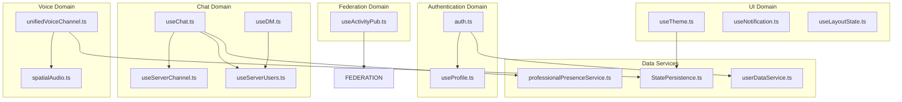

# State Management Documentation

## Overview

Harmony uses Pinia for state management, providing a modern, TypeScript-friendly approach to managing application state. The state is organized by domain boundaries with clear separation of concerns.

## Store Architecture



## Store Definitions

### Authentication Stores

#### `auth.ts` - Core Authentication
**Purpose**: Manages user authentication and session state

```typescript
interface AuthState {
  session: Session | null
  user: User | null
  isLoading: boolean
  error: string | null
}

interface AuthActions {
  login(email: string, password: string): Promise<void>
  logout(): Promise<void>
  initializeAuth(): Promise<void>
  resetPassword(email: string): Promise<void>
}
```

**Key Features**:

- JWT session management
- Automatic session restoration
- Error handling and validation
- Integration with Supabase Auth

#### `useProfile.ts` - User Profile Management
**Purpose**: Manages user profile data and preferences

```typescript
interface ProfileState {
  profile: Profile | null
  profiles: Map<string, Profile>
  loading: boolean
  error: string | null
}

interface ProfileActions {
  fetchProfileByAuthUserId(authUserId: string): Promise<void>
  updateProfile(updates: Partial<Profile>): Promise<void>
  uploadAvatar(file: File): Promise<string>
  deleteProfile(): Promise<void>
}
```

### Chat Domain Stores

#### `useChat.ts` - Chat Messages
**Purpose**: Manages chat messages, channels, and real-time communication

```typescript
interface ChatState {
  messages: Message[]
  currentChannelId: string | null
  loading: boolean
  allMessagesLoaded: boolean
  messageCache: Map<string, CachedMessages>
}

interface ChatActions {
  initializeChatEnvironment(serverId: string, channelId: string): Promise<void>
  fetchMessages(channelId: string, before?: string): Promise<void>
  sendMessage(content: string, channelId: string): Promise<void>
  setupRealtimeSubscription(channelId: string): void
  cleanupSubscriptions(): void
}
```

**Key Features**:

- Message pagination and caching
- Real-time message subscriptions
- File upload integration
- Message search and filtering

#### `useDM.ts` - Direct Messaging
**Purpose**: Handles direct messages and private conversations

```typescript
interface DMState {
  conversations: DMConversation[]
  currentConversationId: string | null
  currentDMMessages: Message[]
  searchResults: DMUser[]
  messageCache: Map<string, DMCache>
}

interface DMActions {
  initializeDMEnvironment(): Promise<void>
  fetchConversations(): Promise<void>
  createOrGetConversation(userIds: string[]): Promise<string>
  sendDMMessage(content: string, conversationId: string): Promise<void>
  searchUsers(query: string): Promise<void>
}
```

#### `useServerChannel.ts` - Server Management
**Purpose**: Manages servers, channels, and memberships

```typescript
interface ServerChannelState {
  servers: Server[]
  currentServerId: string | null
  channels: Channel[]
  categories: Category[]
  loading: boolean
  error: string | null
}

interface ServerChannelActions {
  initializeUserEnvironment(userId: string): Promise<void>
  fetchUserServers(): Promise<void>
  fetchServerChannels(serverId: string): Promise<void>
  createChannel(channelData: CreateChannelData): Promise<void>
  updateChannelOrder(updates: ChannelOrderUpdate[]): Promise<void>
  joinServer(serverId: string): Promise<void>
  leaveServer(serverId: string): Promise<void>
}
```

### Voice/Video Domain

#### `unifiedVoiceChannel.ts` - Voice Channel Management
**Purpose**: Handles voice/video connections and WebRTC

```typescript
interface VoiceChannelState {
  isConnected: boolean
  currentChannelId: string | null
  participants: VoiceParticipant[]
  localStream: MediaStream | null
  remoteStreams: Map<string, MediaStream>
  isMuted: boolean
  isDeafened: boolean
  isVideoEnabled: boolean
  isScreenSharing: boolean
}

interface VoiceChannelActions {
  connectToVoiceChannel(channelId: string): Promise<void>
  disconnectFromVoiceChannel(): Promise<void>
  toggleMute(): void
  toggleDeafen(): void
  toggleVideo(): void
  startScreenShare(): Promise<void>
  stopScreenShare(): void
}
```

#### `spatialAudio.ts` - Spatial Audio System
**Purpose**: Manages 3D spatial audio positioning and settings

```typescript
interface SpatialAudioState {
  settings: SpatialAudioSettings
  userPositions: Map<string, UserPosition>
  isPanelVisible: boolean
  isDragging: boolean
  draggedUserId: string | null
}

interface SpatialAudioActions {
  setUserPosition(userId: string, position: UserPosition): void
  updateSettings(settings: Partial<SpatialAudioSettings>): void
  togglePanel(): void
  startDragging(userId: string): void
  stopDragging(): void
}
```

### Federation Domain

#### `useActivityPub.ts` - ActivityPub Integration
**Purpose**: Manages federated social features and ActivityPub protocol

```typescript
interface ActivityPubState {
  posts: TimelinePost[]
  currentTimeline: TimelineType
  followers: ActivityPubFollow[]
  following: ActivityPubFollow[]
  notifications: ActivityPubNotification[]
  loading: boolean
  error: string | null
}

interface ActivityPubActions {
  fetchTimeline(timeline: TimelineType): Promise<void>
  createPost(content: string, visibility: string): Promise<void>
  favoritePost(postId: string): Promise<void>
  reblogPost(postId: string): Promise<void>
  followUser(actorId: string): Promise<void>
  unfollowUser(actorId: string): Promise<void>
}
```

### UI Domain Stores

#### `useTheme.ts` - Theme Management
**Purpose**: Manages visual and audio themes

```typescript
interface ThemeState {
  audioThemes: AudioTheme[]
  currentAudioTheme: string
  audioVolume: number
  isInitialized: boolean
  isLoading: boolean
  lastError: string | null
}

interface ThemeActions {
  initialize(): Promise<void>
  setAudioTheme(themeId: string): Promise<boolean>
  preloadTheme(themeId: string): Promise<void>
  setAudioVolume(volume: number): void
  playAudio(action: AudioAction): Promise<void>
}
```

#### `useNotification.ts` - Notification System
**Purpose**: Manages notifications and alerts

```typescript
interface NotificationState {
  notifications: Notification[]
  unreadCount: number
  preferences: NotificationPreferences
  sounds: NotificationSound[]
  isEnabled: boolean
}

interface NotificationActions {
  addNotification(notification: Notification): void
  markAsRead(notificationId: string): void
  markAllAsRead(): void
  updatePreferences(preferences: Partial<NotificationPreferences>): void
  requestPermission(): Promise<boolean>
}
```

## State Flow Patterns

### 1. Action → Mutation → State Update

```typescript
// Store action modifies state
export const useChatStore = defineStore('chat', {
  state: () => ({
    messages: [] as Message[]
  }),
  
  actions: {
    async sendMessage(content: string) {
      // API call
      const message = await services.messages.sendMessage(content)
      
      // State mutation
      this.messages.push(message)
    }
  }
})
```

### 2. Real-time Updates

```typescript
// Real-time subscriptions update state directly
setupRealtimeSubscription(channelId: string) {
  this.realtimeChannel = supabase
    .channel(`messages:${channelId}`)
    .on('postgres_changes', { 
      event: 'INSERT',
      schema: 'public',
      table: 'messages'
    }, (payload) => {
      // Direct state update from real-time event
      this.messages.push(payload.new as Message)
    })
    .subscribe()
}
```

### 3. Cross-Store Communication

```typescript
// Store dependencies and communication
export const useServerChannelStore = defineStore('serverChannel', () => {
  const authStore = useAuthStore()
  const chatStore = useChatStore()
  
  const switchServer = async (serverId: string) => {
    // Update current server
    currentServerId.value = serverId
    
    // Notify dependent stores
    await chatStore.initializeChatEnvironment(serverId, defaultChannelId)
  }
  
  return { switchServer }
})
```

## Data Persistence

### State Persistence Service

```typescript
class StatePersistenceService {
  // Persistent state across sessions
  async saveLastActiveServer(serverId: string): Promise<void>
  async getLastActiveServer(): Promise<string | null>
  
  // UI preferences
  async saveSidebarState(visible: boolean): Promise<void>
  async getSidebarState(): Promise<boolean>
  
  // Cache management
  async saveChannelCache(channelId: string, data: any): Promise<void>
  async getChannelCache(channelId: string): Promise<any>
}
```

### Cache Strategy

```typescript
interface CacheConfig {
  ttl: number // Time to live in milliseconds
  maxSize: number // Maximum cache entries
  strategy: 'lru' | 'fifo' // Eviction strategy
}

// Message cache with TTL
const messageCache = new Map<string, {
  data: Message[]
  timestamp: number
  ttl: number
}>()
```

## Performance Optimizations

### 1. Computed Properties for Derived State

```typescript
export const useChatStore = defineStore('chat', () => {
  const messages = ref<Message[]>([])
  
  // Expensive computation cached automatically
  const groupedMessages = computed(() => {
    return groupMessagesByDate(messages.value)
  })
  
  return { messages, groupedMessages }
})
```

### 2. Selective Subscriptions

```typescript
// Only subscribe to data you need
const { currentChannelMessages } = storeToRefs(chatStore)

// Instead of watching entire store
watch(currentChannelMessages, (newMessages) => {
  // React to specific data changes
})
```

### 3. Lazy Store Initialization

```typescript
// Stores initialize only when first accessed
const chatStore = useChatStore()

// Heavy initialization only when needed
await chatStore.initializeChatEnvironment()
```

## Testing Stores

### Unit Testing with Pinia Testing

```typescript
import { createTestingPinia } from '@pinia/testing'
import { useChatStore } from '@/stores/useChat'

describe('Chat Store', () => {
  beforeEach(() => {
    // Create fresh store instance for each test
    setActivePinia(createTestingPinia())
  })
  
  it('sends message successfully', async () => {
    const store = useChatStore()
    const mockMessage = { id: '1', content: 'Hello' }
    
    // Mock the service
    vi.spyOn(chatService, 'sendMessage').mockResolvedValue(mockMessage)
    
    await store.sendMessage('Hello')
    
    expect(store.messages).toContain(mockMessage)
  })
})
```

### Integration Testing

```typescript
// Test store interactions
describe('Store Integration', () => {
  it('initializes user environment correctly', async () => {
    const authStore = useAuthStore()
    const serverStore = useServerChannelStore()
    const chatStore = useChatStore()
    
    // Simulate login
    await authStore.login('user@example.com', 'password')
    
    // Verify cascading initialization
    expect(serverStore.servers).not.toBeEmpty()
    expect(chatStore.currentChannelId).toBeDefined()
  })
})
```

## State Debugging

### Vue DevTools Integration

```typescript
// Stores automatically appear in Vue DevTools
// with time-travel debugging and state inspection
```

### Custom Debug Utilities

```typescript
// Development-only debug helpers
if (import.meta.env.DEV) {
  window.debugStores = {
    chat: useChatStore(),
    auth: useAuthStore(),
    servers: useServerChannelStore()
  }
  
  // Global state inspector
  window.dumpState = () => {
    console.log('Current State:', {
      auth: window.debugStores.auth.$state,
      chat: window.debugStores.chat.$state
    })
  }
}
```

## Security Considerations

### 1. Sensitive Data Handling

```typescript
// Never store sensitive data in plain state
const authStore = defineStore('auth', {
  state: () => ({
    session: null as Session | null,
    // Don't store passwords or tokens directly; use secure session objects from Supabase
  })
})
```

### 2. Input Validation

```typescript
// Validate data before state mutations
actions: {
  async updateProfile(updates: Partial<Profile>) {
    // Validate input
    const validated = profileSchema.parse(updates)
    
    // Update state only with validated data
    this.profile = { ...this.profile, ...validated }
  }
}
```

### 3. Rate Limiting

```typescript
// Prevent excessive API calls
const rateLimiter = new Map<string, number>()

actions: {
  async sendMessage(content: string) {
    const lastCall = rateLimiter.get('sendMessage') || 0
    const now = Date.now()
    
    if (now - lastCall < 1000) {
      throw new Error('Rate limit exceeded')
    }
    
    rateLimiter.set('sendMessage', now)
    // Proceed with message sending
  }
}
```
