# System Flow Documentation

## Overview

This document provides a comprehensive view of how data flows through the Harmony system, from user interactions to database updates, real-time synchronization, and federation with external services.

## Core Application Flows

### 1. User Authentication Flow

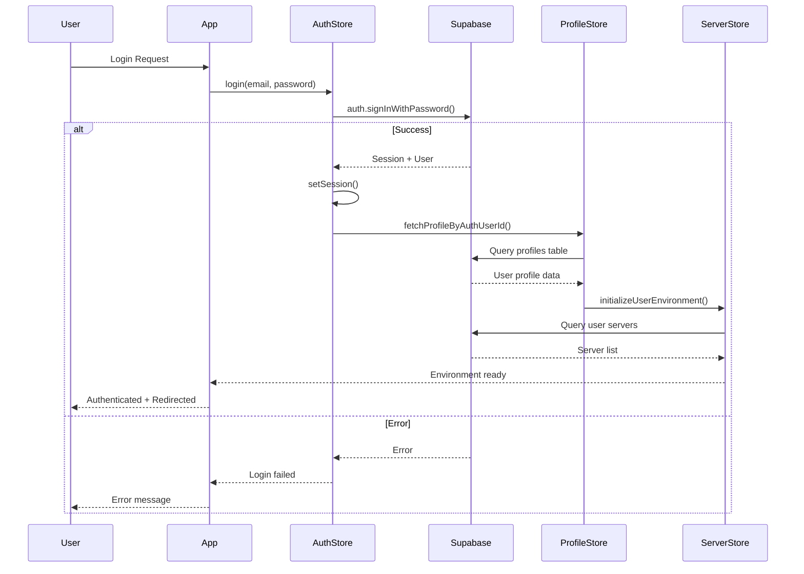

### 2. Message Sending Flow

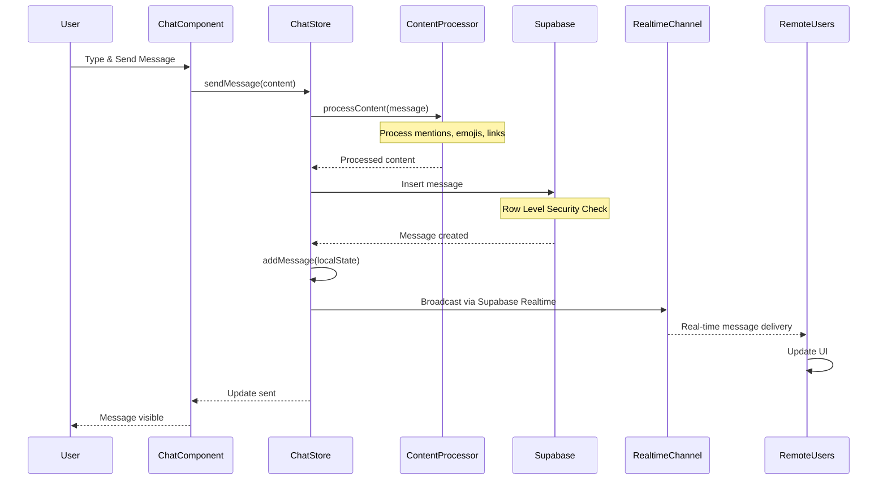

### 3. Voice Channel Connection Flow

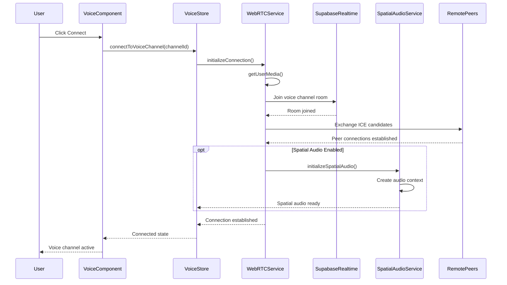

### 4. Federation Activity Flow

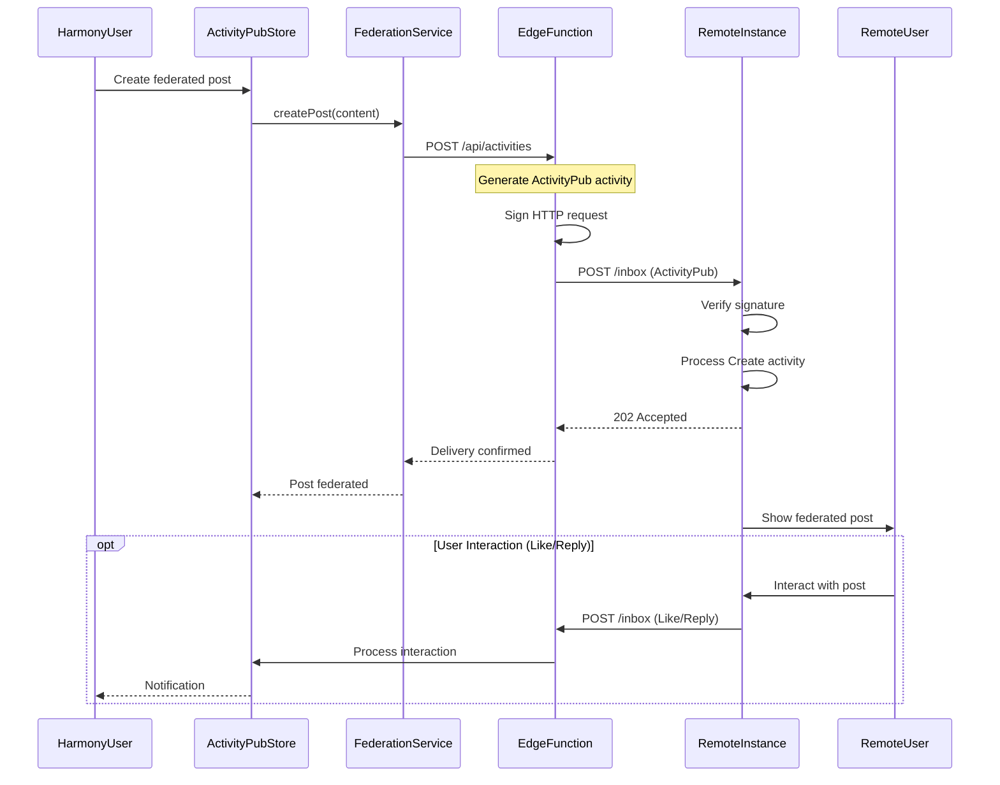

## Data Architecture Flow

### Database Interaction Pattern

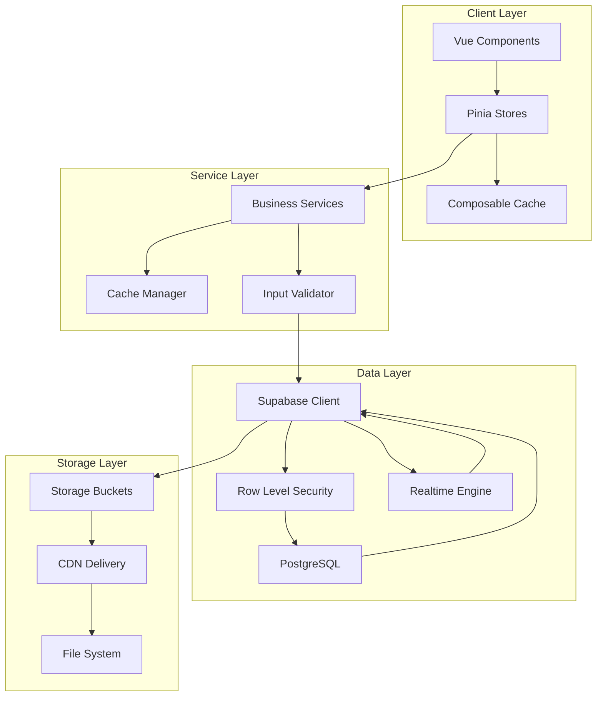

### Real-time Data Synchronization

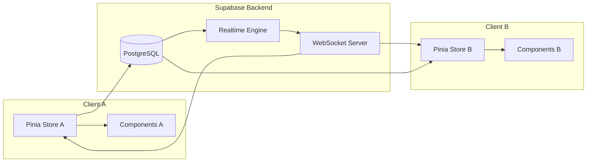

## Component Communication Patterns

### Parent-Child Communication

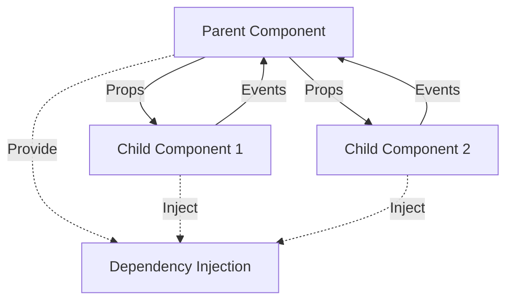

### Store-Mediated Communication

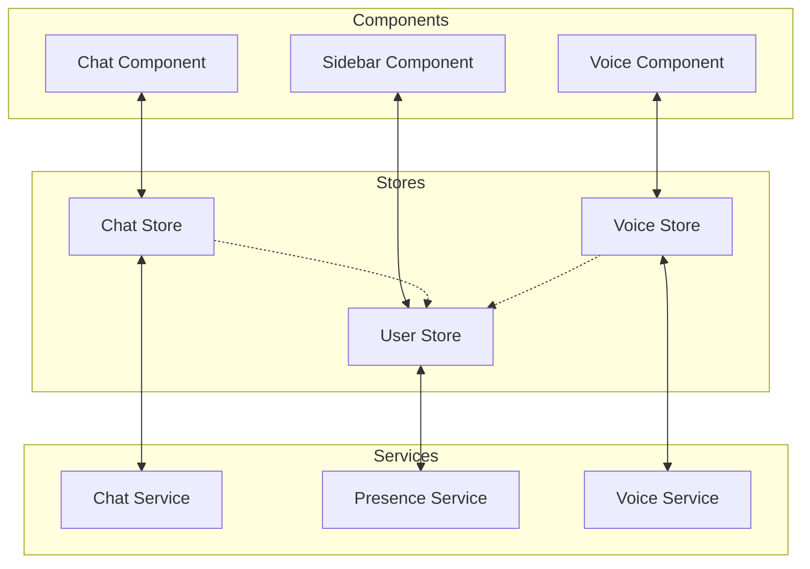

## PWA and Desktop App Flow

### Service Worker Integration

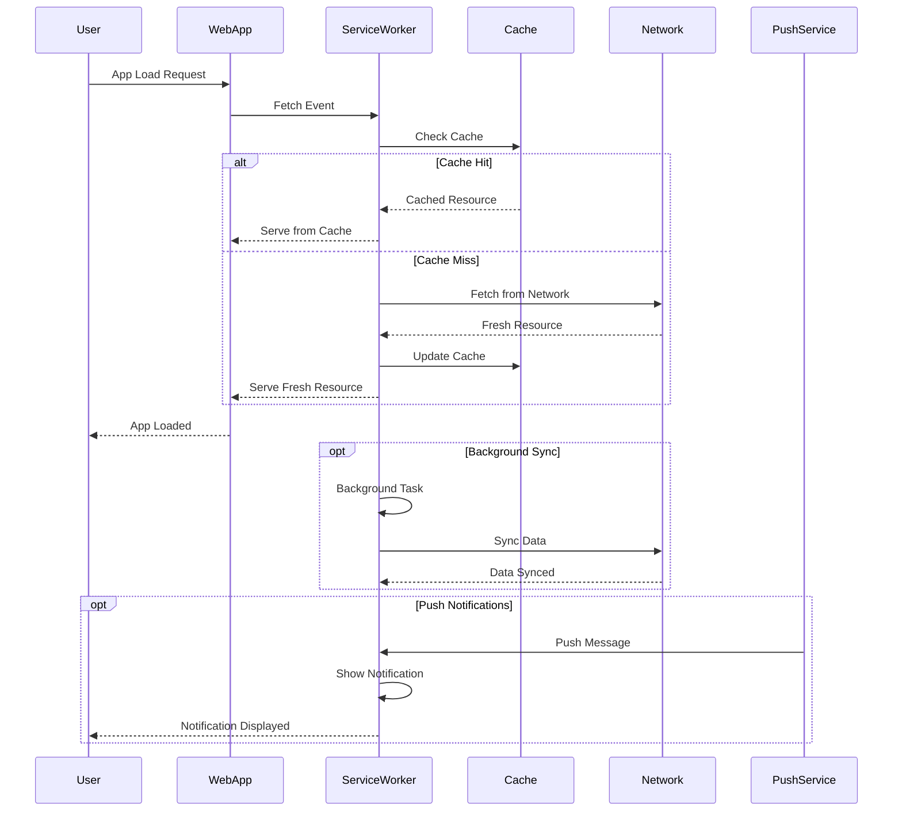

### Tauri Desktop Integration

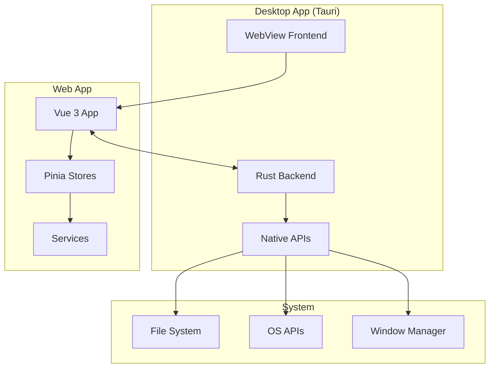

## Federation Network Flow

### ActivityPub Protocol Flow

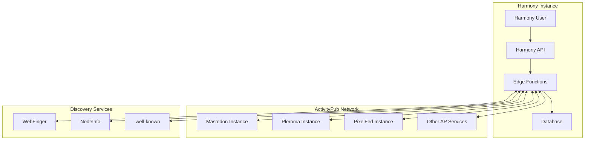

### Cross-Instance Communication

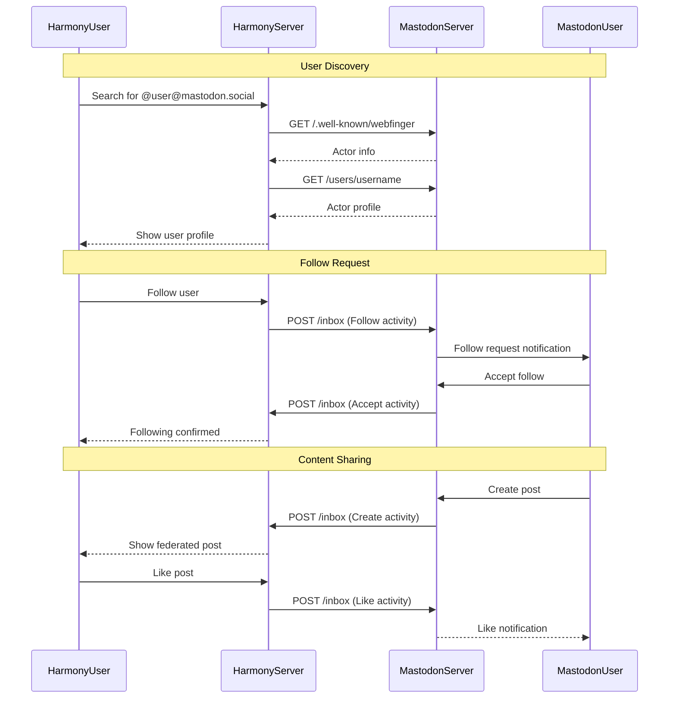

## Error Handling Flow

### Global Error Management

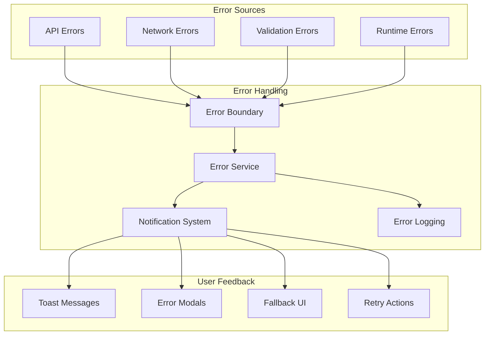

## Performance Optimization Flow

### Caching Strategy

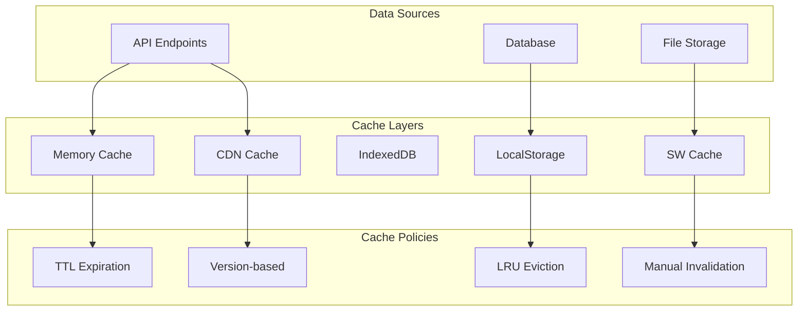

### Bundle Loading Strategy

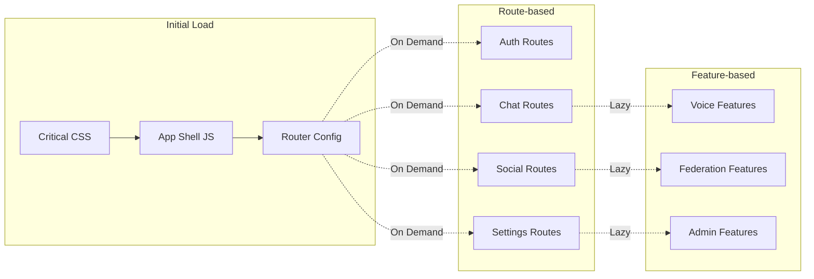

## State Persistence Flow

### Application State Lifecycle

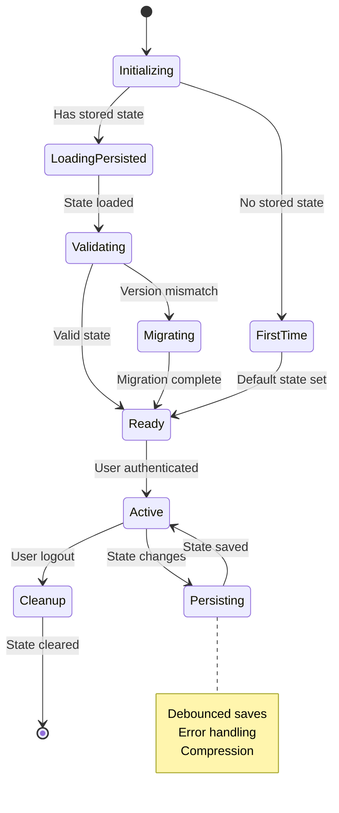

This comprehensive flow documentation provides a complete picture of how Harmony's complex systems work together. Each flow diagram shows the interaction patterns, data movement, and system integration points that make up the application's architecture.

The documentation covers:

1. **User interaction flows** - How users interact with the system
2. **Data flows** - How data moves through the system
3. **Real-time synchronization** - How changes propagate
4. **Federation** - How external systems integrate
5. **Performance optimization** - How the system maintains speed
6. **Error handling** - How problems are managed
7. **State management** - How application state is maintained

This serves as both a development reference and architectural documentation for understanding the complete system behavior.
