# System Flow Documentation

How data moves through Harmony: user interactions, database writes, realtime
synchronization, and federation.

The narrative walkthroughs of the four main flows (auth, chat, federation,
realtime) live under [System Flows](./flows/) in the docs site. This page is the
wide-angle diagram set - request paths, component and store wiring, and the
storage model.

## Core Application Flows

### 1. User Authentication Flow

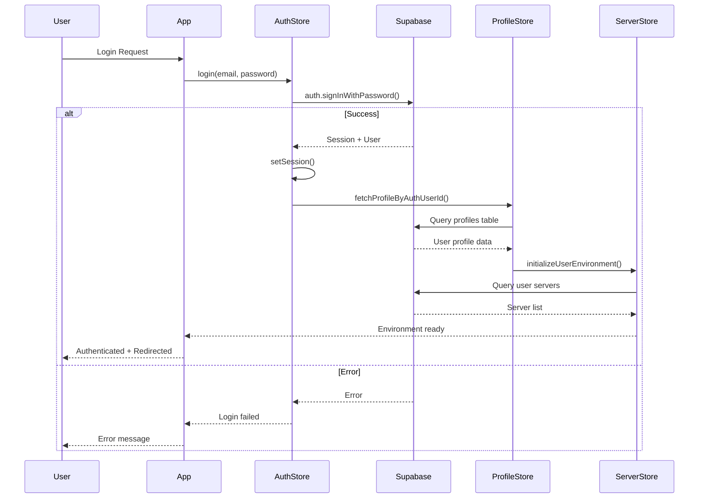
```mermaid
sequenceDiagram
    participant User
    participant App
    participant AuthStore
    participant Supabase
    participant ProfileStore
    participant ServerStore

    User->>App: Login Request
    App->>AuthStore: login(email, password)
    AuthStore->>Supabase: auth.signInWithPassword()
    
    alt Success
        Supabase-->>AuthStore: Session + User
        AuthStore->>AuthStore: setSession()
        AuthStore->>ProfileStore: fetchProfileByAuthUserId()
        ProfileStore->>Supabase: Query profiles table
        Supabase-->>ProfileStore: User profile data
        ProfileStore->>ServerStore: initializeUserEnvironment()
        ServerStore->>Supabase: Query user servers
        Supabase-->>ServerStore: Server list
        ServerStore-->>App: Environment ready
        App-->>User: Authenticated + Redirected
    else Error
        Supabase-->>AuthStore: Error
        AuthStore-->>App: Login failed
        App-->>User: Error message
    end
```

### 2. Message Sending Flow

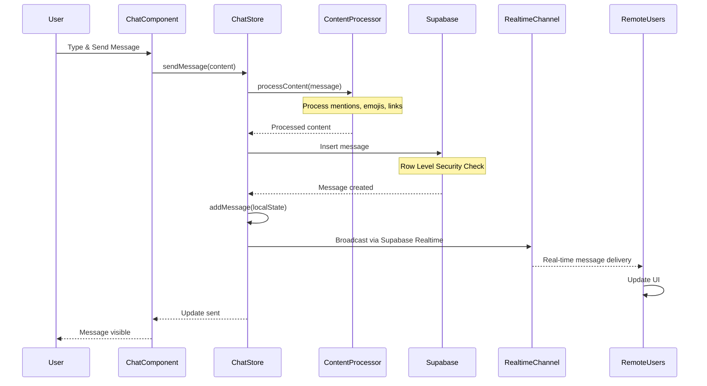
```mermaid
sequenceDiagram
    participant User
    participant ChatComponent
    participant ChatStore
    participant ContentProcessor
    participant Supabase
    participant RealtimeChannel
    participant RemoteUsers

    User->>ChatComponent: Type & Send Message
    ChatComponent->>ChatStore: sendMessage(content)
    ChatStore->>ContentProcessor: processContent(message)
    
    Note over ContentProcessor: Process mentions, emojis, links
    
    ContentProcessor-->>ChatStore: Processed content
    ChatStore->>Supabase: Insert message
    
    Note over Supabase: Row Level Security Check
    
    Supabase-->>ChatStore: Message created
    ChatStore->>ChatStore: addMessage(localState)
    ChatStore->>RealtimeChannel: Broadcast via Supabase Realtime
    
    RealtimeChannel-->>RemoteUsers: Real-time message delivery
    RemoteUsers->>RemoteUsers: Update UI
    
    ChatStore-->>ChatComponent: Update sent
    ChatComponent-->>User: Message visible
```

### 3. Voice Channel Connection Flow

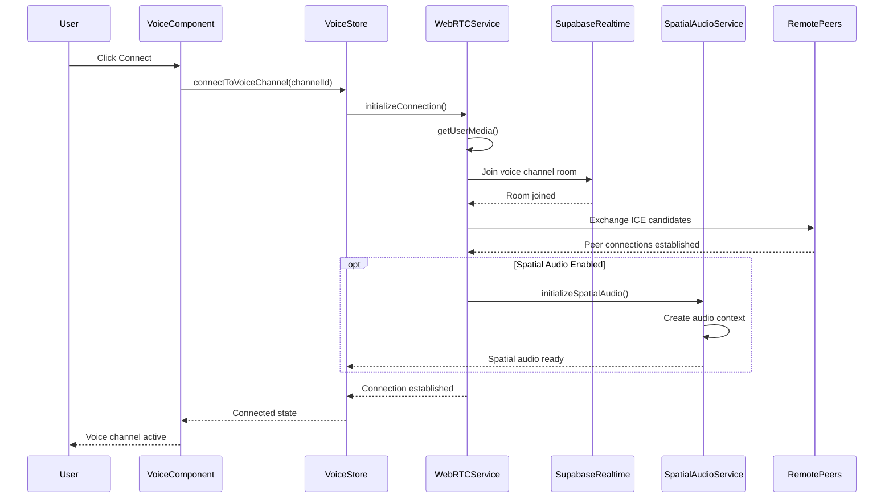
```mermaid
sequenceDiagram
    participant User
    participant VoiceComponent
    participant VoiceStore
    participant WebRTCService
    participant SupabaseRealtime
    participant SpatialAudioService
    participant RemotePeers

    User->>VoiceComponent: Click Connect
    VoiceComponent->>VoiceStore: connectToVoiceChannel(channelId)
    VoiceStore->>WebRTCService: initializeConnection()
    
    WebRTCService->>WebRTCService: getUserMedia()
    WebRTCService->>SupabaseRealtime: Join voice channel room
    
    SupabaseRealtime-->>WebRTCService: Room joined
    WebRTCService->>RemotePeers: Exchange ICE candidates
    
    RemotePeers-->>WebRTCService: Peer connections established
    
    opt Spatial Audio Enabled
        WebRTCService->>SpatialAudioService: initializeSpatialAudio()
        SpatialAudioService->>SpatialAudioService: Create audio context
        SpatialAudioService-->>VoiceStore: Spatial audio ready
    end
    
    WebRTCService-->>VoiceStore: Connection established
    VoiceStore-->>VoiceComponent: Connected state
    VoiceComponent-->>User: Voice channel active
```

### 4. Federation Activity Flow

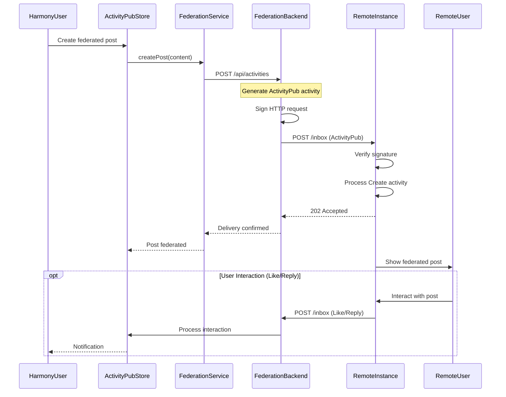
```mermaid
sequenceDiagram
    participant HarmonyUser
    participant ActivityPubStore
    participant FederationService
    participant FederationBackend
    participant RemoteInstance
    participant RemoteUser

    HarmonyUser->>ActivityPubStore: Create federated post
    ActivityPubStore->>FederationService: createPost(content)
    FederationService->>FederationBackend: POST /api/activities
    
    Note over FederationBackend: Generate ActivityPub activity
    
    FederationBackend->>FederationBackend: Sign HTTP request
    FederationBackend->>RemoteInstance: POST /inbox (ActivityPub)
    
    RemoteInstance->>RemoteInstance: Verify signature
    RemoteInstance->>RemoteInstance: Process Create activity
    RemoteInstance-->>FederationBackend: 202 Accepted
    
    FederationBackend-->>FederationService: Delivery confirmed
    FederationService-->>ActivityPubStore: Post federated
    
    RemoteInstance->>RemoteUser: Show federated post
    
    opt User Interaction (Like/Reply)
        RemoteUser->>RemoteInstance: Interact with post
        RemoteInstance->>FederationBackend: POST /inbox (Like/Reply)
        FederationBackend->>ActivityPubStore: Process interaction
        ActivityPubStore-->>HarmonyUser: Notification
    end
```

## Data Architecture Flow

### Database Interaction Pattern

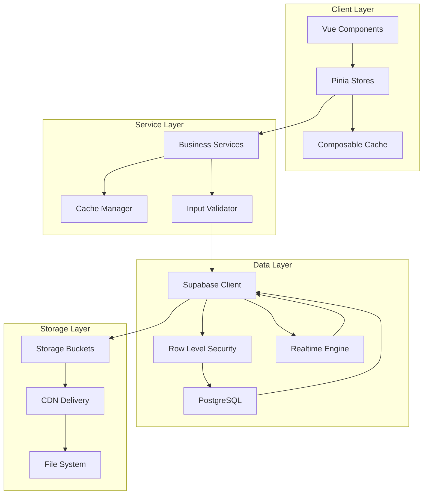
```mermaid
graph TB
    subgraph "Client Layer"
        COMP[Vue Components]
        STORE[Pinia Stores]
        COMP_CACHE[Composable Cache]
    end
    
    subgraph "Service Layer"
        SERVICE[Business Services]
        CACHE[Cache Manager]
        VALIDATOR[Input Validator]
    end
    
    subgraph "Data Layer"
        SUPABASE[Supabase Client]
        RLS[Row Level Security]
        POSTGRES[PostgreSQL]
        REALTIME[Realtime Engine]
    end
    
    subgraph "Storage Layer"
        BUCKET[Storage Buckets]
        CDN[CDN Delivery]
        FILES[File System]
    end
    
    COMP --> STORE
    STORE --> COMP_CACHE
    STORE --> SERVICE
    SERVICE --> CACHE
    SERVICE --> VALIDATOR
    VALIDATOR --> SUPABASE
    SUPABASE --> RLS
    RLS --> POSTGRES
    SUPABASE --> REALTIME
    SUPABASE --> BUCKET
    BUCKET --> CDN
    CDN --> FILES
    
    REALTIME --> SUPABASE
    POSTGRES --> SUPABASE
```

### Real-time Data Synchronization

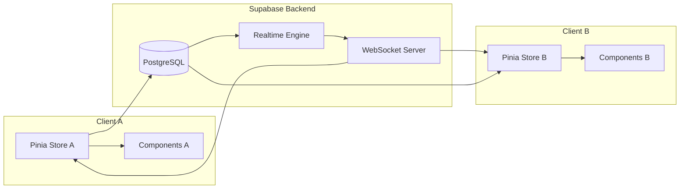
```mermaid
graph LR
    subgraph "Client A"
        STORE_A[Pinia Store A]
        COMP_A[Components A]
    end
    
    subgraph "Client B"
        STORE_B[Pinia Store B]
        COMP_B[Components B]
    end
    
    subgraph "Supabase Backend"
        POSTGRES_DB[(PostgreSQL)]
        REALTIME_ENGINE[Realtime Engine]
        WEBSOCKET[WebSocket Server]
    end
    
    STORE_A --> POSTGRES_DB
    POSTGRES_DB --> REALTIME_ENGINE
    REALTIME_ENGINE --> WEBSOCKET
    WEBSOCKET --> STORE_A
    WEBSOCKET --> STORE_B
    STORE_B --> COMP_B
    STORE_A --> COMP_A
    
    POSTGRES_DB --> STORE_B
```

## Component Communication Patterns

### Parent-Child Communication

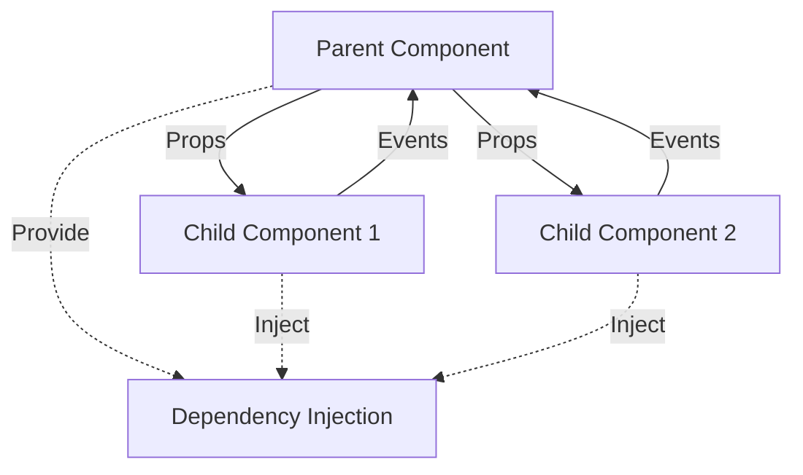
```mermaid
graph TD
    PARENT[Parent Component]
    CHILD1[Child Component 1]
    CHILD2[Child Component 2]
    
    PARENT -->|Props| CHILD1
    PARENT -->|Props| CHILD2
    CHILD1 -->|Events| PARENT
    CHILD2 -->|Events| PARENT
    
    PARENT -.->|Provide| INJECTION[Dependency Injection]
    CHILD1 -.->|Inject| INJECTION
    CHILD2 -.->|Inject| INJECTION
```

### Store-Mediated Communication

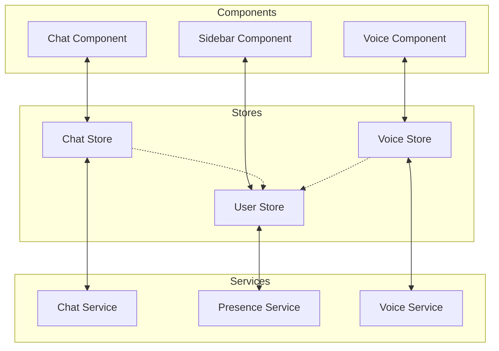
```mermaid
graph TB
    subgraph "Components"
        COMP1[Chat Component]
        COMP2[Sidebar Component]
        COMP3[Voice Component]
    end
    
    subgraph "Stores"
        CHAT_STORE[Chat Store]
        USER_STORE[User Store]
        VOICE_STORE[Voice Store]
    end
    
    subgraph "Services"
        CHAT_SVC[Chat Service]
        PRESENCE_SVC[Presence Service]
        VOICE_SVC[Voice Service]
    end
    
    COMP1 <--> CHAT_STORE
    COMP2 <--> USER_STORE
    COMP3 <--> VOICE_STORE
    
    CHAT_STORE <--> CHAT_SVC
    USER_STORE <--> PRESENCE_SVC
    VOICE_STORE <--> VOICE_SVC
    
    CHAT_STORE -.-> USER_STORE
    VOICE_STORE -.-> USER_STORE
```

## PWA and Desktop App Flow

### Service Worker Integration

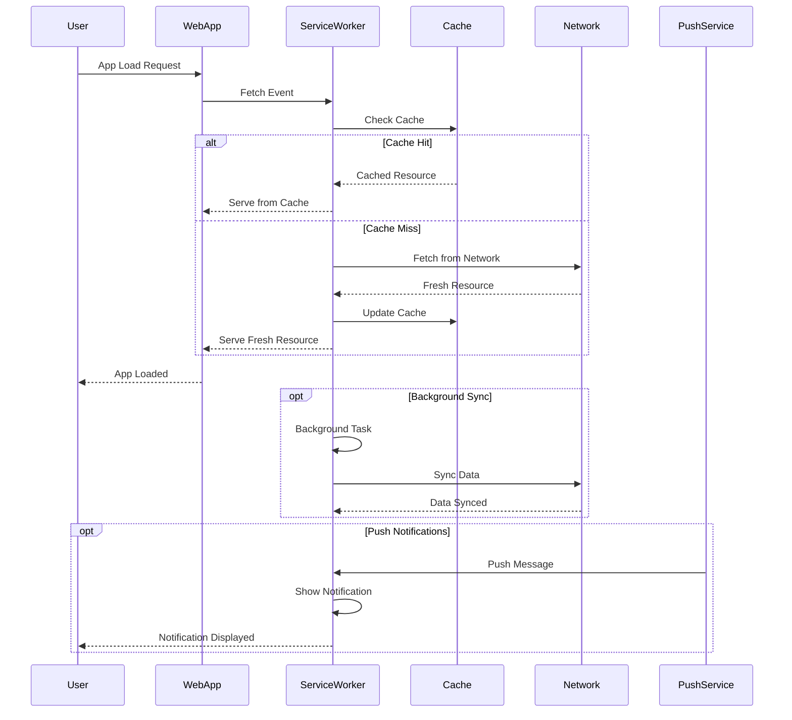
```mermaid
sequenceDiagram
    participant User
    participant WebApp
    participant ServiceWorker
    participant Cache
    participant Network
    participant PushService

    User->>WebApp: App Load Request
    WebApp->>ServiceWorker: Fetch Event
    ServiceWorker->>Cache: Check Cache
    
    alt Cache Hit
        Cache-->>ServiceWorker: Cached Resource
        ServiceWorker-->>WebApp: Serve from Cache
    else Cache Miss
        ServiceWorker->>Network: Fetch from Network
        Network-->>ServiceWorker: Fresh Resource
        ServiceWorker->>Cache: Update Cache
        ServiceWorker-->>WebApp: Serve Fresh Resource
    end
    
    WebApp-->>User: App Loaded
    
    opt Background Sync
        ServiceWorker->>ServiceWorker: Background Task
        ServiceWorker->>Network: Sync Data
        Network-->>ServiceWorker: Data Synced
    end
    
    opt Push Notifications
        PushService->>ServiceWorker: Push Message
        ServiceWorker->>ServiceWorker: Show Notification
        ServiceWorker-->>User: Notification Displayed
    end
```

### Tauri Desktop Integration

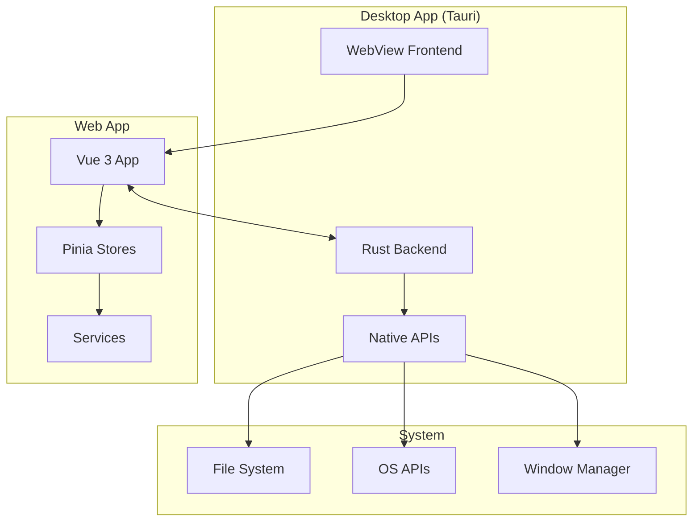
```mermaid
graph TB
    subgraph "Desktop App (Tauri)"
        RUST[Rust Backend]
        WEBVIEW[WebView Frontend]
        NATIVE[Native APIs]
    end
    
    subgraph "Web App"
        VUE[Vue 3 App]
        STORES[Pinia Stores]
        SERVICES[Services]
    end
    
    subgraph "System"
        FILE_SYSTEM[File System]
        OS_APIS[OS APIs]
        WINDOW_MANAGER[Window Manager]
    end
    
    WEBVIEW --> VUE
    VUE --> STORES
    STORES --> SERVICES
    
    RUST --> NATIVE
    NATIVE --> FILE_SYSTEM
    NATIVE --> OS_APIS
    NATIVE --> WINDOW_MANAGER
    
    VUE <--> RUST
```

## Federation Network Flow

### ActivityPub Protocol Flow

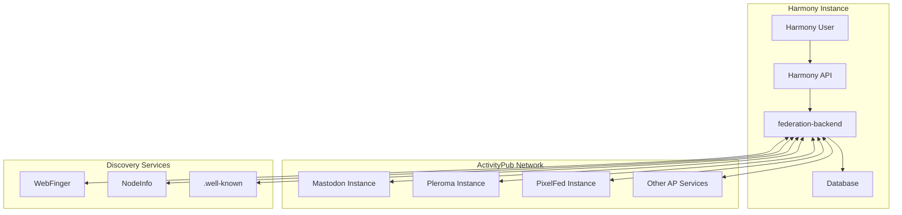
```mermaid
graph TB
    subgraph "Harmony Instance"
        USER[Harmony User]
        HARMONY_API[Harmony API]
        FEDERATION_SVC[federation-backend]
        DB[Database]
    end
    
    subgraph "ActivityPub Network"
        MASTODON[Mastodon Instance]
        PLEROMA[Pleroma Instance]
        PIXELFED[PixelFed Instance]
        OTHER[Other AP Services]
    end
    
    subgraph "Discovery Services"
        WEBFINGER[WebFinger]
        NODEINFO[NodeInfo]
        WELL_KNOWN[.well-known]
    end
    
    USER --> HARMONY_API
    HARMONY_API --> FEDERATION_SVC
    FEDERATION_SVC --> DB
    
    FEDERATION_SVC <--> WEBFINGER
    FEDERATION_SVC <--> NODEINFO
    FEDERATION_SVC <--> WELL_KNOWN
    
    FEDERATION_SVC <--> MASTODON
    FEDERATION_SVC <--> PLEROMA
    FEDERATION_SVC <--> PIXELFED
    FEDERATION_SVC <--> OTHER
```

### Cross-Instance Communication

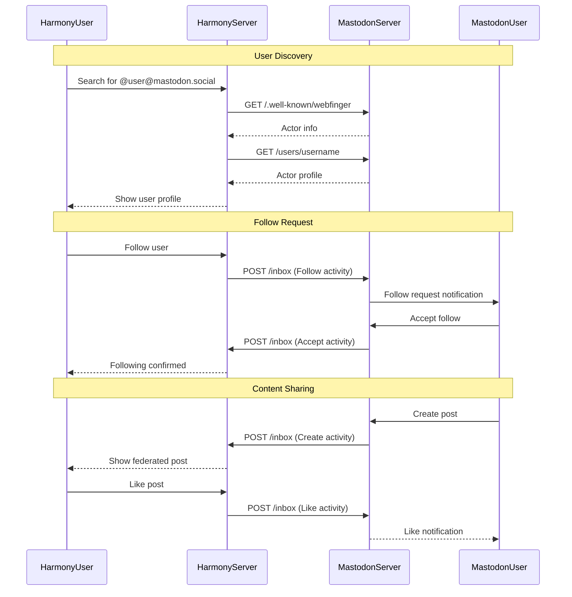
```mermaid
sequenceDiagram
    participant HarmonyUser
    participant HarmonyServer
    participant MastodonServer
    participant MastodonUser

    Note over HarmonyUser,MastodonUser: User Discovery

    HarmonyUser->>HarmonyServer: Search for @user@mastodon.social
    HarmonyServer->>MastodonServer: GET /.well-known/webfinger
    MastodonServer-->>HarmonyServer: Actor info
    HarmonyServer->>MastodonServer: GET /users/username
    MastodonServer-->>HarmonyServer: Actor profile
    HarmonyServer-->>HarmonyUser: Show user profile

    Note over HarmonyUser,MastodonUser: Follow Request

    HarmonyUser->>HarmonyServer: Follow user
    HarmonyServer->>MastodonServer: POST /inbox (Follow activity)
    MastodonServer->>MastodonUser: Follow request notification
    MastodonUser->>MastodonServer: Accept follow
    MastodonServer->>HarmonyServer: POST /inbox (Accept activity)
    HarmonyServer-->>HarmonyUser: Following confirmed

    Note over HarmonyUser,MastodonUser: Content Sharing

    MastodonUser->>MastodonServer: Create post
    MastodonServer->>HarmonyServer: POST /inbox (Create activity)
    HarmonyServer-->>HarmonyUser: Show federated post
    HarmonyUser->>HarmonyServer: Like post
    HarmonyServer->>MastodonServer: POST /inbox (Like activity)
    MastodonServer-->>MastodonUser: Like notification
```

## Error Handling Flow

### Global Error Management

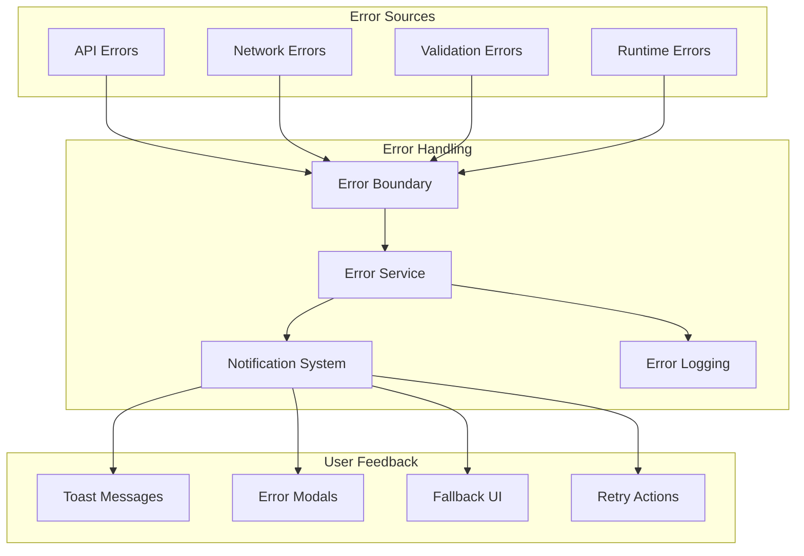
```mermaid
graph TB
    subgraph "Error Sources"
        API_ERROR[API Errors]
        NETWORK_ERROR[Network Errors]
        VALIDATION_ERROR[Validation Errors]
        RUNTIME_ERROR[Runtime Errors]
    end
    
    subgraph "Error Handling"
        ERROR_BOUNDARY[Error Boundary]
        ERROR_SERVICE[Error Service]
        NOTIFICATION[Notification System]
        LOGGING[Error Logging]
    end
    
    subgraph "User Feedback"
        TOAST[Toast Messages]
        MODAL[Error Modals]
        FALLBACK[Fallback UI]
        RETRY[Retry Actions]
    end
    
    API_ERROR --> ERROR_BOUNDARY
    NETWORK_ERROR --> ERROR_BOUNDARY
    VALIDATION_ERROR --> ERROR_BOUNDARY
    RUNTIME_ERROR --> ERROR_BOUNDARY
    
    ERROR_BOUNDARY --> ERROR_SERVICE
    ERROR_SERVICE --> NOTIFICATION
    ERROR_SERVICE --> LOGGING
    
    NOTIFICATION --> TOAST
    NOTIFICATION --> MODAL
    NOTIFICATION --> FALLBACK
    NOTIFICATION --> RETRY
```

## Performance Optimization Flow

### Caching Strategy

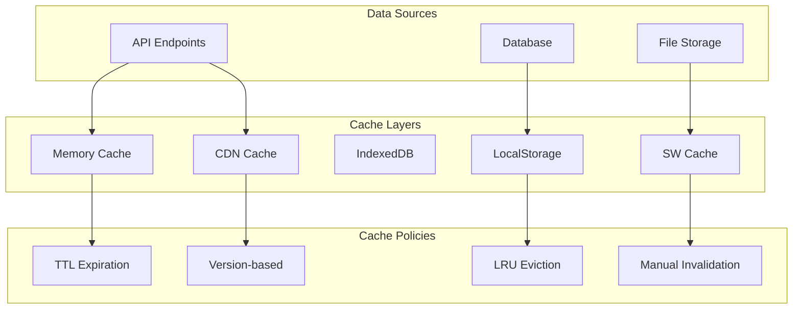
```mermaid
graph TB
    subgraph "Cache Layers"
        MEMORY[Memory Cache]
        LOCAL_STORAGE[LocalStorage]
        INDEXED_DB[IndexedDB]
        SERVICE_WORKER[SW Cache]
        CDN_CACHE[CDN Cache]
    end
    
    subgraph "Data Sources"
        API[API Endpoints]
        DATABASE[Database]
        STORAGE[File Storage]
    end
    
    subgraph "Cache Policies"
        TTL[TTL Expiration]
        LRU[LRU Eviction]
        MANUAL[Manual Invalidation]
        VERSION[Version-based]
    end
    
    API --> MEMORY
    DATABASE --> LOCAL_STORAGE
    STORAGE --> SERVICE_WORKER
    API --> CDN_CACHE
    
    MEMORY --> TTL
    LOCAL_STORAGE --> LRU
    SERVICE_WORKER --> MANUAL
    CDN_CACHE --> VERSION
```

### Bundle Loading Strategy

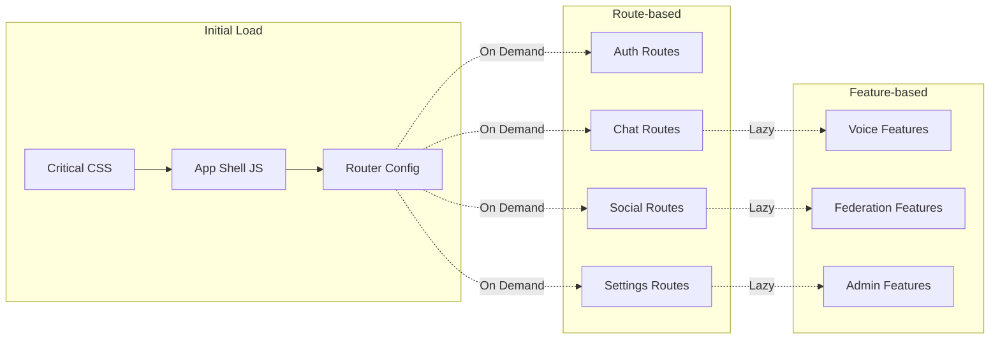
```mermaid
graph LR
    subgraph "Initial Load"
        CRITICAL[Critical CSS]
        APP_JS[App Shell JS]
        ROUTER[Router Config]
    end
    
    subgraph "Route-based"
        AUTH_CHUNK[Auth Routes]
        CHAT_CHUNK[Chat Routes]
        SOCIAL_CHUNK[Social Routes]
        SETTINGS_CHUNK[Settings Routes]
    end
    
    subgraph "Feature-based"
        VOICE_CHUNK[Voice Features]
        FEDERATION_CHUNK[Federation Features]
        ADMIN_CHUNK[Admin Features]
    end
    
    CRITICAL --> APP_JS
    APP_JS --> ROUTER
    
    ROUTER -.->|On Demand| AUTH_CHUNK
    ROUTER -.->|On Demand| CHAT_CHUNK
    ROUTER -.->|On Demand| SOCIAL_CHUNK
    ROUTER -.->|On Demand| SETTINGS_CHUNK
    
    CHAT_CHUNK -.->|Lazy| VOICE_CHUNK
    SOCIAL_CHUNK -.->|Lazy| FEDERATION_CHUNK
    SETTINGS_CHUNK -.->|Lazy| ADMIN_CHUNK
```

## State Persistence Flow

### Application State Lifecycle

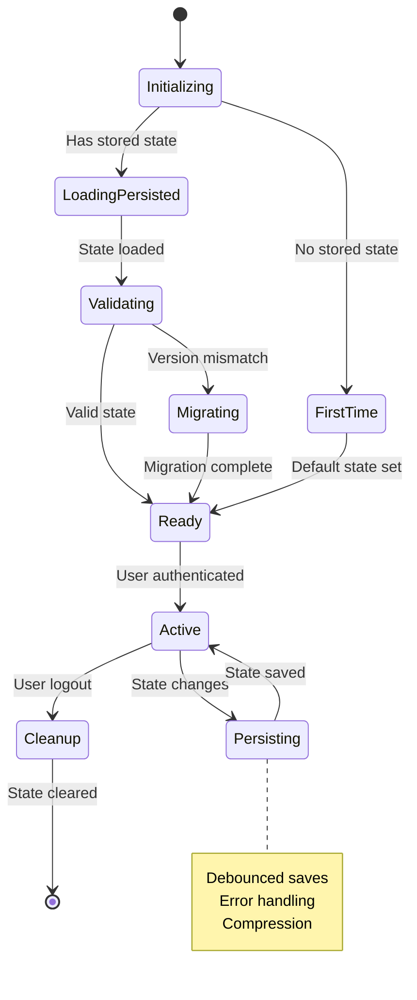
```mermaid
stateDiagram-v2
    [*] --> Initializing
    
    Initializing --> LoadingPersisted: Has stored state
    Initializing --> FirstTime: No stored state
    
    LoadingPersisted --> Validating: State loaded
    Validating --> Migrating: Version mismatch
    Validating --> Ready: Valid state
    
    Migrating --> Ready: Migration complete
    FirstTime --> Ready: Default state set
    
    Ready --> Active: User authenticated
    Active --> Persisting: State changes
    Persisting --> Active: State saved
    
    Active --> Cleanup: User logout
    Cleanup --> [*]: State cleared
    
    note right of Persisting
        Debounced saves
        Error handling
        Compression
    end note
```

## Component Interconnection Map

### Layout hierarchy

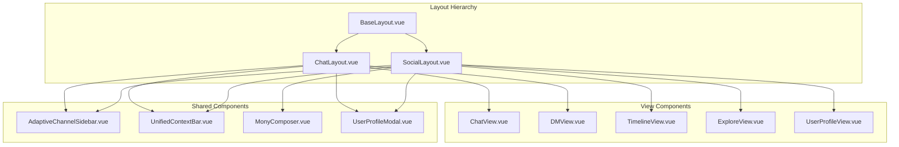
```mermaid
graph TB
    subgraph "Layout Hierarchy"
        BASE[BaseLayout.vue]
        CHAT[ChatLayout.vue]
        SOCIAL[SocialLayout.vue]
    end
    
    subgraph "View Components"
        CHATVIEW[ChatView.vue]
        DMVIEW[DMView.vue]
        TIMELINE[TimelineView.vue]
        EXPLORE[ExploreView.vue]
        PROFILE[UserProfileView.vue]
    end
    
    subgraph "Shared Components"
        SIDEBAR[AdaptiveChannelSidebar.vue]
        CONTEXTBAR[UnifiedContextBar.vue]
        COMPOSER[MonyComposer.vue]
        MODAL[UserProfileModal.vue]
    end
    
    BASE --> CHAT
    BASE --> SOCIAL
    CHAT --> CHATVIEW
    CHAT --> DMVIEW
    SOCIAL --> TIMELINE
    SOCIAL --> EXPLORE
    SOCIAL --> PROFILE
    
    CHAT --> SIDEBAR
    SOCIAL --> SIDEBAR
    CHAT --> CONTEXTBAR
    SOCIAL --> CONTEXTBAR
    SOCIAL --> COMPOSER
    CHAT --> MODAL
    SOCIAL --> MODAL
```

### Store interconnections

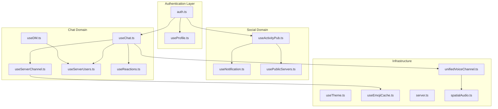
```mermaid
graph TB
    subgraph "Authentication Layer"
        AUTH[auth.ts]
        PROFILE[useProfile.ts]
    end
    
    subgraph "Chat Domain"
        CHAT[useChat.ts]
        DM[useDM.ts]
        SERVERCHAN[useServerChannel.ts]
        SERVERUSERS[useServerUsers.ts]
        REACTIONS[useReactions.ts]
    end
    
    subgraph "Social Domain"
        ACTIVITYPUB[useActivityPub.ts]
        NOTIFICATIONS[useNotification.ts]
        PUBLICSERVERS[usePublicServers.ts]
    end
    
    subgraph "Infrastructure"
        THEME[useTheme.ts]
        EMOJI[useEmojiCache.ts]
        SERVER[server.ts]
        VOICE[unifiedVoiceChannel.ts]
        SPATIAL[spatialAudio.ts]
    end
    
    AUTH --> PROFILE
    AUTH --> CHAT
    AUTH --> ACTIVITYPUB
    
    CHAT --> SERVERCHAN
    CHAT --> SERVERUSERS
    CHAT --> REACTIONS
    DM --> SERVERUSERS
    
    ACTIVITYPUB --> NOTIFICATIONS
    ACTIVITYPUB --> PUBLICSERVERS
    
    SERVERCHAN --> EMOJI
    CHAT --> VOICE
    VOICE --> SPATIAL
```

### Service layer dependencies

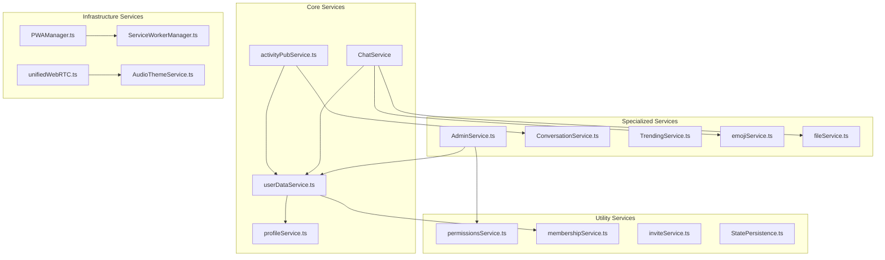
```mermaid
graph TB
    subgraph "Core Services"
        ACTIVITYPUB_SVC[activityPubService.ts]
        CHAT_SVC[ChatService]
        USER_SVC[userDataService.ts]
        PROFILE_SVC[profileService.ts]
    end
    
    subgraph "Specialized Services"
        ADMIN_SVC[AdminService.ts]
        CONVERSATION_SVC[ConversationService.ts]
        TRENDING_SVC[TrendingService.ts]
        EMOJI_SVC[emojiService.ts]
        FILE_SVC[fileService.ts]
    end
    
    subgraph "Infrastructure Services"
        PWA_MGR[PWAManager.ts]
        SW_MGR[ServiceWorkerManager.ts]
        AUDIO_SVC[AudioThemeService.ts]
        WEBRTC_SVC[unifiedWebRTC.ts]
    end
    
    subgraph "Utility Services"
        PERMISSIONS[permissionsService.ts]
        MEMBERSHIP[membershipService.ts]
        INVITE[inviteService.ts]
        PERSISTENCE[StatePersistence.ts]
    end
    
    ACTIVITYPUB_SVC --> USER_SVC
    ACTIVITYPUB_SVC --> CONVERSATION_SVC
    CHAT_SVC --> USER_SVC
    CHAT_SVC --> EMOJI_SVC
    CHAT_SVC --> FILE_SVC
    
    ADMIN_SVC --> USER_SVC
    ADMIN_SVC --> PERMISSIONS
    
    USER_SVC --> PROFILE_SVC
    USER_SVC --> MEMBERSHIP
    
    PWA_MGR --> SW_MGR
    WEBRTC_SVC --> AUDIO_SVC
```

## Realtime Subscription Architecture

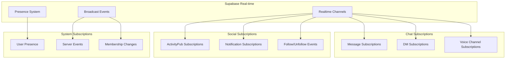
```mermaid
graph TB
    subgraph "Supabase Real-time"
        CHANNELS[Realtime Channels]
        PRESENCE[Presence System]
        BROADCAST[Broadcast Events]
    end
    
    subgraph "Chat Subscriptions"
        CHAT_SUB[Message Subscriptions]
        DM_SUB[DM Subscriptions]
        VOICE_SUB[Voice Channel Subscriptions]
    end
    
    subgraph "Social Subscriptions"
        ACTIVITY_SUB[ActivityPub Subscriptions]
        NOTIF_SUB[Notification Subscriptions]
        FOLLOW_SUB[Follow/Unfollow Events]
    end
    
    subgraph "System Subscriptions"
        USER_SUB[User Presence]
        SERVER_SUB[Server Events]
        MEMBER_SUB[Membership Changes]
    end
    
    CHANNELS --> CHAT_SUB
    CHANNELS --> DM_SUB
    CHANNELS --> VOICE_SUB
    CHANNELS --> ACTIVITY_SUB
    CHANNELS --> NOTIF_SUB
    CHANNELS --> FOLLOW_SUB
    
    PRESENCE --> USER_SUB
    BROADCAST --> SERVER_SUB
    BROADCAST --> MEMBER_SUB
```

## Data Storage Model

```mermaid
erDiagram
    USERS ||--o{ PROFILES : has
    USERS ||--o{ SERVERS : owns
    USERS ||--o{ MESSAGES : sends
    USERS ||--o{ ACTIVITYPUB_POSTS : creates
    
    SERVERS ||--o{ CHANNELS : contains
    SERVERS ||--o{ CATEGORIES : organizes
    SERVERS ||--o{ SERVER_USERS : members
    SERVERS ||--o{ EMOJIS : custom_emojis
    
    CHANNELS ||--o{ MESSAGES : contains
    CHANNELS ||--o{ VOICE_SESSIONS : hosts
    
    MESSAGES ||--o{ REACTIONS : receives
    MESSAGES ||--o{ ATTACHMENTS : includes
    
    ACTIVITYPUB_POSTS ||--o{ AP_ACTIVITIES : generates
    ACTIVITYPUB_POSTS ||--o{ AP_REACTIONS : receives
    
    PROFILES ||--o{ FOLLOWS : social_connections
    PROFILES ||--o{ NOTIFICATIONS : receives
    
    STORAGE_OBJECTS ||--o{ FILE_UPLOADS : stores
```
