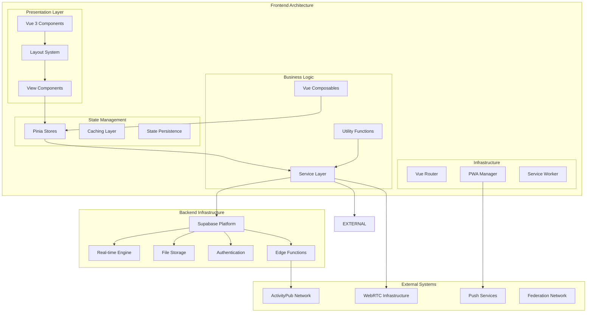
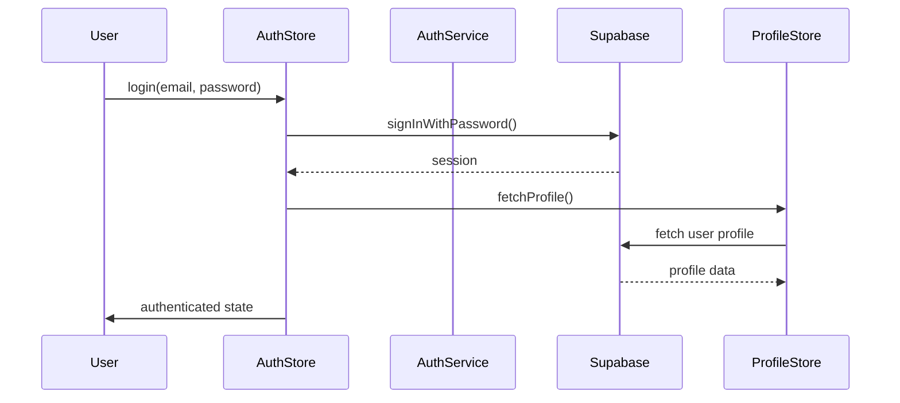
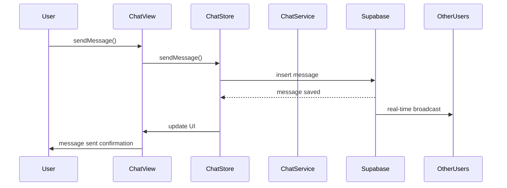
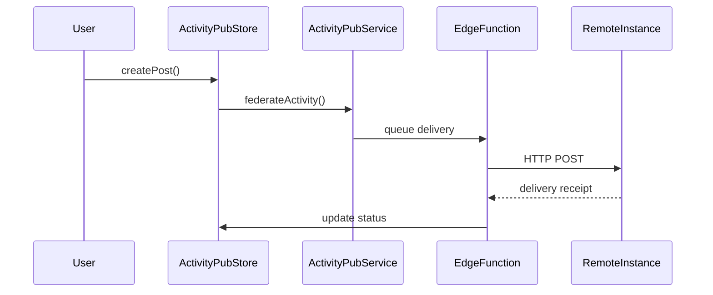
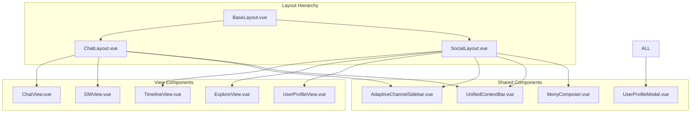
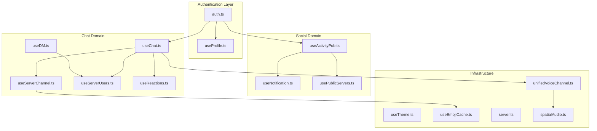
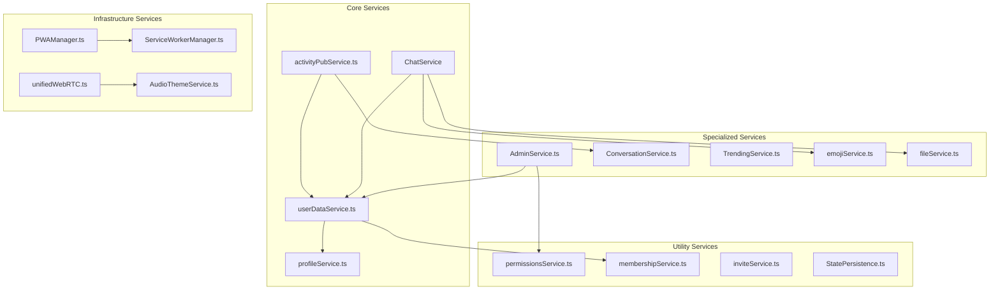
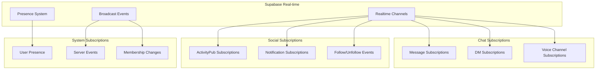
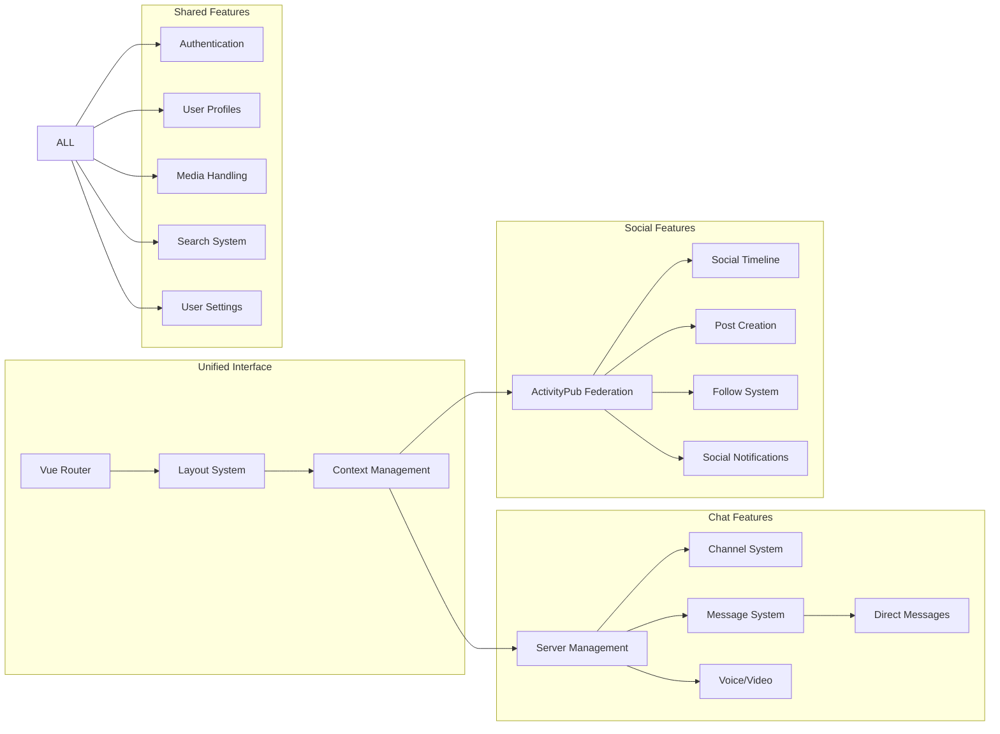
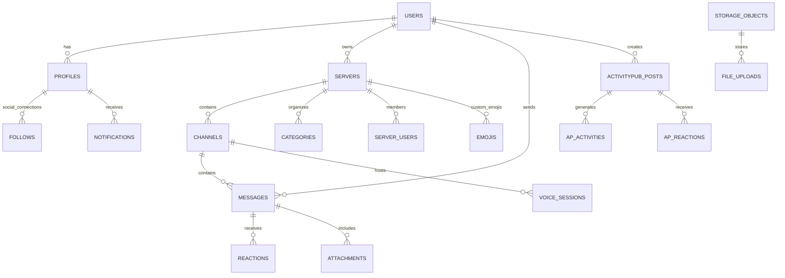

# Harmony System Architecture & Interconnection Flow

## 🏗️ High-Level System Architecture

## 🔄 Core Data Flow

### 1. Authentication Flow

### 2. Chat Message Flow

### 3. ActivityPub Federation Flow

## 📁 Component Interconnection Map

### Layout System Architecture

### Store Interconnections

### Service Layer Dependencies

## 🔌 Real-time Subscription Architecture

## 🎯 Feature Integration Map

### Unified Interface System

## 📊 Data Storage Architecture

This comprehensive flow shows how all components in your Harmony codebase are interconnected, from the frontend Vue components down to the Supabase backend and external federation systems.
