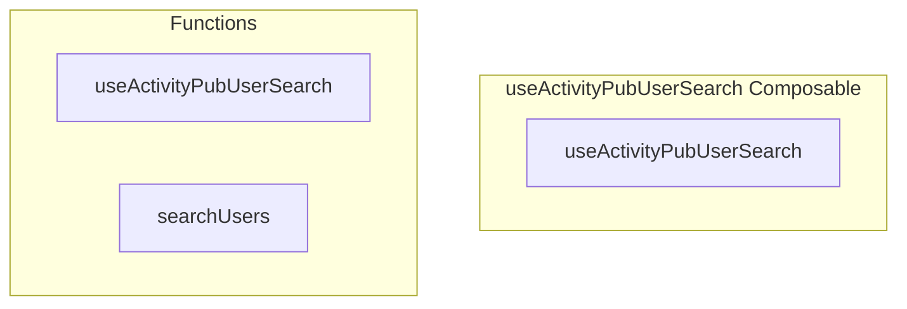

# useActivityPubUserSearch Composable

**File:** `src/composables/useActivityPubUserSearch.ts`

## Overview




## Exports

- **useActivityPubUserSearch** - function export

## Functions

### `useActivityPubUserSearch()`

No description available.

**Parameters:**
None

**Returns:** `void`

```typescript
export function useActivityPubUserSearch()
```

### `searchUsers(query: string)`

No description available.

**Parameters:**
- `query: string`

**Returns:** `Promise&lt;SuggestionItem[]&gt;`

```typescript
const searchUsers = async (query: string): Promise<SuggestionItem[]> =>
```


## Source Code Insights

**File Size:** 4155 characters
**Lines of Code:** 119
**Imports:** 5

## Usage Example

```typescript
import { useActivityPubUserSearch } from '@/composables/useActivityPubUserSearch'

// Example usage
useActivityPubUserSearch()
```

---

*This documentation was automatically generated from the source code.*