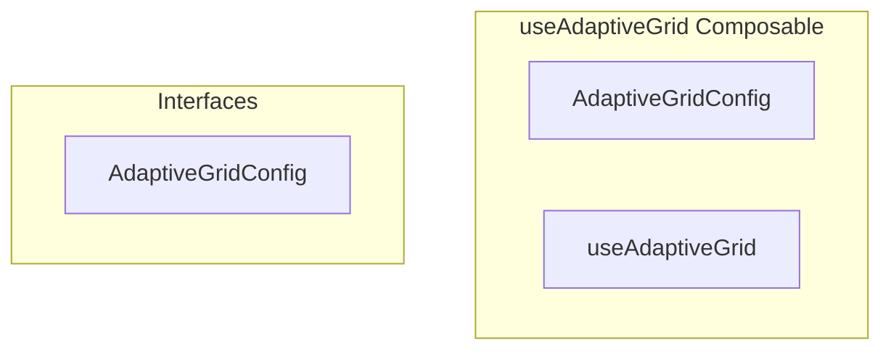

# useAdaptiveGrid Composable

**File:** `src/composables/useAdaptiveGrid.ts`

## Overview




## Exports

- **AdaptiveGridConfig** - interface export
- **useAdaptiveGrid** - function export


## Interfaces

### AdaptiveGridConfig

No description available.

```typescript
interface AdaptiveGridConfig {

  columns: number;
  minCardWidth: string;
  maxCardWidth: string;
  cardHeight: string;
  gap: string;
  gridClass: string;

}
```


## Source Code Insights

**File Size:** 3484 characters
**Lines of Code:** 155
**Imports:** 1

## Usage Example

```typescript
import { AdaptiveGridConfig, useAdaptiveGrid } from '@/composables/useAdaptiveGrid'

// Example usage
// Use the exported functionality
```

---

*This documentation was automatically generated from the source code.*