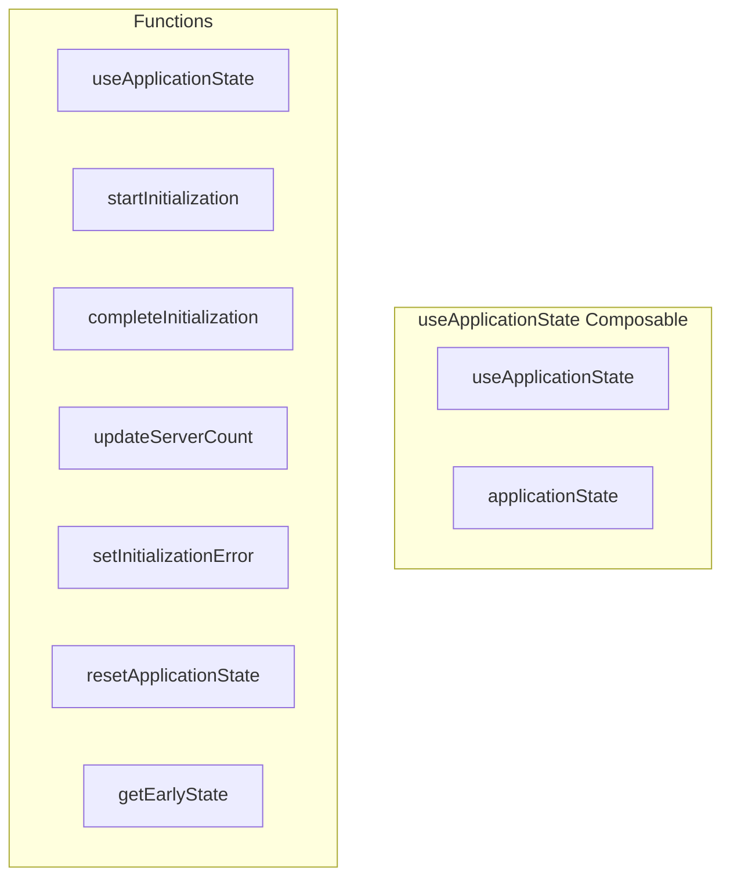

# useApplicationState Composable

**File:** `src/composables/useApplicationState.ts`

## Overview




## Exports

- **useApplicationState** - function export
- **applicationState** - const export

## Functions

### `useApplicationState()`

No description available.

**Parameters:**
None

**Returns:** `void`

```typescript
/**
 * Composable for managing application initialization state
 * Prevents splash screen flashes and provides smooth loading experience
 */
export function useApplicationState()
```

### `startInitialization()`

No description available.

**Parameters:**
None

**Returns:** `Promise&lt;void&gt;`

```typescript
/**
   * Check if the application should show loading state
   */
  const isInitializing = computed(() => _isInitializing.value)
  
  /**
   * Check if the application has completed initialization
   */
  const hasInitialized = computed(() => _hasInitialized.value)
  
  /**
   * Check if user has any servers
   */
  const hasServers = computed(() => _hasServers.value)
  
  /**
   * Get initialization error if any occurred
   */
  const initializationError = computed(() => _initializationError.value)
  
  /**
   * Determine if splash screen should be shown
   */
  const shouldShowSplash = computed(() => {
    return hasInitialized.value && !hasServers.value && !initializationError.value
  })
  
  /**
   * Determine if loading screen should be shown
   */
  const shouldShowLoading = computed(() => {
    return isInitializing.value && !initializationError.value
  })
  
  /**
   * Start application initialization
   */
  async function startInitialization(): Promise<void>
```

### `completeInitialization(serverCount: number)`

No description available.

**Parameters:**
- `serverCount: number`

**Returns:** `Promise&lt;void&gt;`

```typescript
/**
   * Complete initialization process
   */
  async function completeInitialization(serverCount: number): Promise<void>
```

### `updateServerCount(count: number)`

No description available.

**Parameters:**
- `count: number`

**Returns:** `void`

```typescript
/**
   * Update server count (when user joins/leaves servers)
   */
  function updateServerCount(count: number): void
```

### `setInitializationError(error: string | null)`

No description available.

**Parameters:**
- `error: string | null`

**Returns:** `void`

```typescript
/**
   * Set initialization error
   */
  function setInitializationError(error: string | null): void
```

### `resetApplicationState()`

No description available.

**Parameters:**
None

**Returns:** `Promise&lt;void&gt;`

```typescript
/**
   * Reset application state (for logout, etc.)
   */
  async function resetApplicationState(): Promise<void>
```

### `getEarlyState()`

No description available.

**Parameters:**
None

**Returns:** `void`

```typescript
/**
   * Get early state for preventing flash (synchronous)
   */
  function getEarlyState()
```


## Source Code Insights

**File Size:** 4684 characters
**Lines of Code:** 168
**Imports:** 3

## Usage Example

```typescript
import { useApplicationState, applicationState } from '@/composables/useApplicationState'

// Example usage
useApplicationState()
```

---

*This documentation was automatically generated from the source code.*