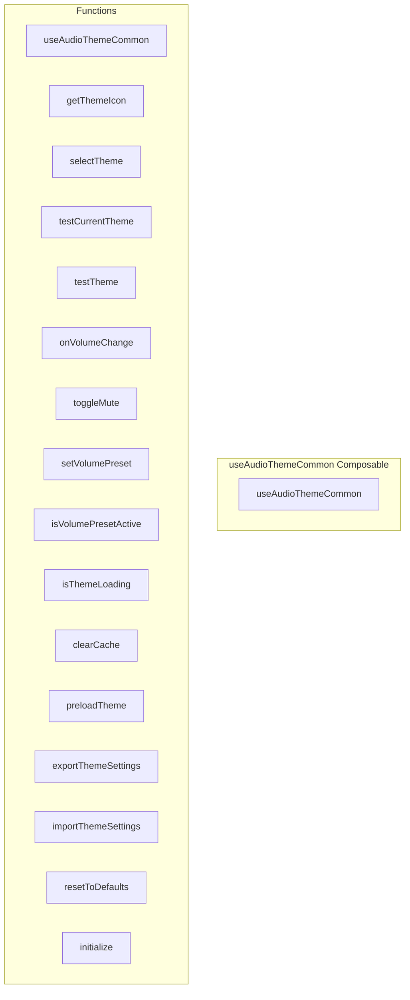

# useAudioThemeCommon Composable

**File:** `src/composables/useAudioThemeCommon.ts`

## Overview




## Exports

- **useAudioThemeCommon** - function export

## Functions

### `useAudioThemeCommon()`

No description available.

**Parameters:**
None

**Returns:** `void`

```typescript
/**
 * Shared composable for common audio theme functionality
 * Used by AudioThemePicker and AudioThemeManager to avoid code duplication
 */
export function useAudioThemeCommon()
```

### `getThemeIcon(themeId: string)`

No description available.

**Parameters:**
- `themeId: string`

**Returns:** `string`

```typescript
const getThemeIcon = (themeId: string): string =>
```

### `selectTheme(themeId: string)`

No description available.

**Parameters:**
- `themeId: string`

**Returns:** `Promise&lt;boolean&gt;`

```typescript
const selectTheme = async (themeId: string): Promise<boolean> =>
```

### `testCurrentTheme()`

No description available.

**Parameters:**
None

**Returns:** `Promise&lt;void&gt;`

```typescript
const testCurrentTheme = async (): Promise<void> =>
```

### `testTheme(themeId: string)`

No description available.

**Parameters:**
- `themeId: string`

**Returns:** `Promise&lt;void&gt;`

```typescript
const testTheme = async (themeId: string): Promise<void> =>
```

### `onVolumeChange()`

No description available.

**Parameters:**
None

**Returns:** `void`

```typescript
const onVolumeChange = (): void =>
```

### `toggleMute()`

No description available.

**Parameters:**
None

**Returns:** `void`

```typescript
const toggleMute = (): void =>
```

### `setVolumePreset(value: number)`

No description available.

**Parameters:**
- `value: number`

**Returns:** `void`

```typescript
const setVolumePreset = (value: number): void =>
```

### `isVolumePresetActive(value: number)`

No description available.

**Parameters:**
- `value: number`

**Returns:** `boolean`

```typescript
const isVolumePresetActive = (value: number): boolean =>
```

### `isThemeLoading(themeId?: string)`

No description available.

**Parameters:**
- `themeId?: string`

**Returns:** `boolean`

```typescript
const isThemeLoading = (themeId?: string): boolean =>
```

### `clearCache()`

No description available.

**Parameters:**
None

**Returns:** `void`

```typescript
const clearCache = (): void =>
```

### `preloadTheme(themeId: string)`

No description available.

**Parameters:**
- `themeId: string`

**Returns:** `Promise&lt;void&gt;`

```typescript
const preloadTheme = async (themeId: string): Promise<void> =>
```

### `exportThemeSettings()`

No description available.

**Parameters:**
None

**Returns:** `void`

```typescript
const exportThemeSettings = (): void =>
```

### `importThemeSettings()`

No description available.

**Parameters:**
None

**Returns:** `void`

```typescript
const importThemeSettings = (): void =>
```

### `resetToDefaults()`

No description available.

**Parameters:**
None

**Returns:** `Promise&lt;void&gt;`

```typescript
const resetToDefaults = async (): Promise<void> =>
```

### `initialize()`

No description available.

**Parameters:**
None

**Returns:** `Promise&lt;void&gt;`

```typescript
const initialize = async (): Promise<void> =>
```


## Source Code Insights

**File Size:** 8964 characters
**Lines of Code:** 343
**Imports:** 4

## Usage Example

```typescript
import { useAudioThemeCommon } from '@/composables/useAudioThemeCommon'

// Example usage
useAudioThemeCommon()
```

---

*This documentation was automatically generated from the source code.*