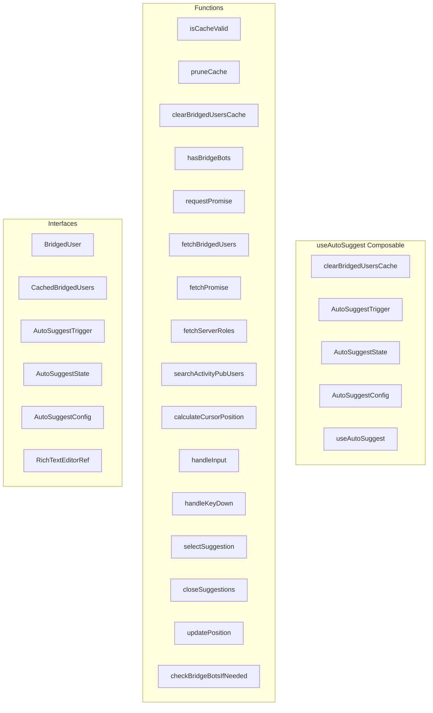

# useAutoSuggest Composable

**File:** `src/composables/useAutoSuggest.ts`

## Overview




## Exports

- **clearBridgedUsersCache** - function export
- **AutoSuggestTrigger** - interface export
- **AutoSuggestState** - interface export
- **AutoSuggestConfig** - interface export
- **useAutoSuggest** - function export

## Functions

### `isCacheValid(entry: CachedBridgedUsers | undefined)`

No description available.

**Parameters:**
- `entry: CachedBridgedUsers | undefined`

**Returns:** `boolean`

```typescript
function isCacheValid(entry: CachedBridgedUsers | undefined): boolean
```

### `pruneCache()`

No description available.

**Parameters:**
None

**Returns:** `void`

```typescript
function pruneCache()
```

### `clearBridgedUsersCache(channelId?: string)`

No description available.

**Parameters:**
- `channelId?: string`

**Returns:** `void`

```typescript
export function clearBridgedUsersCache(channelId?: string)
```

### `hasBridgeBots(serverId: string | null)`

No description available.

**Parameters:**
- `serverId: string | null`

**Returns:** `Promise&lt;boolean&gt;`

```typescript
const hasBridgeBots = async (serverId: string | null): Promise<boolean> =>
```

### `requestPromise(async ()`

No description available.

**Parameters:**
- `async (`

**Returns:** `Unknown`

```typescript
const requestPromise = (async () =>
```

### `fetchBridgedUsers(channelId: string)`

No description available.

**Parameters:**
- `channelId: string`

**Returns:** `Unknown`

```typescript
const fetchBridgedUsers = async (channelId: string) =>
```

### `fetchPromise(async ()`

No description available.

**Parameters:**
- `async (`

**Returns:** `Promise&lt;BridgedUser[]&gt;`

```typescript
const fetchPromise = (async (): Promise<BridgedUser[]> =>
```

### `fetchServerRoles(serverId: string)`

No description available.

**Parameters:**
- `serverId: string`

**Returns:** `Unknown`

```typescript
const fetchServerRoles = async (serverId: string) =>
```

### `searchActivityPubUsers(query: string)`

No description available.

**Parameters:**
- `query: string`

**Returns:** `Unknown`

```typescript
const searchActivityPubUsers = async (query: string) =>
```

### `calculateCursorPosition()`

No description available.

**Parameters:**
None

**Returns:** `SuggestionPosition`

```typescript
const calculateCursorPosition = (): SuggestionPosition =>
```

### `handleInput(value: string, cursorPosition: number)`

No description available.

**Parameters:**
- `value: string`
- `cursorPosition: number`

**Returns:** `Unknown`

```typescript
const handleInput = (value: string, cursorPosition: number) =>
```

### `handleKeyDown(event: KeyboardEvent)`

No description available.

**Parameters:**
- `event: KeyboardEvent`

**Returns:** `boolean`

```typescript
const handleKeyDown = (event: KeyboardEvent): boolean =>
```

### `selectSuggestion(suggestion: SuggestionItem)`

No description available.

**Parameters:**
- `suggestion: SuggestionItem`

**Returns:** `string`

```typescript
const selectSuggestion = (suggestion: SuggestionItem): string =>
```

### `closeSuggestions()`

No description available.

**Parameters:**
None

**Returns:** `Unknown`

```typescript
const closeSuggestions = () =>
```

### `updatePosition()`

No description available.

**Parameters:**
None

**Returns:** `Unknown`

```typescript
const updatePosition = () =>
```

### `checkBridgeBotsIfNeeded(serverId: string | null)`

No description available.

**Parameters:**
- `serverId: string | null`

**Returns:** `Unknown`

```typescript
const checkBridgeBotsIfNeeded = async (serverId: string | null) =>
```


## Interfaces

### BridgedUser

No description available.

```typescript
interface BridgedUser {

  id: string;
  username: string;
  displayName: string;
  avatarUrl: string;
  source: 'discord';

}
```

### CachedBridgedUsers

No description available.

```typescript
interface CachedBridgedUsers {

  users: BridgedUser[];
  timestamp: number;

}
```

### AutoSuggestTrigger

No description available.

```typescript
interface AutoSuggestTrigger {

  char: string;
  pattern: RegExp;
  type: 'emoji' | 'mention';

}
```

### AutoSuggestState

No description available.

```typescript
interface AutoSuggestState {

  isActive: boolean;
  triggerType: 'emoji' | 'mention' | null;
  query: string;
  triggerPosition: number;
  selectedIndex: number;
  position: SuggestionPosition;

}
```

### AutoSuggestConfig

No description available.

```typescript
interface AutoSuggestConfig {

  mode: 'chat' | 'activitypub';
  enableEmojis?: boolean;
  enableMentions?: boolean;
  maxSuggestions?: number;

}
```

### RichTextEditorRef

No description available.

```typescript
interface RichTextEditorRef {

  getCursorPosition?: () => number;
  focus?: () => void;
  insertTextAtCursor?: (text: string) => void;
  $el?: HTMLElement;

}
```


## Type Definitions

### InputElementType

No description available.

```typescript
type InputElementType = HTMLTextAreaElement | HTMLInputElement | RichTextEditorRef | any;
```


## Constants

### BRIDGED_USERS_CACHE_TTL

No description available.

```typescript
const BRIDGED_USERS_CACHE_TTL = 5 * 60 * 1000
```

### BRIDGED_USERS_CACHE_MAX_SIZE

No description available.

```typescript
const BRIDGED_USERS_CACHE_MAX_SIZE = 50
```

### BRIDGE_BOT_CHECK_CACHE_TTL

No description available.

```typescript
const BRIDGE_BOT_CHECK_CACHE_TTL = 5 * 60 * 1000
```


## Source Code Insights

**File Size:** 38580 characters
**Lines of Code:** 1057
**Imports:** 13

## Usage Example

```typescript
import { clearBridgedUsersCache, AutoSuggestTrigger, AutoSuggestState, AutoSuggestConfig, useAutoSuggest } from '@/composables/useAutoSuggest'

// Example usage
isCacheValid()
```

---

*This documentation was automatically generated from the source code.*