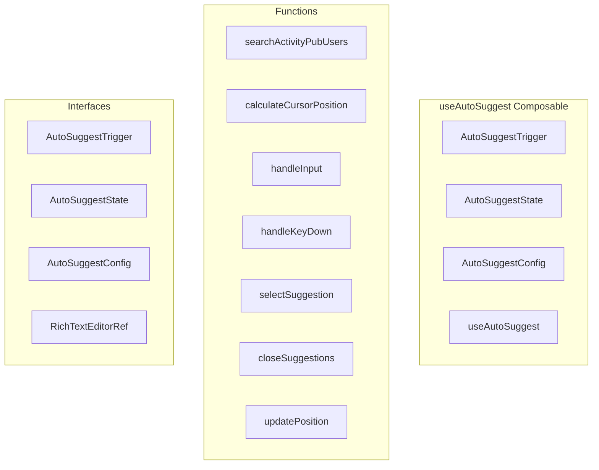

# useAutoSuggest Composable

**File:** `src/composables/useAutoSuggest.ts`

## Overview


```mermaid
graph TB
    subgraph "useAutoSuggest Composable"
        AUTOSUGGESTTRIGGER[AutoSuggestTrigger]
        AUTOSUGGESTSTATE[AutoSuggestState]
        AUTOSUGGESTCONFIG[AutoSuggestConfig]
        USEAUTOSUGGEST[useAutoSuggest]
    end
    
    subgraph "Functions"
        FN_SEARCHACTIVITYPUBUSERS[searchActivityPubUsers]
        FN_CALCULATECURSORPOSITION[calculateCursorPosition]
        FN_HANDLEINPUT[handleInput]
        FN_HANDLEKEYDOWN[handleKeyDown]
        FN_SELECTSUGGESTION[selectSuggestion]
        FN_CLOSESUGGESTIONS[closeSuggestions]
        FN_UPDATEPOSITION[updatePosition]
    end
    
    subgraph "Interfaces"
        INT_AUTOSUGGESTTRIGGER[AutoSuggestTrigger]
        INT_AUTOSUGGESTSTATE[AutoSuggestState]
        INT_AUTOSUGGESTCONFIG[AutoSuggestConfig]
        INT_RICHTEXTEDITORREF[RichTextEditorRef]
    end
```


## Exports

- **AutoSuggestTrigger** - interface export
- **AutoSuggestState** - interface export
- **AutoSuggestConfig** - interface export
- **useAutoSuggest** - function export

## Functions

### `searchActivityPubUsers(query: string)`

No description available.

**Parameters:**
- `query: string`

**Returns:** `Unknown`

```typescript
const searchActivityPubUsers = async (query: string) =>
```

### `calculateCursorPosition()`

No description available.

**Parameters:**
None

**Returns:** `SuggestionPosition`

```typescript
const calculateCursorPosition = (): SuggestionPosition =>
```

### `handleInput(value: string, cursorPosition: number)`

No description available.

**Parameters:**
- `value: string`
- `cursorPosition: number`

**Returns:** `Unknown`

```typescript
const handleInput = (value: string, cursorPosition: number) =>
```

### `handleKeyDown(event: KeyboardEvent)`

No description available.

**Parameters:**
- `event: KeyboardEvent`

**Returns:** `boolean`

```typescript
const handleKeyDown = (event: KeyboardEvent): boolean =>
```

### `selectSuggestion(suggestion: SuggestionItem)`

No description available.

**Parameters:**
- `suggestion: SuggestionItem`

**Returns:** `string`

```typescript
const selectSuggestion = (suggestion: SuggestionItem): string =>
```

### `closeSuggestions()`

No description available.

**Parameters:**
None

**Returns:** `Unknown`

```typescript
const closeSuggestions = () =>
```

### `updatePosition()`

No description available.

**Parameters:**
None

**Returns:** `Unknown`

```typescript
const updatePosition = () =>
```


## Interfaces

### AutoSuggestTrigger

No description available.

```typescript
interface AutoSuggestTrigger {

  char: string;
  pattern: RegExp;
  type: 'emoji' | 'mention';

}
```

### AutoSuggestState

No description available.

```typescript
interface AutoSuggestState {

  isActive: boolean;
  triggerType: 'emoji' | 'mention' | null;
  query: string;
  triggerPosition: number;
  selectedIndex: number;
  position: SuggestionPosition;

}
```

### AutoSuggestConfig

No description available.

```typescript
interface AutoSuggestConfig {

  mode: 'chat' | 'activitypub';
  enableEmojis?: boolean;
  enableMentions?: boolean;
  maxSuggestions?: number;

}
```

### RichTextEditorRef

No description available.

```typescript
interface RichTextEditorRef {

  getCursorPosition?: () => number;
  focus?: () => void;
  insertTextAtCursor?: (text: string) => void;
  $el?: HTMLElement;

}
```


## Type Definitions

### InputElementType

No description available.

```typescript
type InputElementType = HTMLTextAreaElement | HTMLInputElement | RichTextEditorRef | any;
```


## Source Code Insights

**File Size:** 22428 characters
**Lines of Code:** 644
**Imports:** 9

## Usage Example

```typescript
import { AutoSuggestTrigger, AutoSuggestState, AutoSuggestConfig, useAutoSuggest } from '@/composables/useAutoSuggest'

// Example usage
searchActivityPubUsers()
```

---

*This documentation was automatically generated from the source code.*