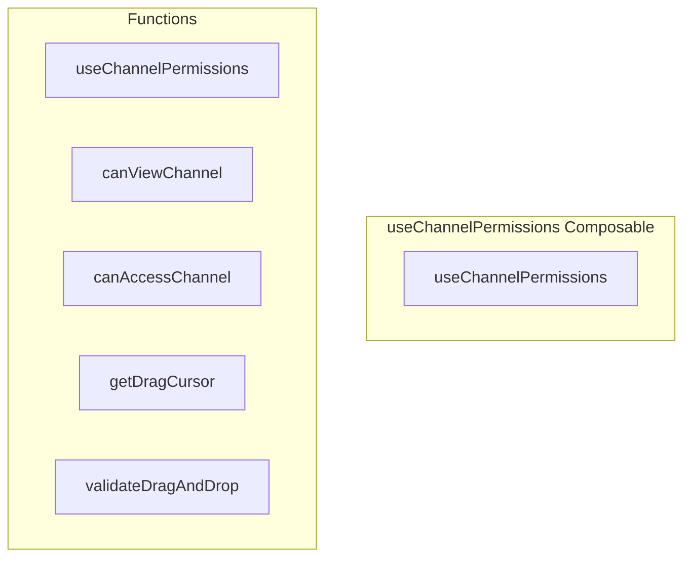

# useChannelPermissions Composable

**File:** `src/composables/useChannelPermissions.ts`

## Overview


```mermaid
graph TB
    subgraph "useChannelPermissions Composable"
        USECHANNELPERMISSIONS[useChannelPermissions]
    end
    
    subgraph "Functions"
        FN_USECHANNELPERMISSIONS[useChannelPermissions]
        FN_CANVIEWCHANNEL[canViewChannel]
        FN_CANACCESSCHANNEL[canAccessChannel]
        FN_GETDRAGCURSOR[getDragCursor]
        FN_VALIDATEDRAGANDDROP[validateDragAndDrop]
    end
```


## Exports

- **useChannelPermissions** - function export

## Functions

### `useChannelPermissions()`

No description available.

**Parameters:**
None

**Returns:** `void`

```typescript
export function useChannelPermissions()
```

### `canViewChannel(channelId: string)`

No description available.

**Parameters:**
- `channelId: string`

**Returns:** `Unknown`

```typescript
const canViewChannel = (channelId: string) =>
```

### `canAccessChannel(channelId: string)`

No description available.

**Parameters:**
- `channelId: string`

**Returns:** `Unknown`

```typescript
const canAccessChannel = (channelId: string) =>
```

### `getDragCursor(itemType: 'channel' | 'category', isDragging = false)`

No description available.

**Parameters:**
- `itemType: 'channel' | 'category'`
- `isDragging = false`

**Returns:** `Unknown`

```typescript
const getDragCursor = (itemType: 'channel' | 'category', isDragging = false) =>
```

### `validateDragAndDrop(itemType: string, dropType: string)`

No description available.

**Parameters:**
- `itemType: string`
- `dropType: string`

**Returns:** `Unknown`

```typescript
const validateDragAndDrop = (itemType: string, dropType: string) =>
```


## Source Code Insights

**File Size:** 3950 characters
**Lines of Code:** 139
**Imports:** 4

## Usage Example

```typescript
import { useChannelPermissions } from '@/composables/useChannelPermissions'

// Example usage
useChannelPermissions()
```

---

*This documentation was automatically generated from the source code.*