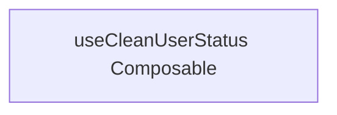

# useCleanUserStatus Composable

**File:** `src/composables/useCleanUserStatus.ts`

## Overview




## Source Code Insights

**File Size:** 0 characters
**Lines of Code:** 1
**Imports:** 0

## Usage Example

```typescript
import { useCleanUserStatus } from '@/composables/useCleanUserStatus'

// Example usage
// Use the exported functionality
```

---

*This documentation was automatically generated from the source code.*