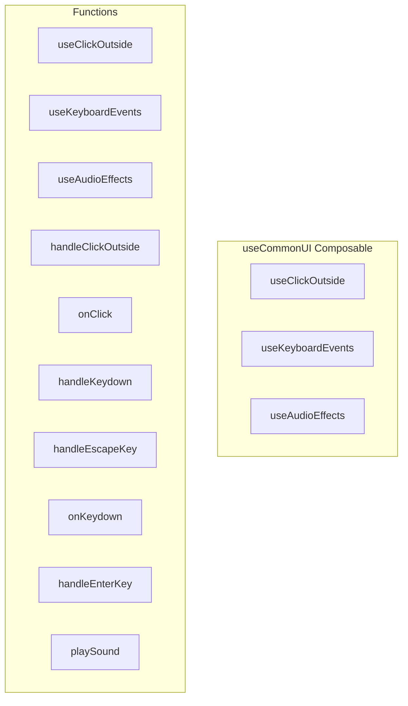

# useCommonUI Composable

**File:** `src/composables/useCommonUI.ts`

## Overview




## Exports

- **useClickOutside** - function export
- **useKeyboardEvents** - function export
- **useAudioEffects** - function export

## Functions

### `useClickOutside()`

No description available.

**Parameters:**
None

**Returns:** `void`

```typescript
export function useClickOutside()
```

### `useKeyboardEvents()`

No description available.

**Parameters:**
None

**Returns:** `void`

```typescript
export function useKeyboardEvents()
```

### `useAudioEffects()`

No description available.

**Parameters:**
None

**Returns:** `void`

```typescript
export function useAudioEffects()
```

### `handleClickOutside(callback: ()`

No description available.

**Parameters:**
- `callback: (`

**Returns:** `Unknown`

```typescript
const handleClickOutside = (callback: () =>
```

### `onClick(event: MouseEvent)`

No description available.

**Parameters:**
- `event: MouseEvent`

**Returns:** `Unknown`

```typescript
const onClick = (event: MouseEvent) =>
```

### `handleKeydown(callback: (event: KeyboardEvent)`

No description available.

**Parameters:**
- `callback: (event: KeyboardEvent`

**Returns:** `Unknown`

```typescript
const handleKeydown = (callback: (event: KeyboardEvent) =>
```

### `handleEscapeKey(callback: ()`

No description available.

**Parameters:**
- `callback: (`

**Returns:** `Unknown`

```typescript
const handleEscapeKey = (callback: () =>
```

### `onKeydown(event: KeyboardEvent)`

No description available.

**Parameters:**
- `event: KeyboardEvent`

**Returns:** `Unknown`

```typescript
const onKeydown = (event: KeyboardEvent) =>
```

### `handleEnterKey(callback: ()`

No description available.

**Parameters:**
- `callback: (`

**Returns:** `Unknown`

```typescript
const handleEnterKey = (callback: () =>
```

### `playSound(soundPath: string, volume = 0.5)`

No description available.

**Parameters:**
- `soundPath: string`
- `volume = 0.5`

**Returns:** `Unknown`

```typescript
const playSound = (soundPath: string, volume = 0.5) =>
```


## Source Code Insights

**File Size:** 1937 characters
**Lines of Code:** 83
**Imports:** 2

## Usage Example

```typescript
import { useClickOutside, useKeyboardEvents, useAudioEffects } from '@/composables/useCommonUI'

// Example usage
useClickOutside()
```

---

*This documentation was automatically generated from the source code.*