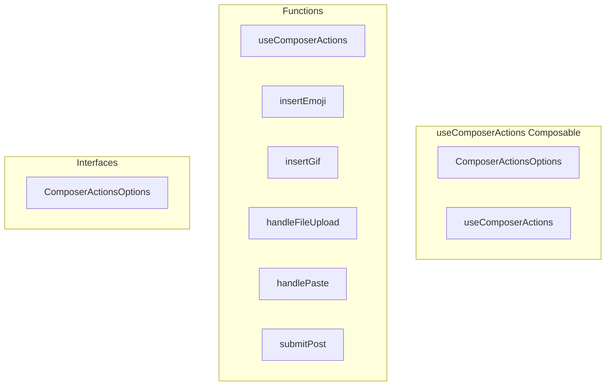

# useComposerActions Composable

**File:** `src/composables/useComposerActions.ts`

## Overview




## Exports

- **ComposerActionsOptions** - interface export
- **useComposerActions** - function export

## Functions

### `useComposerActions(options: ComposerActionsOptions)`

No description available.

**Parameters:**
- `options: ComposerActionsOptions`

**Returns:** `void`

```typescript
export function useComposerActions(options: ComposerActionsOptions)
```

### `insertEmoji(emoji: any)`

No description available.

**Parameters:**
- `emoji: any`

**Returns:** `Unknown`

```typescript
/**
 * useComposerActions - Shared actions for ActivityPub post composer
 * 
 * Handles emoji/GIF insertion, media uploads, content parsing,
 * and submission logic for the composer.
 */

import { nextTick, type Ref } from 'vue';
import type { MediaAttachment, Post } from '@/types';
import { useActivityPubStore } from '@/stores/useActivityPub';
import type RichTextEditor from '@/components/RichTextEditor.vue';
import { debug } from '@/utils/debug'

export interface ComposerActionsOptions {
  content: Ref<string>;
  richEditorRef: Ref<InstanceType<typeof RichTextEditor> | undefined>;
  showEmojiPicker: Ref<boolean>;
  showGiphyPicker: Ref<boolean>;
  mediaAttachments: Ref<MediaAttachment[]>;
  canAddMedia: Ref<boolean>;
  onContentUpdate?: (content: string) => void;
}

export function useComposerActions(options: ComposerActionsOptions) {
  const activityPubStore = useActivityPubStore();

  /**
   * Insert emoji at cursor position or append to content
   */
  const insertEmoji = (emoji: any) =>
```

### `insertGif(gif: any)`

No description available.

**Parameters:**
- `gif: any`

**Returns:** `Unknown`

```typescript
/**
   * Insert GIF URL into content
   */
  const insertGif = (gif: any) =>
```

### `handleFileUpload(event: Event)`

No description available.

**Parameters:**
- `event: Event`

**Returns:** `Unknown`

```typescript
/**
   * Handle file selection and create media attachments
   */
  const handleFileUpload = async (event: Event) =>
```

### `handlePaste(event: ClipboardEvent)`

No description available.

**Parameters:**
- `event: ClipboardEvent`

**Returns:** `Unknown`

```typescript
/**
   * Handle paste events to support image pasting
   */
  const handlePaste = (event: ClipboardEvent) =>
```

### `submitPost(visibility: Post['visibility'], contentWarning: string, isSensitive: boolean, replyToId?: string)`

No description available.

**Parameters:**
- `visibility: Post['visibility']`
- `contentWarning: string`
- `isSensitive: boolean`
- `replyToId?: string`

**Returns:** `Unknown`

```typescript
/**
   * Parse content and create post
   */
  const submitPost = async (
    visibility: Post['visibility'],
    contentWarning: string,
    isSensitive: boolean,
    replyToId?: string
  ) =>
```


## Interfaces

### ComposerActionsOptions

No description available.

```typescript
interface ComposerActionsOptions {

  content: Ref<string>;
  richEditorRef: Ref<InstanceType<typeof RichTextEditor> | undefined>;
  showEmojiPicker: Ref<boolean>;
  showGiphyPicker: Ref<boolean>;
  mediaAttachments: Ref<MediaAttachment[]>;
  canAddMedia: Ref<boolean>;
  onContentUpdate?: (content: string) => void;

}
```


## Source Code Insights

**File Size:** 6228 characters
**Lines of Code:** 207
**Imports:** 5

## Usage Example

```typescript
import { ComposerActionsOptions, useComposerActions } from '@/composables/useComposerActions'

// Example usage
useComposerActions()
```

---

*This documentation was automatically generated from the source code.*