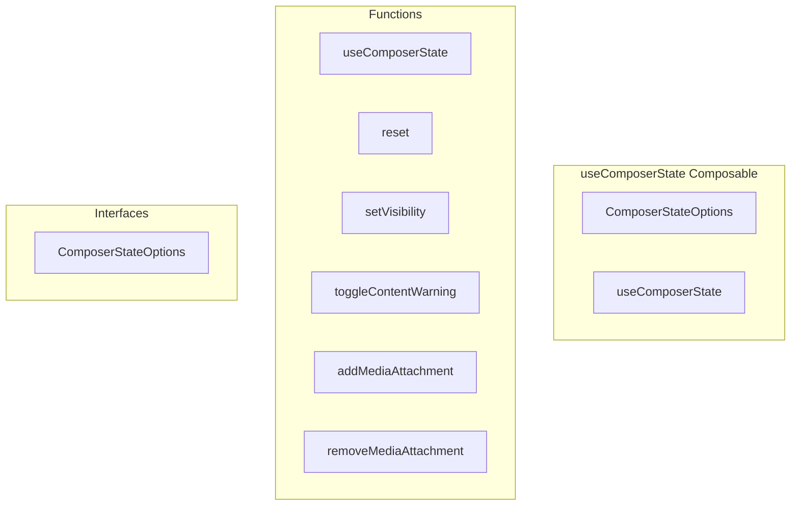

# useComposerState Composable

**File:** `src/composables/useComposerState.ts`

## Overview




## Exports

- **ComposerStateOptions** - interface export
- **useComposerState** - function export

## Functions

### `useComposerState(options: ComposerStateOptions = {})`

No description available.

**Parameters:**
- `options: ComposerStateOptions = {}`

**Returns:** `void`

```typescript
export function useComposerState(options: ComposerStateOptions = {})
```

### `reset()`

No description available.

**Parameters:**
None

**Returns:** `Unknown`

```typescript
const reset = () =>
```

### `setVisibility(newVisibility: Post['visibility'])`

No description available.

**Parameters:**
- `newVisibility: Post['visibility']`

**Returns:** `Unknown`

```typescript
const setVisibility = (newVisibility: Post['visibility']) =>
```

### `toggleContentWarning()`

No description available.

**Parameters:**
None

**Returns:** `Unknown`

```typescript
const toggleContentWarning = () =>
```

### `addMediaAttachment(attachment: MediaAttachment)`

No description available.

**Parameters:**
- `attachment: MediaAttachment`

**Returns:** `Unknown`

```typescript
const addMediaAttachment = (attachment: MediaAttachment) =>
```

### `removeMediaAttachment(index: number)`

No description available.

**Parameters:**
- `index: number`

**Returns:** `Unknown`

```typescript
const removeMediaAttachment = (index: number) =>
```


## Interfaces

### ComposerStateOptions

No description available.

```typescript
interface ComposerStateOptions {

  defaultVisibility?: Post['visibility'];
  characterLimit?: number;
  maxMediaAttachments?: number;

}
```


## Source Code Insights

**File Size:** 4453 characters
**Lines of Code:** 168
**Imports:** 2

## Usage Example

```typescript
import { ComposerStateOptions, useComposerState } from '@/composables/useComposerState'

// Example usage
useComposerState()
```

---

*This documentation was automatically generated from the source code.*