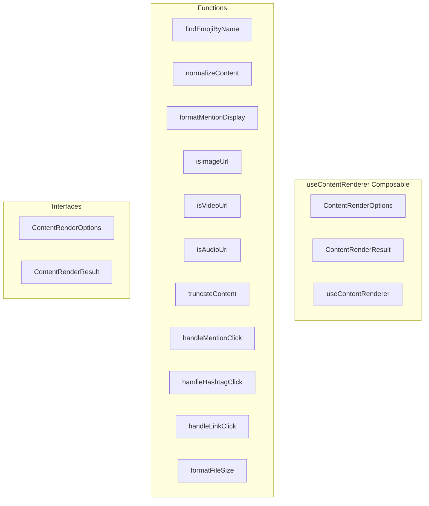

# useContentRenderer Composable

**File:** `src/composables/useContentRenderer.ts`

## Overview




## Exports

- **ContentRenderOptions** - interface export
- **ContentRenderResult** - interface export
- **useContentRenderer** - function export

## Functions

### `findEmojiByName(name: string)`

No description available.

**Parameters:**
- `name: string`

**Returns:** `Unknown`

```typescript
const findEmojiByName = (name: string) =>
```

### `normalizeContent(rawContent: any)`

No description available.

**Parameters:**
- `rawContent: any`

**Returns:** `MessagePart[]`

```typescript
const normalizeContent = (rawContent: any): MessagePart[] =>
```

### `formatMentionDisplay(mention: MessagePart)`

No description available.

**Parameters:**
- `mention: MessagePart`

**Returns:** `string`

```typescript
const formatMentionDisplay = (mention: MessagePart): string =>
```

### `isImageUrl(url: string)`

No description available.

**Parameters:**
- `url: string`

**Returns:** `boolean`

```typescript
const isImageUrl = (url: string): boolean =>
```

### `isVideoUrl(url: string)`

No description available.

**Parameters:**
- `url: string`

**Returns:** `boolean`

```typescript
const isVideoUrl = (url: string): boolean =>
```

### `isAudioUrl(url: string)`

No description available.

**Parameters:**
- `url: string`

**Returns:** `boolean`

```typescript
const isAudioUrl = (url: string): boolean =>
```

### `truncateContent(parts: MessagePart[], maxLength: number)`

No description available.

**Parameters:**
- `parts: MessagePart[]`
- `maxLength: number`

**Returns:** `MessagePart[]`

```typescript
const truncateContent = (parts: MessagePart[], maxLength: number): MessagePart[] =>
```

### `handleMentionClick(userId: string, event: Event)`

No description available.

**Parameters:**
- `userId: string`
- `event: Event`

**Returns:** `Unknown`

```typescript
const handleMentionClick = (userId: string, event: Event) =>
```

### `handleHashtagClick(tag: string)`

No description available.

**Parameters:**
- `tag: string`

**Returns:** `Unknown`

```typescript
const handleHashtagClick = (tag: string) =>
```

### `handleLinkClick(url: string, event: Event)`

No description available.

**Parameters:**
- `url: string`
- `event: Event`

**Returns:** `Unknown`

```typescript
const handleLinkClick = (url: string, event: Event) =>
```

### `formatFileSize(bytes: number)`

No description available.

**Parameters:**
- `bytes: number`

**Returns:** `string`

```typescript
const formatFileSize = (bytes: number): string =>
```


## Interfaces

### ContentRenderOptions

No description available.

```typescript
interface ContentRenderOptions {

  mode?: 'display' | 'preview' | 'edit';
  showImages?: boolean;
  showVideos?: boolean;
  maxPreviewLength?: number;
  singleLine?: boolean;
  enableMarkdown?: boolean;
  enableClickHandlers?: boolean;

}
```

### ContentRenderResult

No description available.

```typescript
interface ContentRenderResult {

  // For Vue template rendering
  renderableContent: Ref<MessagePart[]>;
  
  // For HTML string rendering (like MonyContent)
  formattedHTML: Ref<string>;
  
  // Helper functions
  isSingleEmoji: Ref<boolean>;
  findEmojiByName: (name: string) => any;
  formatMentionDisplay: (mention: MessagePart) => string;
  isImageUrl: (url: string) => boolean;
  isVideoUrl: (url: string) => boolean;
  isAudioUrl: (url: string) => boolean;
  
  // Event handlers
  handleMentionClick: (userId: string, event
  // ...
}
```


## Source Code Insights

**File Size:** 17728 characters
**Lines of Code:** 482
**Imports:** 7

## Usage Example

```typescript
import { ContentRenderOptions, ContentRenderResult, useContentRenderer } from '@/composables/useContentRenderer'

// Example usage
findEmojiByName()
```

---

*This documentation was automatically generated from the source code.*