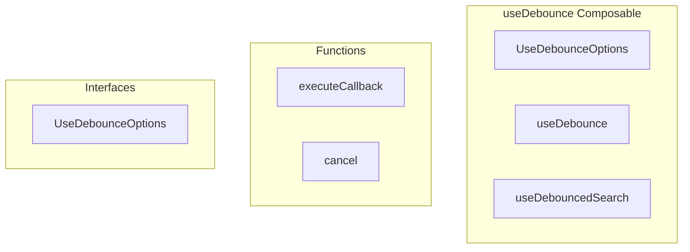

# useDebounce Composable

**File:** `src/composables/useDebounce.ts`

## Overview




## Exports

- **UseDebounceOptions** - interface export
- **useDebounce** - function export
- **useDebouncedSearch** - function export

## Functions

### `executeCallback(value: T)`

No description available.

**Parameters:**
- `value: T`

**Returns:** `Unknown`

```typescript
const executeCallback = async (value: T) =>
```

### `cancel()`

No description available.

**Parameters:**
None

**Returns:** `Unknown`

```typescript
const cancel = () =>
```


## Interfaces

### UseDebounceOptions

No description available.

```typescript
interface UseDebounceOptions {

  delay?: number
  immediate?: boolean

}
```


## Source Code Insights

**File Size:** 1644 characters
**Lines of Code:** 84
**Imports:** 1

## Usage Example

```typescript
import { UseDebounceOptions, useDebounce, useDebouncedSearch } from '@/composables/useDebounce'

// Example usage
executeCallback()
```

---

*This documentation was automatically generated from the source code.*