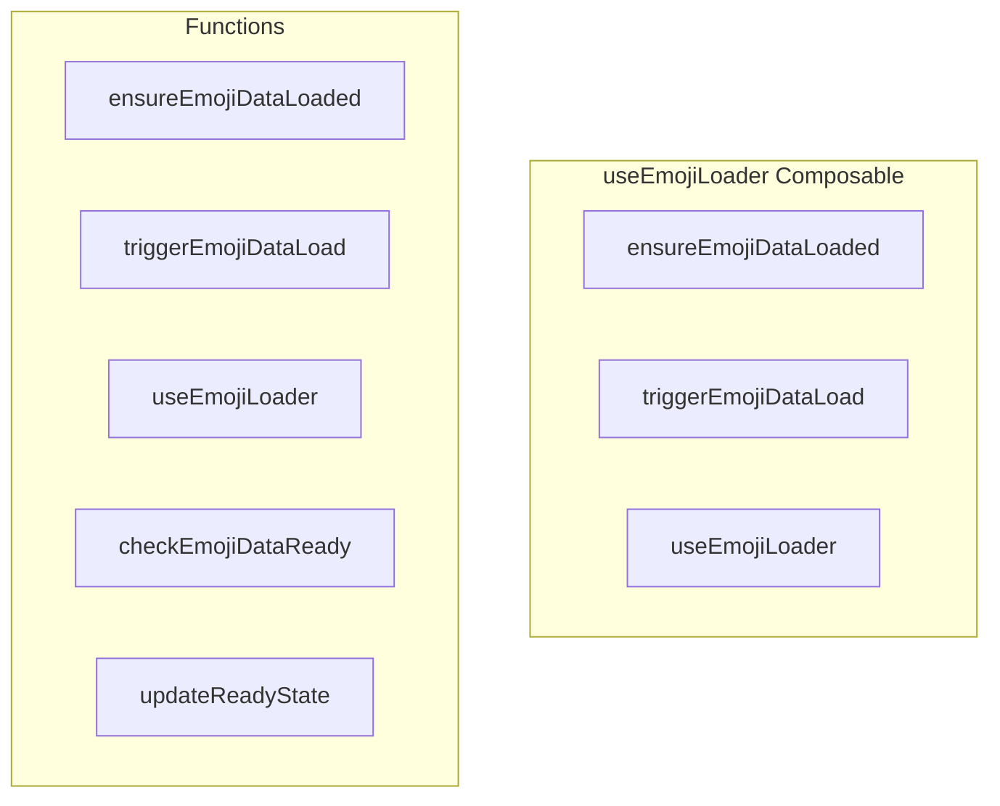

# useEmojiLoader Composable

**File:** `src/composables/useEmojiLoader.ts`

## Overview




## Exports

- **ensureEmojiDataLoaded** - function export
- **triggerEmojiDataLoad** - function export
- **useEmojiLoader** - function export

## Functions

### `ensureEmojiDataLoaded()`

No description available.

**Parameters:**
None

**Returns:** `Promise&lt;void&gt;`

```typescript
/**
 * Centralized emoji loading composable
 * Ensures emoji data (unified pack + server emojis) is loaded for autocomplete and picker
 * Loads in background, non-blocking
 */
import { ref } from 'vue'
import { useEmojiCacheStore } from '@/stores/useEmojiCache'
import { useServerChannelStore } from '@/stores/useServerChannel'
import { useUnifiedEmoji } from '@/services/unifiedEmojiService'
import { debug } from '@/utils/debug'

let emojiDataLoadInitiated = false
let emojiDataLoadPromise: Promise<void> | null = null

/**
 * Ensure emoji data is loaded (unified pack + server emojis)
 * This is called by autocomplete and emoji picker to ensure data is available
 * Returns immediately, loads in background
 */
export async function ensureEmojiDataLoaded(): Promise<void>
```

### `triggerEmojiDataLoad()`

No description available.

**Parameters:**
None

**Returns:** `void`

```typescript
/**
 * Trigger emoji data loading in background (non-blocking)
 * Use this when you want to preload emojis but don't need to wait
 */
export function triggerEmojiDataLoad(): void
```

### `useEmojiLoader()`

No description available.

**Parameters:**
None

**Returns:** `void`

```typescript
/**
 * Composable that provides emoji loading state and functions
 */
export function useEmojiLoader()
```

### `checkEmojiDataReady()`

No description available.

**Parameters:**
None

**Returns:** `Unknown`

```typescript
const checkEmojiDataReady = () =>
```

### `updateReadyState()`

No description available.

**Parameters:**
None

**Returns:** `Unknown`

```typescript
const updateReadyState = () =>
```


## Source Code Insights

**File Size:** 4072 characters
**Lines of Code:** 124
**Imports:** 5

## Usage Example

```typescript
import { ensureEmojiDataLoaded, triggerEmojiDataLoad, useEmojiLoader } from '@/composables/useEmojiLoader'

// Example usage
ensureEmojiDataLoaded()
```

---

*This documentation was automatically generated from the source code.*