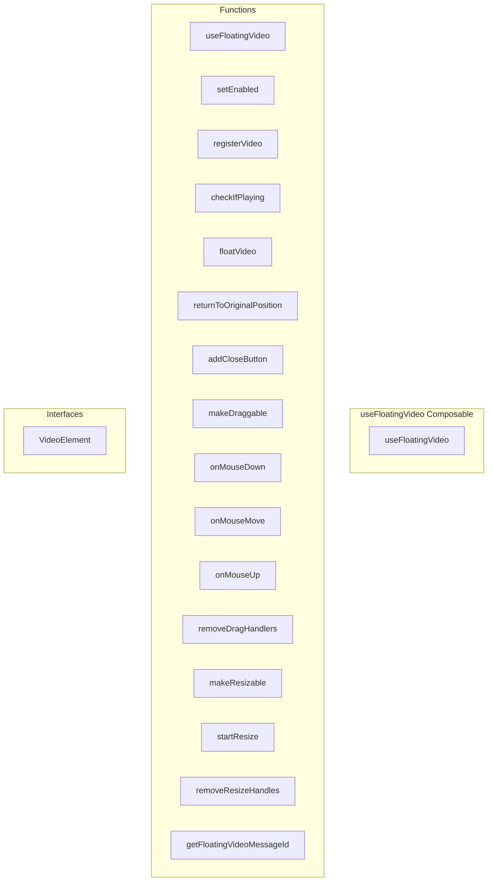

# useFloatingVideo Composable

**File:** `src/composables/useFloatingVideo.ts`

## Overview




## Exports

- **useFloatingVideo** - function export

## Functions

### `useFloatingVideo()`

No description available.

**Parameters:**
None

**Returns:** `void`

```typescript
export function useFloatingVideo()
```

### `setEnabled(enabled: boolean)`

No description available.

**Parameters:**
- `enabled: boolean`

**Returns:** `Unknown`

```typescript
/**
 * Floating Video Player Composable
 * Manages floating video state for YouTube and native video elements
 */

import { ref, computed, onUnmounted } from 'vue'

interface VideoElement {
  element: HTMLElement
  originalParent: HTMLElement
  messageId: string
  type: 'youtube' | 'video'
  isPlaying: boolean
  placeholder?: HTMLElement
  aspectRatio: number
}

// Global state (singleton)
const currentFloatingVideo = ref<VideoElement | null>(null)
const floatingPosition = ref({ x: 0, y: 0 })
const isDragging = ref(false)
const isUserSetting = ref(true) // Default: enabled

// Load user preference
if (typeof localStorage !== 'undefined') {
  const saved = localStorage.getItem('floatingVideoEnabled')
  if (saved !== null) {
    isUserSetting.value = saved === 'true'
  }
}

export function useFloatingVideo() {
  const isEnabled = computed(() => isUserSetting.value)

  /**
   * Toggle floating video feature
   */
  const setEnabled = (enabled: boolean) =>
```

### `registerVideo(element: HTMLElement, originalParent: HTMLElement, messageId: string, type: 'youtube' | 'video')`

No description available.

**Parameters:**
- `element: HTMLElement`
- `originalParent: HTMLElement`
- `messageId: string`
- `type: 'youtube' | 'video'`

**Returns:** `Unknown`

```typescript
/**
   * Register a video element for floating
   */
  const registerVideo = (
    element: HTMLElement,
    originalParent: HTMLElement,
    messageId: string,
    type: 'youtube' | 'video'
  ) =>
```

### `checkIfPlaying(element: HTMLElement, type: 'youtube' | 'video')`

No description available.

**Parameters:**
- `element: HTMLElement`
- `type: 'youtube' | 'video'`

**Returns:** `boolean`

```typescript
/**
   * Check if video is currently playing
   */
  const checkIfPlaying = (element: HTMLElement, type: 'youtube' | 'video'): boolean =>
```

### `floatVideo(element: HTMLElement, originalParent: HTMLElement, messageId: string, type: 'youtube' | 'video')`

No description available.

**Parameters:**
- `element: HTMLElement`
- `originalParent: HTMLElement`
- `messageId: string`
- `type: 'youtube' | 'video'`

**Returns:** `Unknown`

```typescript
/**
   * Float the video to top-right corner
   */
  const floatVideo = (
    element: HTMLElement,
    originalParent: HTMLElement,
    messageId: string,
    type: 'youtube' | 'video'
  ) =>
```

### `returnToOriginalPosition()`

No description available.

**Parameters:**
None

**Returns:** `Unknown`

```typescript
/**
   * Return video to original position
   */
  const returnToOriginalPosition = () =>
```

### `addCloseButton(element: HTMLElement)`

No description available.

**Parameters:**
- `element: HTMLElement`

**Returns:** `Unknown`

```typescript
/**
   * Add close button to floating video
   */
  const addCloseButton = (element: HTMLElement) =>
```

### `makeDraggable(element: HTMLElement)`

No description available.

**Parameters:**
- `element: HTMLElement`

**Returns:** `Unknown`

```typescript
/**
   * Make video draggable
   */
  const makeDraggable = (element: HTMLElement) =>
```

### `onMouseDown(e: MouseEvent)`

No description available.

**Parameters:**
- `e: MouseEvent`

**Returns:** `Unknown`

```typescript
const onMouseDown = (e: MouseEvent) =>
```

### `onMouseMove(e: MouseEvent)`

No description available.

**Parameters:**
- `e: MouseEvent`

**Returns:** `Unknown`

```typescript
const onMouseMove = (e: MouseEvent) =>
```

### `onMouseUp(e: MouseEvent)`

No description available.

**Parameters:**
- `e: MouseEvent`

**Returns:** `Unknown`

```typescript
const onMouseUp = (e: MouseEvent) =>
```

### `removeDragHandlers(element: HTMLElement)`

No description available.

**Parameters:**
- `element: HTMLElement`

**Returns:** `Unknown`

```typescript
/**
   * Remove drag handlers
   */
  const removeDragHandlers = (element: HTMLElement) =>
```

### `makeResizable(element: HTMLElement)`

No description available.

**Parameters:**
- `element: HTMLElement`

**Returns:** `Unknown`

```typescript
/**
   * Make video resizable
   */
  const makeResizable = (element: HTMLElement) =>
```

### `startResize(e: MouseEvent, element: HTMLElement, position: string)`

No description available.

**Parameters:**
- `e: MouseEvent`
- `element: HTMLElement`
- `position: string`

**Returns:** `Unknown`

```typescript
/**
   * Start resizing video
   */
  const startResize = (e: MouseEvent, element: HTMLElement, position: string) =>
```

### `removeResizeHandles(element: HTMLElement)`

No description available.

**Parameters:**
- `element: HTMLElement`

**Returns:** `Unknown`

```typescript
/**
   * Remove resize handles
   */
  const removeResizeHandles = (element: HTMLElement) =>
```

### `getFloatingVideoMessageId()`

No description available.

**Parameters:**
None

**Returns:** `Unknown`

```typescript
/**
   * Get current floating video
   */
  const getCurrentFloatingVideo = computed(() => currentFloatingVideo.value)

  /**
   * Check if a video is currently floating
   */
  const hasFloatingVideo = computed(() => currentFloatingVideo.value !== null)

  /**
   * Get the messageId of the currently floating video
   */
  const getFloatingVideoMessageId = () =>
```


## Interfaces

### VideoElement

No description available.

```typescript
interface VideoElement {

  element: HTMLElement
  originalParent: HTMLElement
  messageId: string
  type: 'youtube' | 'video'
  isPlaying: boolean
  placeholder?: HTMLElement
  aspectRatio: number

}
```


## Source Code Insights

**File Size:** 21961 characters
**Lines of Code:** 737
**Imports:** 1

## Usage Example

```typescript
import { useFloatingVideo } from '@/composables/useFloatingVideo'

// Example usage
useFloatingVideo()
```

---

*This documentation was automatically generated from the source code.*