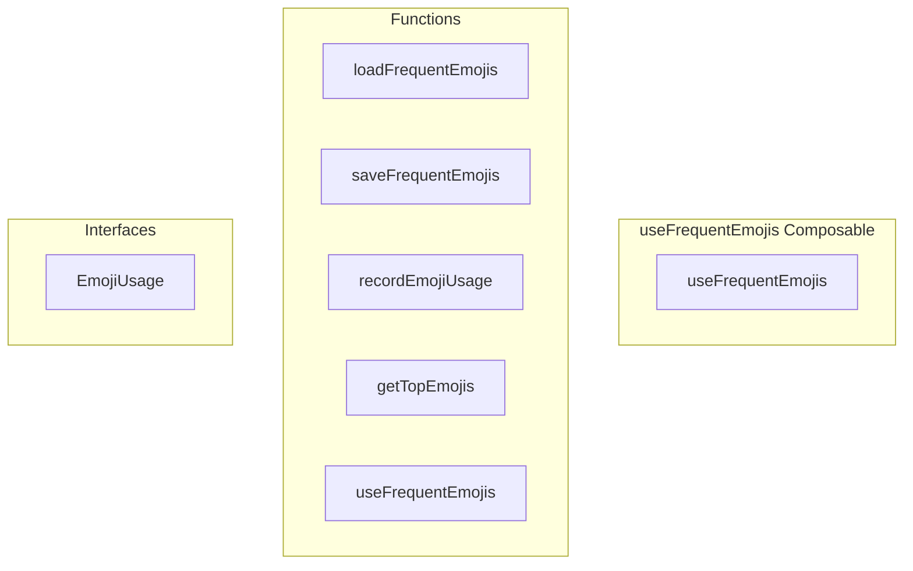

# useFrequentEmojis Composable

**File:** `src/composables/useFrequentEmojis.ts`

## Overview




## Exports

- **useFrequentEmojis** - function export

## Functions

### `loadFrequentEmojis()`

No description available.

**Parameters:**
None

**Returns:** `void`

```typescript
/**
 * Frequent Emojis Composable
 * 
 * Tracks user's most frequently used emojis in localStorage
 * and provides methods to get top emojis for the picker and context menu.
 */

import { ref, computed } from 'vue'
import { debug } from '@/utils/debug'
import { userStorage } from '@/utils/userScopedStorage'

interface EmojiUsage {
  id: string           // Emoji ID or unicode character
  native?: string      // Unicode emoji character (for native emojis)
  name: string         // Emoji name/shortcode
  url?: string         // URL for custom server emojis
  count: number        // Usage count
  lastUsed: number     // Timestamp of last use
}

const STORAGE_KEY = 'frequent-emojis'
const MAX_STORED_EMOJIS = 50  // Maximum emojis to track

// Shared state across all composable instances
const frequentEmojis = ref<EmojiUsage[]>([])
const isInitialized = ref(false)

/**
 * Load frequent emojis from localStorage
 */
function loadFrequentEmojis(): void
```

### `saveFrequentEmojis()`

No description available.

**Parameters:**
None

**Returns:** `void`

```typescript
/**
 * Save frequent emojis to localStorage
 */
function saveFrequentEmojis(): void
```

### `recordEmojiUsage(emoji: { id?: string; native?: string; name: string; url?: string })`

No description available.

**Parameters:**
- `emoji: { id?: string; native?: string; name: string; url?: string }`

**Returns:** `void`

```typescript
/**
 * Record emoji usage (call this when an emoji is used)
 */
function recordEmojiUsage(emoji: { id?: string; native?: string; name: string; url?: string }): void
```

### `getTopEmojis(limit: number = 10)`

No description available.

**Parameters:**
- `limit: number = 10`

**Returns:** `EmojiUsage[]`

```typescript
/**
 * Get top N frequently used emojis
 */
function getTopEmojis(limit: number = 10): EmojiUsage[]
```

### `useFrequentEmojis()`

No description available.

**Parameters:**
None

**Returns:** `void`

```typescript
/**
 * Composable for frequent emojis
 */
export function useFrequentEmojis()
```


## Interfaces

### EmojiUsage

No description available.

```typescript
interface EmojiUsage {

  id: string           // Emoji ID or unicode character
  native?: string      // Unicode emoji character (for native emojis)
  name: string         // Emoji name/shortcode
  url?: string         // URL for custom server emojis
  count: number        // Usage count
  lastUsed: number     // Timestamp of last use

}
```


## Constants

### STORAGE_KEY

No description available.

```typescript
const STORAGE_KEY = 'frequent-emojis'
```

### MAX_STORED_EMOJIS

No description available.

```typescript
const MAX_STORED_EMOJIS = 50  // Maximum emojis to track
```


## Source Code Insights

**File Size:** 4229 characters
**Lines of Code:** 159
**Imports:** 3

## Usage Example

```typescript
import { useFrequentEmojis } from '@/composables/useFrequentEmojis'

// Example usage
loadFrequentEmojis()
```

---

*This documentation was automatically generated from the source code.*