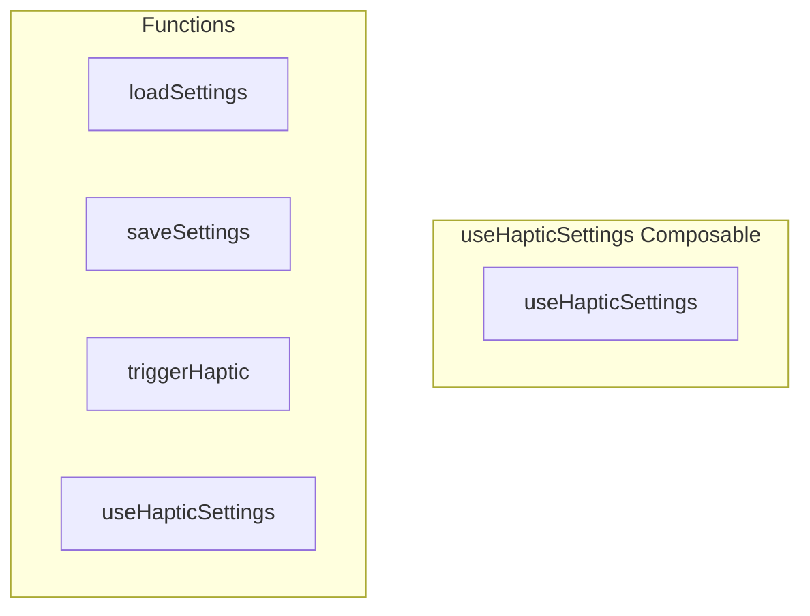

# useHapticSettings Composable

**File:** `src/composables/useHapticSettings.ts`

## Overview




## Exports

- **useHapticSettings** - function export

## Functions

### `loadSettings()`

No description available.

**Parameters:**
None

**Returns:** `void`

```typescript
/**
 * Haptic Settings Composable
 * 
 * Manages haptic feedback preferences and provides methods to trigger
 * haptics only when enabled by user settings.
 */

import { ref, watch } from 'vue'
import { hapticManager, type HapticPattern } from '@/utils/hapticFeedback'
import { debug } from '@/utils/debug'
import { userStorage } from '@/utils/userScopedStorage'

// Shared state across all composable instances
const isEnabled = ref(true)
const isInitialized = ref(false)

// Specific haptic triggers that can be individually controlled
const hapticTriggers = ref({
  messages: false,     // Send message (off by default - can be annoying)
  reactions: true,     // Add/remove reactions
  navigation: true,    // Tab changes, drawer open/close
  voice: true,         // Join/leave voice, mute/unmute
  interactions: true,  // Long press, pull to refresh
  toggles: true,       // Toggle switches, checkboxes
  destructive: true,   // Delete, leave server, etc.
})

/**
 * Load haptic settings from localStorage
 */
function loadSettings(): void
```

### `saveSettings()`

No description available.

**Parameters:**
None

**Returns:** `void`

```typescript
/**
 * Save haptic settings to localStorage
 */
function saveSettings(): void
```

### `triggerHaptic(category: keyof typeof hapticTriggers.value, pattern: HapticPattern = 'light')`

No description available.

**Parameters:**
- `category: keyof typeof hapticTriggers.value`
- `pattern: HapticPattern = 'light'`

**Returns:** `void`

```typescript
/**
 * Trigger haptic feedback if enabled for the given category
 */
function triggerHaptic(
  category: keyof typeof hapticTriggers.value,
  pattern: HapticPattern = 'light'
): void
```

### `useHapticSettings()`

No description available.

**Parameters:**
None

**Returns:** `void`

```typescript
/**
 * Composable for haptic settings
 */
export function useHapticSettings()
```


## Source Code Insights

**File Size:** 3620 characters
**Lines of Code:** 116
**Imports:** 4

## Usage Example

```typescript
import { useHapticSettings } from '@/composables/useHapticSettings'

// Example usage
loadSettings()
```

---

*This documentation was automatically generated from the source code.*