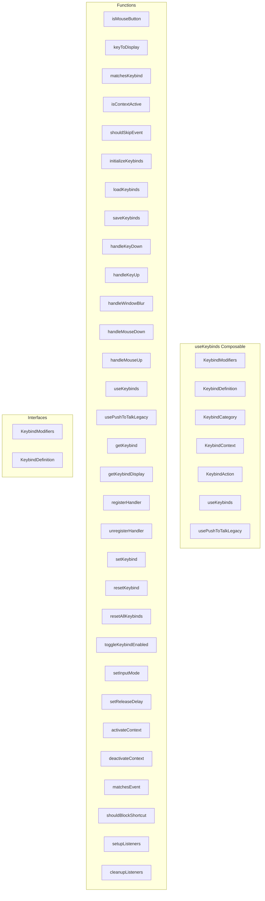

# useKeybinds Composable

**File:** `src/composables/useKeybinds.ts`

## Overview




## Exports

- **KeybindModifiers** - interface export
- **KeybindDefinition** - interface export
- **KeybindCategory** - type export
- **KeybindContext** - type export
- **KeybindAction** - type export
- **useKeybinds** - function export
- **usePushToTalkLegacy** - function export

## Functions

### `isMouseButton(key: string)`

No description available.

**Parameters:**
- `key: string`

**Returns:** `boolean`

```typescript
/**
 * Centralized Keybind Management System
 * 
 * Provides a professional, unified approach to keyboard shortcuts.
 * All keybinds are defined here, customizable, and handled through
 * a single global listener.
 * 
 * Features:
 * - Centralized keybind definitions
 * - Customizable keybinds stored in localStorage
 * - Modifier key support (Ctrl, Alt, Shift, Meta)
 * - Context-aware shortcuts (global vs scoped)
 * - Conflict detection and priority handling
 * - PTT integration
 */

import { ref, computed, readonly } from 'vue'
import { debug } from '@/utils/debug'

// =============================================================================
// TYPES
// =============================================================================

export interface KeybindModifiers {
  ctrl: boolean
  alt: boolean
  shift: boolean
  meta: boolean
}

export interface KeybindDefinition {
  id: string
  name: string
  description: string
  category: KeybindCategory
  defaultKey: string
  defaultModifiers: KeybindModifiers
  // Current customized values
  key: string
  modifiers: KeybindModifiers
  // Whether this keybind is enabled
  enabled: boolean
  // Context in which this keybind is active
  context: KeybindContext
  // Whether the key must be held (like PTT) vs pressed once
  holdMode: boolean
}

export type KeybindCategory = 
  | 'global'      // Always active
  | 'voice'       // Active during voice calls
  | 'chat'        // Active in chat view
  | 'navigation'  // Navigation shortcuts

export type KeybindContext =
  | 'global'           // Works everywhere
  | 'voice-connected'  // Only when in a voice channel
  | 'voice-overlay'    // Only when voice overlay is open
  | 'chat-focused'     // Only when chat input is NOT focused

export type KeybindAction =
  | 'push-to-talk'
  | 'toggle-mute'
  | 'toggle-deafen'
  | 'toggle-camera'
  | 'toggle-screenshare'
  | 'toggle-voice-settings'
  | 'exit-fullscreen'
  | 'minimize-overlay'

// Handler types
type KeybindHandler = () => void
type HoldKeyHandler = (isPressed: boolean) => void

// =============================================================================
// CONSTANTS
// =============================================================================

const STORAGE_KEY = 'harmony-keybinds'

const NO_MODIFIERS: KeybindModifiers = { ctrl: false, alt: false, shift: false, meta: false }

// Default keybind definitions
const DEFAULT_KEYBINDS: Record<KeybindAction, Omit<KeybindDefinition, 'key' | 'modifiers'>> = {
  'push-to-talk': {
    id: 'push-to-talk',
    name: 'Push to Talk',
    description: 'Hold to transmit audio in voice channels',
    category: 'voice',
    defaultKey: 'KeyV',
    defaultModifiers: NO_MODIFIERS,
    enabled: true,
    context: 'voice-connected',
    holdMode: true,
  },
  'toggle-mute': {
    id: 'toggle-mute',
    name: 'Toggle Mute',
    description: 'Mute or unmute your microphone',
    category: 'voice',
    defaultKey: 'KeyM',
    defaultModifiers: NO_MODIFIERS,
    enabled: true,
    context: 'voice-connected',
    holdMode: false,
  },
  'toggle-deafen': {
    id: 'toggle-deafen',
    name: 'Toggle Deafen',
    description: 'Deafen or undeafen yourself',
    category: 'voice',
    defaultKey: 'KeyD',
    defaultModifiers: NO_MODIFIERS,
    enabled: true,
    context: 'voice-connected',
    holdMode: false,
  },
  'toggle-camera': {
    id: 'toggle-camera',
    name: 'Toggle Camera',
    description: 'Turn your camera on or off',
    category: 'voice',
    defaultKey: 'KeyV',
    defaultModifiers: NO_MODIFIERS,
    enabled: true,
    context: 'voice-overlay',
    holdMode: false,
  },
  'toggle-screenshare': {
    id: 'toggle-screenshare',
    name: 'Toggle Screen Share',
    description: 'Start or stop screen sharing',
    category: 'voice',
    defaultKey: 'KeyS',
    defaultModifiers: NO_MODIFIERS,
    enabled: true,
    context: 'voice-overlay',
    holdMode: false,
  },
  'toggle-voice-settings': {
    id: 'toggle-voice-settings',
    name: 'Voice Settings',
    description: 'Open voice settings panel',
    category: 'voice',
    defaultKey: 'Comma',
    defaultModifiers: NO_MODIFIERS,
    enabled: true,
    context: 'voice-overlay',
    holdMode: false,
  },
  'exit-fullscreen': {
    id: 'exit-fullscreen',
    name: 'Exit/Close',
    description: 'Exit fullscreen or close panels',
    category: 'voice',
    defaultKey: 'Escape',
    defaultModifiers: NO_MODIFIERS,
    enabled: true,
    context: 'voice-overlay',
    holdMode: false,
  },
  'minimize-overlay': {
    id: 'minimize-overlay',
    name: 'Minimize Overlay',
    description: 'Minimize the voice overlay',
    category: 'voice',
    defaultKey: 'Escape',
    defaultModifiers: NO_MODIFIERS,
    enabled: true,
    context: 'voice-overlay',
    holdMode: false,
  },
}

// =============================================================================
// STATE (Singleton)
// =============================================================================

const keybinds = ref<Map<KeybindAction, KeybindDefinition>>(new Map())
const handlers = ref<Map<KeybindAction, KeybindHandler | HoldKeyHandler>>(new Map())
const holdState = ref<Map<KeybindAction, boolean>>(new Map()) // Track held keys
const activeContexts = ref<Set<KeybindContext>>(new Set(['global']))
const isInitialized = ref(false)
const isListenerSetup = ref(false)

// Input mode for voice (voice_activity vs push_to_talk)
const inputMode = ref<'voice_activity' | 'push_to_talk'>('voice_activity')
const releaseDelay = ref(200) // ms

// Debounce timer for hold release
let releaseTimers: Map<KeybindAction, ReturnType<typeof setTimeout>> = new Map()

// =============================================================================
// HELPERS
// =============================================================================

/**
 * Mouse button name mappings
 */
const MOUSE_BUTTON_NAMES: Record<string, string> = {
  'Mouse0': 'Left Click',
  'Mouse1': 'Middle Click',
  'Mouse2': 'Right Click',
  'Mouse3': 'Mouse 4 (Back)',
  'Mouse4': 'Mouse 5 (Forward)',
  'Mouse5': 'Mouse 6',
  'Mouse6': 'Mouse 7',
  'Mouse7': 'Mouse 8',
}

/**
 * Check if a key code is a mouse button
 */
function isMouseButton(key: string): boolean
```

### `keyToDisplay(key: string, modifiers: KeybindModifiers)`

No description available.

**Parameters:**
- `key: string`
- `modifiers: KeybindModifiers`

**Returns:** `string`

```typescript
/**
 * Convert key code to display string
 */
function keyToDisplay(key: string, modifiers: KeybindModifiers): string
```

### `matchesKeybind(event: KeyboardEvent, keybind: KeybindDefinition)`

No description available.

**Parameters:**
- `event: KeyboardEvent`
- `keybind: KeybindDefinition`

**Returns:** `boolean`

```typescript
/**
 * Check if event matches a keybind
 */
function matchesKeybind(event: KeyboardEvent, keybind: KeybindDefinition): boolean
```

### `isContextActive(context: KeybindContext)`

No description available.

**Parameters:**
- `context: KeybindContext`

**Returns:** `boolean`

```typescript
/**
 * Check if context is currently active
 */
function isContextActive(context: KeybindContext): boolean
```

### `shouldSkipEvent(event: KeyboardEvent)`

No description available.

**Parameters:**
- `event: KeyboardEvent`

**Returns:** `boolean`

```typescript
/**
 * Check if we should skip this event (typing in input fields)
 */
function shouldSkipEvent(event: KeyboardEvent): boolean
```

### `initializeKeybinds()`

No description available.

**Parameters:**
None

**Returns:** `void`

```typescript
function initializeKeybinds(): void
```

### `loadKeybinds()`

No description available.

**Parameters:**
None

**Returns:** `void`

```typescript
function loadKeybinds(): void
```

### `saveKeybinds()`

No description available.

**Parameters:**
None

**Returns:** `void`

```typescript
function saveKeybinds(): void
```

### `handleKeyDown(event: KeyboardEvent)`

No description available.

**Parameters:**
- `event: KeyboardEvent`

**Returns:** `void`

```typescript
function handleKeyDown(event: KeyboardEvent): void
```

### `handleKeyUp(event: KeyboardEvent)`

No description available.

**Parameters:**
- `event: KeyboardEvent`

**Returns:** `void`

```typescript
function handleKeyUp(event: KeyboardEvent): void
```

### `handleWindowBlur()`

No description available.

**Parameters:**
None

**Returns:** `void`

```typescript
function handleWindowBlur(): void
```

### `handleMouseDown(event: MouseEvent)`

No description available.

**Parameters:**
- `event: MouseEvent`

**Returns:** `void`

```typescript
function handleMouseDown(event: MouseEvent): void
```

### `handleMouseUp(event: MouseEvent)`

No description available.

**Parameters:**
- `event: MouseEvent`

**Returns:** `void`

```typescript
function handleMouseUp(event: MouseEvent): void
```

### `useKeybinds()`

No description available.

**Parameters:**
None

**Returns:** `void`

```typescript
export function useKeybinds()
```

### `usePushToTalkLegacy()`

No description available.

**Parameters:**
None

**Returns:** `void`

```typescript
/**
 * Legacy composable for PTT - wraps the new unified system
 * @deprecated Use useKeybinds instead
 */
export function usePushToTalkLegacy()
```

### `getKeybind(action: KeybindAction)`

No description available.

**Parameters:**
- `action: KeybindAction`

**Returns:** `KeybindDefinition | undefined`

```typescript
const getKeybind = (action: KeybindAction): KeybindDefinition | undefined =>
```

### `getKeybindDisplay(action: KeybindAction)`

No description available.

**Parameters:**
- `action: KeybindAction`

**Returns:** `string`

```typescript
const getKeybindDisplay = (action: KeybindAction): string =>
```

### `registerHandler(action: KeybindAction, handler: KeybindHandler | HoldKeyHandler)`

No description available.

**Parameters:**
- `action: KeybindAction`
- `handler: KeybindHandler | HoldKeyHandler`

**Returns:** `void`

```typescript
const registerHandler = (action: KeybindAction, handler: KeybindHandler | HoldKeyHandler): void =>
```

### `unregisterHandler(action: KeybindAction)`

No description available.

**Parameters:**
- `action: KeybindAction`

**Returns:** `void`

```typescript
const unregisterHandler = (action: KeybindAction): void =>
```

### `setKeybind(action: KeybindAction, key: string, modifiers: KeybindModifiers)`

No description available.

**Parameters:**
- `action: KeybindAction`
- `key: string`
- `modifiers: KeybindModifiers`

**Returns:** `void`

```typescript
const setKeybind = (action: KeybindAction, key: string, modifiers: KeybindModifiers): void =>
```

### `resetKeybind(action: KeybindAction)`

No description available.

**Parameters:**
- `action: KeybindAction`

**Returns:** `void`

```typescript
const resetKeybind = (action: KeybindAction): void =>
```

### `resetAllKeybinds()`

No description available.

**Parameters:**
None

**Returns:** `void`

```typescript
const resetAllKeybinds = (): void =>
```

### `toggleKeybindEnabled(action: KeybindAction)`

No description available.

**Parameters:**
- `action: KeybindAction`

**Returns:** `void`

```typescript
const toggleKeybindEnabled = (action: KeybindAction): void =>
```

### `setInputMode(mode: 'voice_activity' | 'push_to_talk')`

No description available.

**Parameters:**
- `mode: 'voice_activity' | 'push_to_talk'`

**Returns:** `void`

```typescript
const setInputMode = (mode: 'voice_activity' | 'push_to_talk'): void =>
```

### `setReleaseDelay(delay: number)`

No description available.

**Parameters:**
- `delay: number`

**Returns:** `void`

```typescript
const setReleaseDelay = (delay: number): void =>
```

### `activateContext(context: KeybindContext)`

No description available.

**Parameters:**
- `context: KeybindContext`

**Returns:** `void`

```typescript
const activateContext = (context: KeybindContext): void =>
```

### `deactivateContext(context: KeybindContext)`

No description available.

**Parameters:**
- `context: KeybindContext`

**Returns:** `void`

```typescript
const deactivateContext = (context: KeybindContext): void =>
```

### `matchesEvent(action: KeybindAction, event: KeyboardEvent)`

No description available.

**Parameters:**
- `action: KeybindAction`
- `event: KeyboardEvent`

**Returns:** `boolean`

```typescript
const matchesEvent = (action: KeybindAction, event: KeyboardEvent): boolean =>
```

### `shouldBlockShortcut(event: KeyboardEvent, excludeActions?: KeybindAction[])`

No description available.

**Parameters:**
- `event: KeyboardEvent`
- `excludeActions?: KeybindAction[]`

**Returns:** `boolean`

```typescript
const shouldBlockShortcut = (event: KeyboardEvent, excludeActions?: KeybindAction[]): boolean =>
```

### `setupListeners()`

No description available.

**Parameters:**
None

**Returns:** `void`

```typescript
const setupListeners = (): void =>
```

### `cleanupListeners()`

No description available.

**Parameters:**
None

**Returns:** `void`

```typescript
const cleanupListeners = (): void =>
```


## Interfaces

### KeybindModifiers

No description available.

```typescript
interface KeybindModifiers {

  ctrl: boolean
  alt: boolean
  shift: boolean
  meta: boolean

}
```

### KeybindDefinition

No description available.

```typescript
interface KeybindDefinition {

  id: string
  name: string
  description: string
  category: KeybindCategory
  defaultKey: string
  defaultModifiers: KeybindModifiers
  // Current customized values
  key: string
  modifiers: KeybindModifiers
  // Whether this keybind is enabled
  enabled: boolean
  // Context in which this keybind is active
  context: KeybindContext
  // Whether the key must be held (like PTT) vs pressed once
  holdMode: boolean

}
```


## Type Definitions

### KeybindCategory

No description available.

```typescript
export type KeybindCategory = 
  | 'global'      // Always active
  | 'voice'       // Active during voice calls
  | 'chat'        // Active in chat view
  | 'navigation'  // Navigation shortcuts

export type KeybindContext =
  | 'global'           // Works everywhere
  | 'voice-connected'  // Only when in a voice channel
  | 'voice-overlay'    // Only when voice overlay is open
  | 'chat-focused'     // Only when chat input is NOT focused

export type KeybindAction =
  | 'push-to-talk'
  | 'tog...
```


## Constants

### STORAGE_KEY

No description available.

```typescript
const STORAGE_KEY = 'harmony-keybinds'
```

### NO_MODIFIERS

No description available.

```typescript
const NO_MODIFIERS: KeybindModifiers = { ctrl: false, alt: false, shift: false, meta: false }
```

### DEFAULT_KEYBINDS

No description available.

```typescript
const DEFAULT_KEYBINDS: Record<KeybindAction, Omit<KeybindDefinition, 'key' | 'modifiers'>> = {
```

### MOUSE_BUTTON_NAMES

No description available.

```typescript
const MOUSE_BUTTON_NAMES: Record<string, string> = {
```


## Source Code Insights

**File Size:** 24751 characters
**Lines of Code:** 828
**Imports:** 2

## Usage Example

```typescript
import { KeybindModifiers, KeybindDefinition, KeybindCategory, KeybindContext, KeybindAction, useKeybinds, usePushToTalkLegacy } from '@/composables/useKeybinds'

// Example usage
isMouseButton()
```

---

*This documentation was automatically generated from the source code.*