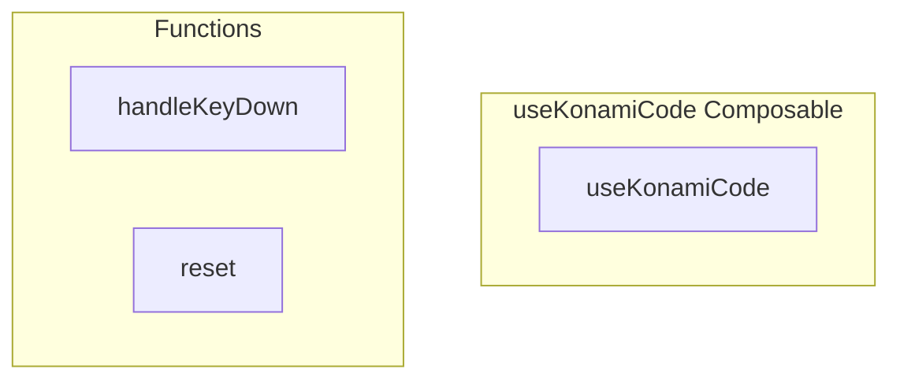

# useKonamiCode Composable

**File:** `src/composables/useKonamiCode.ts`

## Overview




## Exports

- **useKonamiCode** - function export

## Functions

### `handleKeyDown(event: KeyboardEvent)`

No description available.

**Parameters:**
- `event: KeyboardEvent`

**Returns:** `Unknown`

```typescript
const handleKeyDown = (event: KeyboardEvent) =>
```

### `reset()`

No description available.

**Parameters:**
None

**Returns:** `Unknown`

```typescript
const reset = () =>
```


## Constants

### KONAMI_SEQUENCE

No description available.

```typescript
const KONAMI_SEQUENCE = [
```

### RESET_TIMEOUT

No description available.

```typescript
const RESET_TIMEOUT = 3000 // Reset sequence if no key pressed for 3 seconds
```


## Source Code Insights

**File Size:** 2627 characters
**Lines of Code:** 105
**Imports:** 2

## Usage Example

```typescript
import { useKonamiCode } from '@/composables/useKonamiCode'

// Example usage
handleKeyDown()
```

---

*This documentation was automatically generated from the source code.*