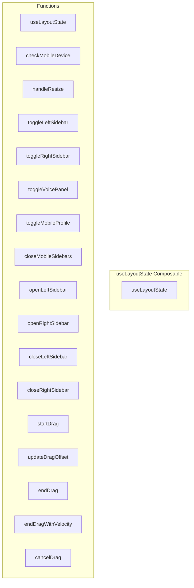

# useLayoutState Composable

**File:** `src/composables/useLayoutState.ts`

## Overview




## Exports

- **useLayoutState** - function export

## Functions

### `useLayoutState()`

No description available.

**Parameters:**
None

**Returns:** `void`

```typescript
export function useLayoutState()
```

### `checkMobileDevice()`

No description available.

**Parameters:**
None

**Returns:** `Unknown`

```typescript
const checkMobileDevice = () =>
```

### `handleResize()`

No description available.

**Parameters:**
None

**Returns:** `Unknown`

```typescript
const handleResize = () =>
```

### `toggleLeftSidebar()`

No description available.

**Parameters:**
None

**Returns:** `Unknown`

```typescript
const toggleLeftSidebar = () =>
```

### `toggleRightSidebar()`

No description available.

**Parameters:**
None

**Returns:** `Unknown`

```typescript
const toggleRightSidebar = () =>
```

### `toggleVoicePanel()`

No description available.

**Parameters:**
None

**Returns:** `Unknown`

```typescript
const toggleVoicePanel = () =>
```

### `toggleMobileProfile()`

No description available.

**Parameters:**
None

**Returns:** `Unknown`

```typescript
const toggleMobileProfile = () =>
```

### `closeMobileSidebars()`

No description available.

**Parameters:**
None

**Returns:** `Unknown`

```typescript
const closeMobileSidebars = () =>
```

### `openLeftSidebar()`

No description available.

**Parameters:**
None

**Returns:** `Unknown`

```typescript
const openLeftSidebar = () =>
```

### `openRightSidebar()`

No description available.

**Parameters:**
None

**Returns:** `Unknown`

```typescript
const openRightSidebar = () =>
```

### `closeLeftSidebar()`

No description available.

**Parameters:**
None

**Returns:** `Unknown`

```typescript
const closeLeftSidebar = () =>
```

### `closeRightSidebar()`

No description available.

**Parameters:**
None

**Returns:** `Unknown`

```typescript
const closeRightSidebar = () =>
```

### `startDrag(direction: 'left' | 'right')`

No description available.

**Parameters:**
- `direction: 'left' | 'right'`

**Returns:** `Unknown`

```typescript
/**
   * Start a drag operation for native-feeling sidebar gestures
   * Tracks initial state to determine if we're opening or closing
   */
  const startDrag = (direction: 'left' | 'right') =>
```

### `updateDragOffset(deltaX: number, direction: 'left' | 'right')`

No description available.

**Parameters:**
- `deltaX: number`
- `direction: 'left' | 'right'`

**Returns:** `Unknown`

```typescript
/**
   * Update drag offset during touch move
   * Now properly handles both opening and closing
   */
  const updateDragOffset = (deltaX: number, direction: 'left' | 'right') =>
```

### `endDrag(direction: 'left' | 'right')`

No description available.

**Parameters:**
- `direction: 'left' | 'right'`

**Returns:** `Unknown`

```typescript
/**
   * End drag operation and determine final state based on current offset
   * Uses threshold to decide whether to complete or cancel the gesture
   */
  const endDrag = (direction: 'left' | 'right') =>
```

### `endDragWithVelocity(velocity: number, direction: 'left' | 'right')`

No description available.

**Parameters:**
- `velocity: number`
- `direction: 'left' | 'right'`

**Returns:** `Unknown`

```typescript
/**
   * End drag with velocity consideration
   * @param velocity - The velocity of the swipe (px/ms), positive = right, negative = left
   * @param direction - Which sidebar was being dragged
   */
  const endDragWithVelocity = (velocity: number, direction: 'left' | 'right') =>
```

### `cancelDrag()`

No description available.

**Parameters:**
None

**Returns:** `Unknown`

```typescript
/**
   * Cancel drag and restore previous state
   */
  const cancelDrag = () =>
```


## Constants

### SIDEBAR_WIDTH

No description available.

```typescript
const SIDEBAR_WIDTH = 280
```

### SERVER_SIDEBAR_WIDTH

No description available.

```typescript
const SERVER_SIDEBAR_WIDTH = 72
```

### COMPLETION_THRESHOLD

No description available.

```typescript
const COMPLETION_THRESHOLD = 0.4 // 40% threshold
```

### VELOCITY_THRESHOLD

No description available.

```typescript
const VELOCITY_THRESHOLD = 0.3 // px/ms velocity threshold
```


## Source Code Insights

**File Size:** 12488 characters
**Lines of Code:** 415
**Imports:** 2

## Usage Example

```typescript
import { useLayoutState } from '@/composables/useLayoutState'

// Example usage
useLayoutState()
```

---

*This documentation was automatically generated from the source code.*