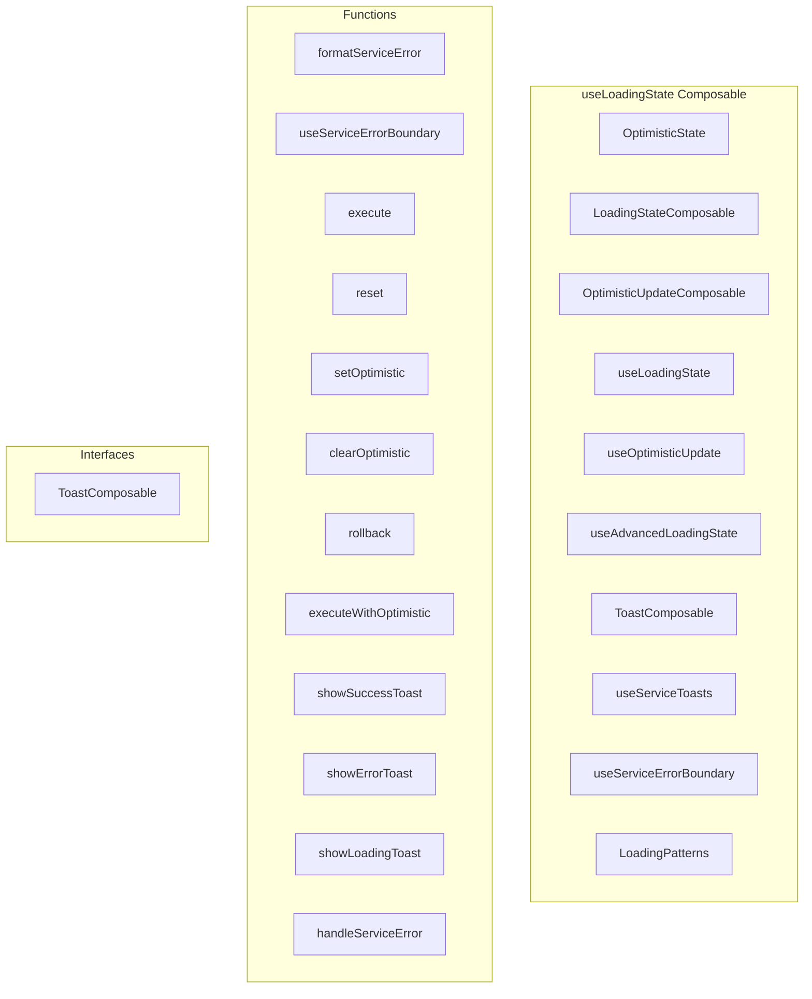

# useLoadingState Composable

**File:** `src/composables/useLoadingState.ts`

## Overview




## Exports

- **OptimisticState** - interface export
- **LoadingStateComposable** - interface export
- **OptimisticUpdateComposable** - interface export
- **useLoadingState** - function export
- **useOptimisticUpdate** - function export
- **useAdvancedLoadingState** - function export
- **ToastComposable** - interface export
- **useServiceToasts** - function export
- **useServiceErrorBoundary** - function export
- **LoadingPatterns** - const export

## Functions

### `formatServiceError(error: any)`

No description available.

**Parameters:**
- `error: any`

**Returns:** `ServiceError`

```typescript
/**
 * useLoadingState - Professional loading state management composable
 * 
 * Provides consistent patterns for:
 * - Loading states with error handling
 * - Optimistic UI updates with rollback capability
 * - Toast notifications for service operations
 * - Type-safe service error handling
 */

import { ref, computed, reactive } from 'vue'
import type { Ref } from 'vue'
import { createLoadingState, setLoading, setSuccess, setError } from '@/services'
import type { LoadingState, ServiceError } from '@/services'
import { debug } from '@/utils/debug'

export interface OptimisticState<T> {
  data: T | null
  isOptimistic: boolean
  originalData?: T | null
}

export interface LoadingStateComposable<T> {
  state: Ref<LoadingState<T>>
  isLoading: Ref<boolean>
  hasError: Ref<boolean>
  errorMessage: Ref<string | null>
  execute: (operation: () => Promise<T>) => Promise<T | undefined>
  reset: () => void
}

export interface OptimisticUpdateComposable<T> {
  optimistic: Ref<OptimisticState<T>>
  setOptimistic: (data: T) => void
  clearOptimistic: () => void
  rollback: () => void
  executeWithOptimistic: (
    optimisticData: T,
    operation: () => Promise<T>,
    onSuccess?: (result: T) => void,
    onError?: (error: ServiceError) => void
  ) => Promise<T | undefined>
}

/**
 * Professional loading state management
 */
export function useLoadingState<T>(initialData: T | null = null): LoadingStateComposable<T> {
  const state = ref(createLoadingState<T>(initialData))

  const isLoading = computed(() => state.value.loading)
  const hasError = computed(() => !!state.value.error)
  const errorMessage = computed(() => state.value.error?.message || null)

  const execute = async (operation: () => Promise<T>): Promise<T | undefined> => {
    try {
      state.value = setLoading(state.value)
      const result = await operation()
      state.value = setSuccess(state.value, result)
      return result
    } catch (error) {
      const serviceError = formatServiceError(error)
      state.value = setError(state.value, serviceError)
      debug.error('❌ Operation failed:', serviceError)
      throw serviceError
    }
  }

  const reset = () => {
    state.value = createLoadingState<T>(initialData)
  }

  return {
    state,
    isLoading,
    hasError,
    errorMessage,
    execute,
    reset
  }
}

/**
 * Professional optimistic updates with rollback
 */
export function useOptimisticUpdate<T>(initialData: T | null = null): OptimisticUpdateComposable<T> {
  const optimistic = ref<OptimisticState<T>>({
    data: initialData,
    isOptimistic: false,
    originalData: null
  })

  const setOptimistic = (data: T) => {
    if (!optimistic.value.isOptimistic) {
      optimistic.value.originalData = optimistic.value.data
    }
    optimistic.value = {
      data,
      isOptimistic: true,
      originalData: optimistic.value.originalData
    }
  }

  const clearOptimistic = () => {
    optimistic.value = {
      data: optimistic.value.data,
      isOptimistic: false,
      originalData: null
    }
  }

  const rollback = () => {
    if (optimistic.value.isOptimistic && optimistic.value.originalData !== undefined) {
      optimistic.value = {
        data: optimistic.value.originalData,
        isOptimistic: false,
        originalData: null
      }
    }
  }

  const executeWithOptimistic = async (
    optimisticData: T,
    operation: () => Promise<T>,
    onSuccess?: (result: T) => void,
    onError?: (error: ServiceError) => void
  ): Promise<T | undefined> => {
    try {
      // 1. Apply optimistic update
      setOptimistic(optimisticData)
      
      // 2. Execute actual operation
      const result = await operation()
      
      // 3. Replace optimistic with real data
      optimistic.value = {
        data: result,
        isOptimistic: false,
        originalData: null
      }
      
      // 4. Call success handler
      onSuccess?.(result)
      
      return result
    } catch (error) {
      // 5. Rollback optimistic update on error
      rollback()
      
      const serviceError = formatServiceError(error)
      debug.error('❌ Optimistic operation failed:', serviceError)
      
      // 6. Call error handler
      onError?.(serviceError)
      
      throw serviceError
    }
  }

  return {
    optimistic,
    setOptimistic,
    clearOptimistic,
    rollback,
    executeWithOptimistic
  }
}

/**
 * Combined loading state + optimistic updates for advanced scenarios
 */
export function useAdvancedLoadingState<T>(
  initialData: T | null = null
): LoadingStateComposable<T> & OptimisticUpdateComposable<T> {
  const loadingState = useLoadingState<T>(initialData)
  const optimisticState = useOptimisticUpdate<T>(initialData)

  return {
    ...loadingState,
    ...optimisticState
  }
}

/**
 * Toast notification helpers for service operations
 */
export interface ToastComposable {
  showSuccessToast: (message: string, details?: string) => void
  showErrorToast: (error: ServiceError) => void
  showLoadingToast: (message: string) => void
}

export function useServiceToasts(): ToastComposable {
  // Note: This would integrate with your actual toast system
  // For now, using console logs as placeholder
  
  const showSuccessToast = (message: string, details?: string) => {
    debug.log('✅ Success:', message, details || '')
    // TODO: Integrate with actual toast system
    // toast.success(message, { description: details })
  }

  const showErrorToast = (error: ServiceError) => {
    debug.error('❌ Error:', error.message)
    // TODO: Integrate with actual toast system
    // toast.error(error.message, { description: error.details })
  }

  const showLoadingToast = (message: string) => {
    debug.log('🔄 Loading:', message)
    // TODO: Integrate with actual toast system
    // toast.loading(message)
  }

  return {
    showSuccessToast,
    showErrorToast,
    showLoadingToast
  }
}

/**
 * Utility function to format errors consistently
 */
function formatServiceError(error: any): ServiceError
```

### `useServiceErrorBoundary()`

No description available.

**Parameters:**
None

**Returns:** `void`

```typescript
/**
 * Professional error boundary for service operations
 */
export function useServiceErrorBoundary()
```

### `execute(operation: ()`

No description available.

**Parameters:**
- `operation: (`

**Returns:** `Unknown`

```typescript
const execute = async (operation: () =>
```

### `reset()`

No description available.

**Parameters:**
None

**Returns:** `Unknown`

```typescript
const reset = () =>
```

### `setOptimistic(data: T)`

No description available.

**Parameters:**
- `data: T`

**Returns:** `Unknown`

```typescript
const setOptimistic = (data: T) =>
```

### `clearOptimistic()`

No description available.

**Parameters:**
None

**Returns:** `Unknown`

```typescript
const clearOptimistic = () =>
```

### `rollback()`

No description available.

**Parameters:**
None

**Returns:** `Unknown`

```typescript
const rollback = () =>
```

### `executeWithOptimistic(optimisticData: T, operation: ()`

No description available.

**Parameters:**
- `optimisticData: T`
- `operation: (`

**Returns:** `Unknown`

```typescript
const executeWithOptimistic = async (
    optimisticData: T,
    operation: () =>
```

### `showSuccessToast(message: string, details?: string)`

No description available.

**Parameters:**
- `message: string`
- `details?: string`

**Returns:** `Unknown`

```typescript
const showSuccessToast = (message: string, details?: string) =>
```

### `showErrorToast(error: ServiceError)`

No description available.

**Parameters:**
- `error: ServiceError`

**Returns:** `Unknown`

```typescript
const showErrorToast = (error: ServiceError) =>
```

### `showLoadingToast(message: string)`

No description available.

**Parameters:**
- `message: string`

**Returns:** `Unknown`

```typescript
const showLoadingToast = (message: string) =>
```

### `handleServiceError(error: any, context: string)`

No description available.

**Parameters:**
- `error: any`
- `context: string`

**Returns:** `Unknown`

```typescript
const handleServiceError = (error: any, context: string) =>
```


## Interfaces

### ToastComposable

No description available.

```typescript
interface ToastComposable {

  showSuccessToast: (message: string, details?: string) => void
  showErrorToast: (error: ServiceError) => void
  showLoadingToast: (message: string) => void

}
```


## Source Code Insights

**File Size:** 7960 characters
**Lines of Code:** 305
**Imports:** 5

## Usage Example

```typescript
import { OptimisticState, LoadingStateComposable, OptimisticUpdateComposable, useLoadingState, useOptimisticUpdate, useAdvancedLoadingState, ToastComposable, useServiceToasts, useServiceErrorBoundary, LoadingPatterns } from '@/composables/useLoadingState'

// Example usage
formatServiceError()
```

---

*This documentation was automatically generated from the source code.*