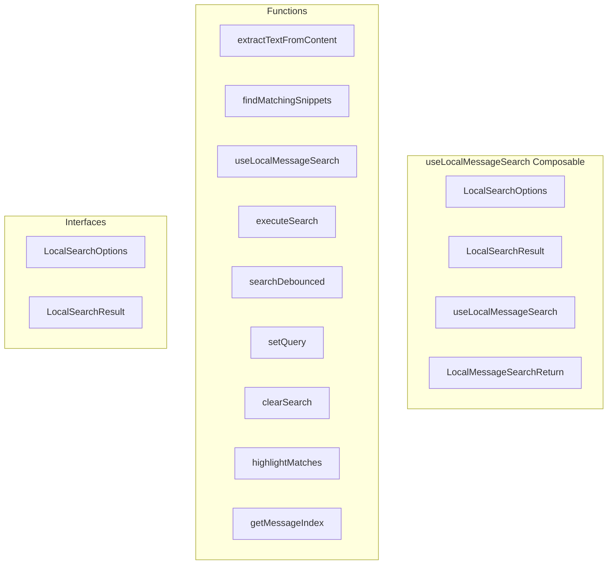

# useLocalMessageSearch Composable

**File:** `src/composables/useLocalMessageSearch.ts`

## Overview




## Exports

- **LocalSearchOptions** - interface export
- **LocalSearchResult** - interface export
- **useLocalMessageSearch** - function export
- **LocalMessageSearchReturn** - type export

## Functions

### `extractTextFromContent(content: MessagePart[])`

No description available.

**Parameters:**
- `content: MessagePart[]`

**Returns:** `string`

```typescript
/**
 * useLocalMessageSearch - Client-side search for encrypted/decrypted messages
 * 
 * This composable provides local (client-side) search functionality for messages
 * that are already loaded and decrypted in memory. This is essential for E2EE
 * messages where server-side search cannot access the decrypted content.
 * 
 * Use cases:
 * - Searching encrypted DM conversations
 * - Searching encrypted server channels
 * - Filtering loaded messages without server round-trips
 */

import { ref, computed, watch, type Ref, type ComputedRef } from 'vue'
import type { Message, MessagePart } from '@/types'

export interface LocalSearchOptions {
  /** Minimum query length to trigger search (default: 2) */
  minQueryLength?: number
  /** Debounce delay in ms (default: 150) */
  debounceMs?: number
  /** Case sensitive search (default: false) */
  caseSensitive?: boolean
  /** Search in user mentions (default: true) */
  searchMentions?: boolean
  /** Search in URLs (default: true) */
  searchUrls?: boolean
}

export interface LocalSearchResult {
  message: Message
  /** Array of matching text snippets with context */
  matches: string[]
  /** Relevance score (higher = more matches) */
  score: number
}

/**
 * Extract searchable text from message content parts
 */
function extractTextFromContent(content: MessagePart[]): string
```

### `findMatchingSnippets(text: string, query: string, caseSensitive: boolean, contextChars: number = 30)`

No description available.

**Parameters:**
- `text: string`
- `query: string`
- `caseSensitive: boolean`
- `contextChars: number = 30`

**Returns:** `string[]`

```typescript
/**
 * Find matching snippets in text with context
 */
function findMatchingSnippets(
  text: string, 
  query: string, 
  caseSensitive: boolean,
  contextChars: number = 30
): string[]
```

### `useLocalMessageSearch(messages: Ref&lt;Message[]&gt; | ComputedRef&lt;Message[]&gt;, options: LocalSearchOptions = {})`

No description available.

**Parameters:**
- `messages: Ref&lt;Message[]&gt; | ComputedRef&lt;Message[]&gt;`
- `options: LocalSearchOptions = {}`

**Returns:** `void`

```typescript
/**
 * Local message search composable
 * 
 * @param messages - Reactive array of messages to search through
 * @param options - Search configuration options
 */
export function useLocalMessageSearch(
  messages: Ref<Message[]> | ComputedRef<Message[]>,
  options: LocalSearchOptions = {}
)
```

### `executeSearch()`

No description available.

**Parameters:**
None

**Returns:** `Unknown`

```typescript
/**
 * useLocalMessageSearch - Client-side search for encrypted/decrypted messages
 * 
 * This composable provides local (client-side) search functionality for messages
 * that are already loaded and decrypted in memory. This is essential for E2EE
 * messages where server-side search cannot access the decrypted content.
 * 
 * Use cases:
 * - Searching encrypted DM conversations
 * - Searching encrypted server channels
 * - Filtering loaded messages without server round-trips
 */

import { ref, computed, watch, type Ref, type ComputedRef } from 'vue'
import type { Message, MessagePart } from '@/types'

export interface LocalSearchOptions {
  /** Minimum query length to trigger search (default: 2) */
  minQueryLength?: number
  /** Debounce delay in ms (default: 150) */
  debounceMs?: number
  /** Case sensitive search (default: false) */
  caseSensitive?: boolean
  /** Search in user mentions (default: true) */
  searchMentions?: boolean
  /** Search in URLs (default: true) */
  searchUrls?: boolean
}

export interface LocalSearchResult {
  message: Message
  /** Array of matching text snippets with context */
  matches: string[]
  /** Relevance score (higher = more matches) */
  score: number
}

/**
 * Extract searchable text from message content parts
 */
function extractTextFromContent(content: MessagePart[]): string {
  if (!content || !Array.isArray(content)) {
    return ''
  }

  return content
    .map((part) => {
      switch (part.type) {
        case 'text':
          return part.text || ''
        case 'mention':
          return part.mention || ''
        case 'url':
          return part.url || ''
        case 'emoji':
          return part.emoji?.name ? `:${part.emoji.name}:` : ''
        case 'hashtag':
          return part.name ? `#${part.name}` : ''
        default:
          return ''
      }
    })
    .join(' ')
    .trim()
}

/**
 * Find matching snippets in text with context
 */
function findMatchingSnippets(
  text: string, 
  query: string, 
  caseSensitive: boolean,
  contextChars: number = 30
): string[] {
  const snippets: string[] = []
  const searchText = caseSensitive ? text : text.toLowerCase()
  const searchQuery = caseSensitive ? query : query.toLowerCase()
  
  let index = searchText.indexOf(searchQuery)
  while (index !== -1) {
    const start = Math.max(0, index - contextChars)
    const end = Math.min(text.length, index + query.length + contextChars)
    
    let snippet = text.slice(start, end)
    if (start > 0) snippet = '...' + snippet
    if (end < text.length) snippet = snippet + '...'
    
    snippets.push(snippet)
    index = searchText.indexOf(searchQuery, index + 1)
  }
  
  return snippets
}

/**
 * Local message search composable
 * 
 * @param messages - Reactive array of messages to search through
 * @param options - Search configuration options
 */
export function useLocalMessageSearch(
  messages: Ref<Message[]> | ComputedRef<Message[]>,
  options: LocalSearchOptions = {}
) {
  const {
    minQueryLength = 2,
    debounceMs = 150,
    caseSensitive = false,
    searchMentions = true,
    searchUrls = true
  } = options

  // State
  const query = ref('')
  const isSearching = ref(false)
  const searchResults = ref<LocalSearchResult[]>([])
  
  // Debounce timer
  let debounceTimer: ReturnType<typeof setTimeout> | null = null

  // Computed
  const hasQuery = computed(() => query.value.trim().length >= minQueryLength)
  const hasResults = computed(() => searchResults.value.length > 0)
  const resultCount = computed(() => searchResults.value.length)
  
  /**
   * Filter messages that are encrypted but not decrypted (can't search these)
   */
  const searchableMessages = computed(() => {
    return messages.value.filter(msg => {
      // Skip deleted messages
      if (msg.is_system) return false
      
      // If encrypted but not decrypted, we can't search it
      if (msg.encrypted && !msg.decrypted) {
        return false
      }
      
      // Has content to search
      return msg.content && Array.isArray(msg.content) && msg.content.length > 0
    })
  })
  
  /**
   * Count of encrypted messages that cannot be searched
   */
  const unsearchableCount = computed(() => {
    return messages.value.filter(msg => 
      msg.encrypted && !msg.decrypted && !msg.is_system
    ).length
  })

  /**
   * Execute local search
   */
  const executeSearch = () =>
```

### `searchDebounced()`

No description available.

**Parameters:**
None

**Returns:** `Unknown`

```typescript
/**
   * Execute search with debouncing
   */
  const searchDebounced = () =>
```

### `setQuery(newQuery: string)`

No description available.

**Parameters:**
- `newQuery: string`

**Returns:** `Unknown`

```typescript
/**
   * Set search query
   */
  const setQuery = (newQuery: string) =>
```

### `clearSearch()`

No description available.

**Parameters:**
None

**Returns:** `Unknown`

```typescript
/**
   * Clear search
   */
  const clearSearch = () =>
```

### `highlightMatches(text: string)`

No description available.

**Parameters:**
- `text: string`

**Returns:** `string`

```typescript
/**
   * Highlight matching text in a message's content
   */
  const highlightMatches = (text: string): string =>
```

### `getMessageIndex(messageId: string)`

No description available.

**Parameters:**
- `messageId: string`

**Returns:** `number`

```typescript
/**
   * Navigate to a specific search result (for use with UI)
   */
  const getMessageIndex = (messageId: string): number =>
```


## Interfaces

### LocalSearchOptions

No description available.

```typescript
interface LocalSearchOptions {

  /** Minimum query length to trigger search (default: 2) */
  minQueryLength?: number
  /** Debounce delay in ms (default: 150) */
  debounceMs?: number
  /** Case sensitive search (default: false) */
  caseSensitive?: boolean
  /** Search in user mentions (default: true) */
  searchMentions?: boolean
  /** Search in URLs (default: true) */
  searchUrls?: boolean

}
```

### LocalSearchResult

No description available.

```typescript
interface LocalSearchResult {

  message: Message
  /** Array of matching text snippets with context */
  matches: string[]
  /** Relevance score (higher = more matches) */
  score: number

}
```


## Source Code Insights

**File Size:** 8149 characters
**Lines of Code:** 316
**Imports:** 2

## Usage Example

```typescript
import { LocalSearchOptions, LocalSearchResult, useLocalMessageSearch, LocalMessageSearchReturn } from '@/composables/useLocalMessageSearch'

// Example usage
extractTextFromContent()
```

---

*This documentation was automatically generated from the source code.*