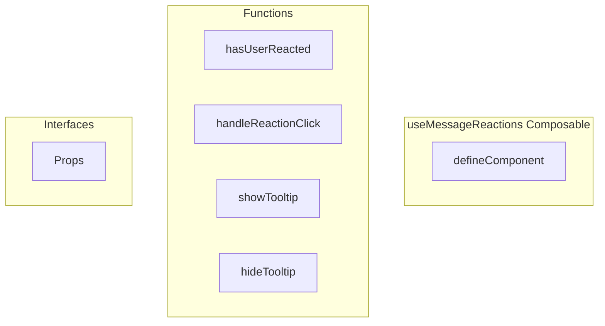

# useMessageReactions Composable

**File:** `src/composables/useMessageReactions.ts`

## Overview




## Exports

- **defineComponent** - default export

## Functions

### `hasUserReacted(emojiId: string)`

No description available.

**Parameters:**
- `emojiId: string`

**Returns:** `Unknown`

```typescript
const hasUserReacted = (emojiId: string) =>
```

### `handleReactionClick(emoji: Emoji)`

No description available.

**Parameters:**
- `emoji: Emoji`

**Returns:** `Unknown`

```typescript
const handleReactionClick = async (emoji: Emoji) =>
```

### `showTooltip(event: MouseEvent, reactionGroup: any)`

No description available.

**Parameters:**
- `event: MouseEvent`
- `reactionGroup: any`

**Returns:** `Unknown`

```typescript
const showTooltip = (event: MouseEvent, reactionGroup: any) =>
```

### `hideTooltip()`

No description available.

**Parameters:**
None

**Returns:** `Unknown`

```typescript
const hideTooltip = () =>
```


## Interfaces

### Props

No description available.

```typescript
interface Props {

  message: Message;
  showReactions?: boolean;

}
```


## Source Code Insights

**File Size:** 3107 characters
**Lines of Code:** 99
**Imports:** 5

## Usage Example

```typescript
import { defineComponent } from '@/composables/useMessageReactions'

// Example usage
hasUserReacted()
```

---

*This documentation was automatically generated from the source code.*