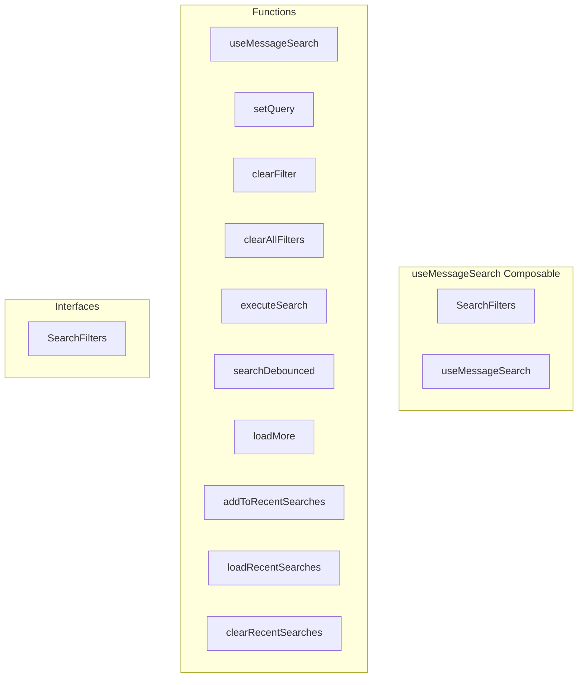

# useMessageSearch Composable

**File:** `src/composables/useMessageSearch.ts`

## Overview




## Exports

- **SearchFilters** - interface export
- **useMessageSearch** - function export

## Functions

### `useMessageSearch()`

No description available.

**Parameters:**
None

**Returns:** `void`

```typescript
/**
 * useMessageSearch - Composable for message search functionality
 * 
 * Provides reactive search state, debouncing, filter management,
 * and search execution with pagination support.
 * 
 * For encrypted messages (E2EE), use useLocalMessageSearch instead,
 * which performs client-side search on already-decrypted messages.
 */

import { ref, computed, watch } from 'vue'
import { searchService, type MessageSearchFilters, type MessageSearchResponse } from '@/services/SearchService'
import { ensureMessageEmbeds } from '@/utils/messageEmbedUtils'
import type { Message } from '@/types'
import { debug } from '@/utils/debug'

export interface SearchFilters {
  query: string
  channelId?: string | string[]
  userId?: string
  conversationId?: string
  serverId?: string
  hasMedia?: boolean
  hasUrl?: boolean
  fromDate?: Date | null
  toDate?: Date | null
}

/**
 * Note on E2EE Search:
 * 
 * For end-to-end encrypted messages, server-side search cannot access
 * the decrypted content. In these cases, use the `useLocalMessageSearch`
 * composable which performs client-side filtering on messages that are
 * already loaded and decrypted in memory.
 * 
 * @see useLocalMessageSearch
 */

export function useMessageSearch()
```

### `setQuery(query: string)`

No description available.

**Parameters:**
- `query: string`

**Returns:** `Unknown`

```typescript
const setQuery = (query: string) =>
```

### `clearFilter(key: keyof SearchFilters)`

No description available.

**Parameters:**
- `key: keyof SearchFilters`

**Returns:** `Unknown`

```typescript
const clearFilter = (key: keyof SearchFilters) =>
```

### `clearAllFilters()`

No description available.

**Parameters:**
None

**Returns:** `Unknown`

```typescript
const clearAllFilters = () =>
```

### `executeSearch(resetOffset = true)`

No description available.

**Parameters:**
- `resetOffset = true`

**Returns:** `Promise&lt;void&gt;`

```typescript
const executeSearch = async (resetOffset = true): Promise<void> =>
```

### `searchDebounced()`

No description available.

**Parameters:**
None

**Returns:** `Unknown`

```typescript
const searchDebounced = () =>
```

### `loadMore()`

No description available.

**Parameters:**
None

**Returns:** `Unknown`

```typescript
const loadMore = async () =>
```

### `addToRecentSearches(query: string)`

No description available.

**Parameters:**
- `query: string`

**Returns:** `Unknown`

```typescript
const addToRecentSearches = (query: string) =>
```

### `loadRecentSearches()`

No description available.

**Parameters:**
None

**Returns:** `Unknown`

```typescript
const loadRecentSearches = () =>
```

### `clearRecentSearches()`

No description available.

**Parameters:**
None

**Returns:** `Unknown`

```typescript
const clearRecentSearches = () =>
```


## Interfaces

### SearchFilters

No description available.

```typescript
interface SearchFilters {

  query: string
  channelId?: string | string[]
  userId?: string
  conversationId?: string
  serverId?: string
  hasMedia?: boolean
  hasUrl?: boolean
  fromDate?: Date | null
  toDate?: Date | null

}
```


## Constants

### DEBOUNCE_MS

No description available.

```typescript
const DEBOUNCE_MS = 300
```


## Source Code Insights

**File Size:** 8957 characters
**Lines of Code:** 342
**Imports:** 5

## Usage Example

```typescript
import { SearchFilters, useMessageSearch } from '@/composables/useMessageSearch'

// Example usage
useMessageSearch()
```

---

*This documentation was automatically generated from the source code.*