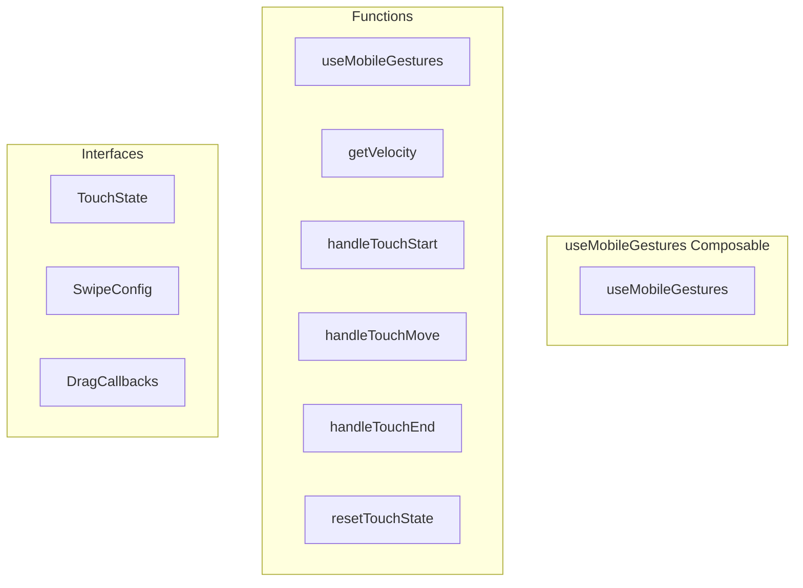

# useMobileGestures Composable

**File:** `src/composables/useMobileGestures.ts`

## Overview




## Exports

- **useMobileGestures** - function export

## Functions

### `useMobileGestures()`

No description available.

**Parameters:**
None

**Returns:** `void`

```typescript
export function useMobileGestures()
```

### `getVelocity()`

No description available.

**Parameters:**
None

**Returns:** `Unknown`

```typescript
const getVelocity = () =>
```

### `handleTouchStart(event: TouchEvent, isMobile: boolean)`

No description available.

**Parameters:**
- `event: TouchEvent`
- `isMobile: boolean`

**Returns:** `Unknown`

```typescript
const handleTouchStart = (event: TouchEvent, isMobile: boolean) =>
```

### `handleTouchMove(event: TouchEvent, isMobile: boolean, hasOpenSidebars: boolean, callbacks?: DragCallbacks)`

No description available.

**Parameters:**
- `event: TouchEvent`
- `isMobile: boolean`
- `hasOpenSidebars: boolean`
- `callbacks?: DragCallbacks`

**Returns:** `Unknown`

```typescript
const handleTouchMove = (
    event: TouchEvent, 
    isMobile: boolean, 
    hasOpenSidebars: boolean,
    callbacks?: DragCallbacks
  ) =>
```

### `handleTouchEnd(event: TouchEvent, isMobile: boolean, callbacks: DragCallbacks)`

No description available.

**Parameters:**
- `event: TouchEvent`
- `isMobile: boolean`
- `callbacks: DragCallbacks`

**Returns:** `Unknown`

```typescript
const handleTouchEnd = (
    event: TouchEvent, 
    isMobile: boolean,
    callbacks: DragCallbacks
  ) =>
```

### `resetTouchState()`

No description available.

**Parameters:**
None

**Returns:** `Unknown`

```typescript
const resetTouchState = () =>
```


## Interfaces

### TouchState

No description available.

```typescript
interface TouchState {

  startX: number
  startY: number
  currentX: number
  currentY: number
  isDragging: boolean
  initialDirection: 'horizontal' | 'vertical' | null
  isEdgeSwipe: boolean
  startTime: number
  dragDirection: 'left' | 'right' | null
  lastMoveTime: number
  lastMoveX: number

}
```

### SwipeConfig

No description available.

```typescript
interface SwipeConfig {

  swipeThreshold: number
  directionThreshold: number
  edgeZone: number
  velocityThreshold: number
  sidebarWidth: number
  completionThreshold: number

}
```

### DragCallbacks

No description available.

```typescript
interface DragCallbacks {

  onSwipeRight: () => void
  onSwipeLeft: () => void
  onDragStart?: (direction: 'left' | 'right') => void
  onDragMove?: (deltaX: number, direction: 'left' | 'right') => void
  onDragEnd?: (velocity: number, direction: 'left' | 'right') => void

}
```


## Source Code Insights

**File Size:** 8759 characters
**Lines of Code:** 256
**Imports:** 1

## Usage Example

```typescript
import { useMobileGestures } from '@/composables/useMobileGestures'

// Example usage
useMobileGestures()
```

---

*This documentation was automatically generated from the source code.*