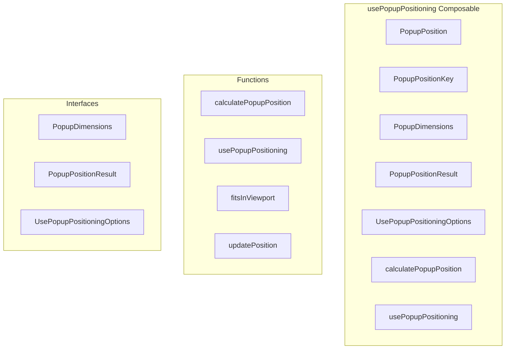

# usePopupPositioning Composable

**File:** `src/composables/usePopupPositioning.ts`

## Overview




## Exports

- **PopupPosition** - type export
- **PopupPositionKey** - type export
- **PopupDimensions** - interface export
- **PopupPositionResult** - interface export
- **UsePopupPositioningOptions** - interface export
- **calculatePopupPosition** - function export
- **usePopupPositioning** - function export

## Functions

### `calculatePopupPosition(triggerElement: HTMLElement, popupDimensions: PopupDimensions, options: UsePopupPositioningOptions = {})`

No description available.

**Parameters:**
- `triggerElement: HTMLElement`
- `popupDimensions: PopupDimensions`
- `options: UsePopupPositioningOptions = {}`

**Returns:** `PopupPositionResult`

```typescript
/**
 * Professional popup positioning system
 * Provides dynamic positioning calculations for popups relative to trigger elements
 */

import { computed, ref, type Ref } from 'vue';
import { debug } from '@/utils/debug'

export type PopupPosition = 'above' | 'below' | 'left' | 'right' | 'auto';
export type PopupPositionKey = 'above' | 'below' | 'left' | 'right';

export interface PopupDimensions {
  width: number;
  height: number;
}

export interface PopupPositionResult {
  x: number;
  y: number;
  actualPosition: PopupPositionKey;
}

export interface UsePopupPositioningOptions {
  position?: PopupPosition;
  offset?: number;
  viewport?: {
    padding: number;
  };
  fallbackPositions?: PopupPositionKey[];
}

/**
 * Calculate optimal popup position relative to trigger element
 */
export function calculatePopupPosition(
  triggerElement: HTMLElement,
  popupDimensions: PopupDimensions,
  options: UsePopupPositioningOptions = {}
): PopupPositionResult
```

### `usePopupPositioning(triggerElement: Ref&lt;HTMLElement | null&gt;, popupDimensions: PopupDimensions, options: UsePopupPositioningOptions = {})`

No description available.

**Parameters:**
- `triggerElement: Ref&lt;HTMLElement | null&gt;`
- `popupDimensions: PopupDimensions`
- `options: UsePopupPositioningOptions = {}`

**Returns:** `void`

```typescript
/**
 * Composable for dynamic popup positioning
 */
export function usePopupPositioning(
  triggerElement: Ref<HTMLElement | null>,
  popupDimensions: PopupDimensions,
  options: UsePopupPositioningOptions = {}
)
```

### `fitsInViewport(pos: PopupPositionResult)`

No description available.

**Parameters:**
- `pos: PopupPositionResult`

**Returns:** `Unknown`

```typescript
const fitsInViewport = (pos: PopupPositionResult) =>
```

### `updatePosition()`

No description available.

**Parameters:**
None

**Returns:** `Unknown`

```typescript
const updatePosition = () =>
```


## Interfaces

### PopupDimensions

No description available.

```typescript
interface PopupDimensions {

  width: number;
  height: number;

}
```

### PopupPositionResult

No description available.

```typescript
interface PopupPositionResult {

  x: number;
  y: number;
  actualPosition: PopupPositionKey;

}
```

### UsePopupPositioningOptions

No description available.

```typescript
interface UsePopupPositioningOptions {

  position?: PopupPosition;
  offset?: number;
  viewport?: {
    padding: number;
  };
  fallbackPositions?: PopupPositionKey[];

}
```


## Type Definitions

### PopupPosition

No description available.

```typescript
export type PopupPosition = 'above' | 'below' | 'left' | 'right' | 'auto';
```

### PopupPositionKey

No description available.

```typescript
export type PopupPositionKey = 'above' | 'below' | 'left' | 'right';
```


## Source Code Insights

**File Size:** 4904 characters
**Lines of Code:** 167
**Imports:** 2

## Usage Example

```typescript
import { PopupPosition, PopupPositionKey, PopupDimensions, PopupPositionResult, UsePopupPositioningOptions, calculatePopupPosition, usePopupPositioning } from '@/composables/usePopupPositioning'

// Example usage
calculatePopupPosition()
```

---

*This documentation was automatically generated from the source code.*