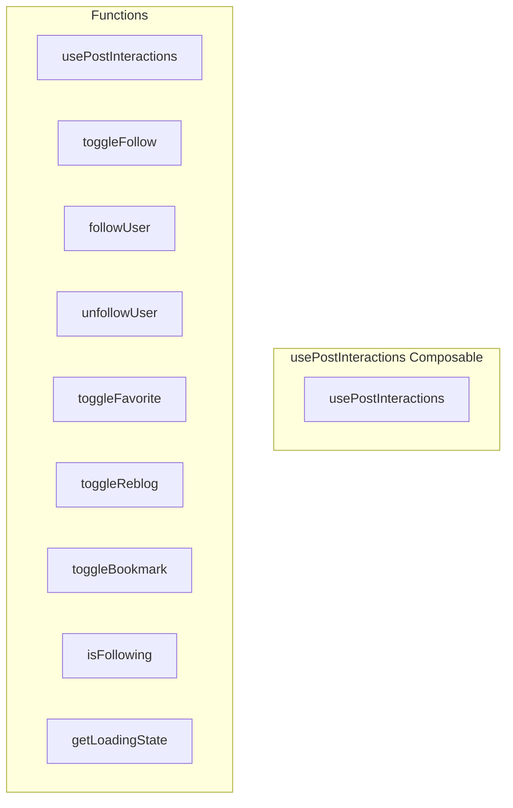

# usePostInteractions Composable

**File:** `src/composables/usePostInteractions.ts`

## Overview




## Exports

- **usePostInteractions** - function export

## Functions

### `usePostInteractions()`

No description available.

**Parameters:**
None

**Returns:** `void`

```typescript
/**
 * Composable for handling ActivityPub post and user interactions
 * Professional, DRY, and reusable across all components
 * Now using service layer for improved error handling and consistency
 */
export function usePostInteractions()
```

### `toggleFollow(user: FederatedUser | string)`

No description available.

**Parameters:**
- `user: FederatedUser | string`

**Returns:** `Promise&lt;{ following: boolean; error?: string }&gt;`

```typescript
/**
 * Composable for handling ActivityPub post and user interactions
 * Professional, DRY, and reusable across all components
 * Now using service layer for improved error handling and consistency
 */
export function usePostInteractions() {
  const activityPubStore = useActivityPubStore()
  
  // Loading states
  const isFollowLoading = ref(false)
  const isFavoriteLoading = ref(false)
  const isReblogLoading = ref(false)
  const isBookmarkLoading = ref(false)

  // =============================================
  // USER INTERACTIONS
  // =============================================

  /**
   * Toggle follow status for a user
   * Now using service layer for consistent error handling and optimistic updates
   */
  const toggleFollow = async (user: FederatedUser | string): Promise<{ following: boolean; error?: string }> =>
```

### `followUser(user: FederatedUser | string)`

No description available.

**Parameters:**
- `user: FederatedUser | string`

**Returns:** `Promise&lt;{ success: boolean; error?: string }&gt;`

```typescript
/**
   * Follow a user (explicit action)
   */
  const followUser = async (user: FederatedUser | string): Promise<{ success: boolean; error?: string }> =>
```

### `unfollowUser(user: FederatedUser | string)`

No description available.

**Parameters:**
- `user: FederatedUser | string`

**Returns:** `Promise&lt;{ success: boolean; error?: string }&gt;`

```typescript
/**
   * Unfollow a user (explicit action)
   */
  const unfollowUser = async (user: FederatedUser | string): Promise<{ success: boolean; error?: string }> =>
```

### `toggleFavorite(post: TimelinePost | string)`

No description available.

**Parameters:**
- `post: TimelinePost | string`

**Returns:** `Promise&lt;{ success: boolean; liked?: boolean; newCount?: number; error?: string }&gt;`

```typescript
/**
   * Toggle favorite (like) status for a post
   * Now using service layer for consistent error handling and optimistic updates
   */
  const toggleFavorite = async (post: TimelinePost | string): Promise<{ success: boolean; liked?: boolean; newCount?: number; error?: string }> =>
```

### `toggleReblog(post: TimelinePost | string)`

No description available.

**Parameters:**
- `post: TimelinePost | string`

**Returns:** `Promise&lt;{ success: boolean; reblogged?: boolean; newCount?: number; error?: string }&gt;`

```typescript
/**
   * Toggle reblog (boost) status for a post
   * Now using service layer for consistent error handling and optimistic updates
   */
  const toggleReblog = async (post: TimelinePost | string): Promise<{ success: boolean; reblogged?: boolean; newCount?: number; error?: string }> =>
```

### `toggleBookmark(post: TimelinePost | string)`

No description available.

**Parameters:**
- `post: TimelinePost | string`

**Returns:** `Promise&lt;{ success: boolean; bookmarked?: boolean; error?: string }&gt;`

```typescript
/**
   * Toggle bookmark status for a post
   * Now using service layer for consistent error handling and optimistic updates
   */
  const toggleBookmark = async (post: TimelinePost | string): Promise<{ success: boolean; bookmarked?: boolean; error?: string }> =>
```

### `isFollowing(user: FederatedUser | string)`

No description available.

**Parameters:**
- `user: FederatedUser | string`

**Returns:** `boolean`

```typescript
/**
   * Check if currently following a user
   */
  const isFollowing = (user: FederatedUser | string): boolean =>
```

### `getLoadingState()`

No description available.

**Parameters:**
None

**Returns:** `Unknown`

```typescript
/**
   * Get loading state for a specific interaction
   */
  const getLoadingState = () =>
```


## Source Code Insights

**File Size:** 7685 characters
**Lines of Code:** 245
**Imports:** 5

## Usage Example

```typescript
import { usePostInteractions } from '@/composables/usePostInteractions'

// Example usage
usePostInteractions()
```

---

*This documentation was automatically generated from the source code.*