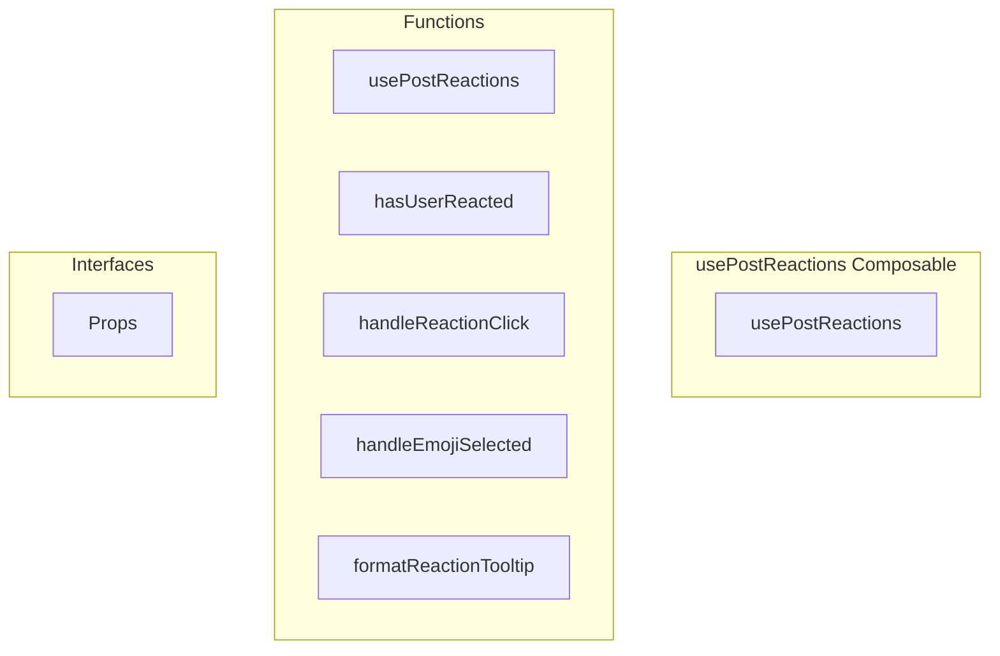

# usePostReactions Composable

**File:** `src/composables/usePostReactions.ts`

## Overview




## Exports

- **usePostReactions** - function export

## Functions

### `usePostReactions(props: Props)`

No description available.

**Parameters:**
- `props: Props`

**Returns:** `void`

```typescript
/**
 * Post Reactions Composable - Professional Architecture
 * 
 * Follows the same pattern as useMessageReactions.ts
 * Key benefits:
 * 1. Centralized reaction logic
 * 2. Optimistic updates for instant feedback
 * 3. Automatic batch loading integration
 * 4. Consistent API with chat reactions
 */
export function usePostReactions(props: Props)
```

### `hasUserReacted(emojiId: string | null, customContent: string | null)`

No description available.

**Parameters:**
- `emojiId: string | null`
- `customContent: string | null`

**Returns:** `Unknown`

```typescript
const hasUserReacted = (emojiId: string | null, customContent: string | null) =>
```

### `handleReactionClick(reaction: any)`

No description available.

**Parameters:**
- `reaction: any`

**Returns:** `Unknown`

```typescript
const handleReactionClick = async (reaction: any) =>
```

### `handleEmojiSelected(emoji: any)`

No description available.

**Parameters:**
- `emoji: any`

**Returns:** `Unknown`

```typescript
const handleEmojiSelected = async (emoji: any) =>
```

### `formatReactionTooltip(reaction: any)`

No description available.

**Parameters:**
- `reaction: any`

**Returns:** `Unknown`

```typescript
const formatReactionTooltip = (reaction: any) =>
```


## Interfaces

### Props

No description available.

```typescript
interface Props {

  post: TimelinePost
  showReactions?: boolean

}
```


## Source Code Insights

**File Size:** 4010 characters
**Lines of Code:** 136
**Imports:** 5

## Usage Example

```typescript
import { usePostReactions } from '@/composables/usePostReactions'

// Example usage
usePostReactions()
```

---

*This documentation was automatically generated from the source code.*