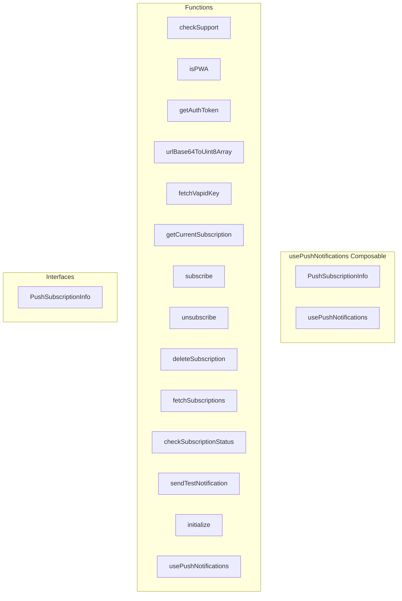

# usePushNotifications Composable

**File:** `src/composables/usePushNotifications.ts`

## Overview




## Exports

- **PushSubscriptionInfo** - interface export
- **usePushNotifications** - function export

## Functions

### `checkSupport()`

No description available.

**Parameters:**
None

**Returns:** `boolean`

```typescript
/**
 * Push Notifications Composable
 * 
 * Handles Web Push notification subscription management for PWA
 * Supports iOS 16.4+, Android, and desktop browsers
 */

import { ref, computed } from 'vue'
import { supabase } from '@/supabase'
import { debug } from '@/utils/debug'

// Federation backend base path (proxied via nginx)
const FEDERATION_BACKEND_URL = '/api/federation'

// Push notification state (shared across all composable instances)
const isSupported = ref(false)
const isSubscribed = ref(false)
const isLoading = ref(false)
const permission = ref<NotificationPermission>('default')
const vapidPublicKey = ref<string | null>(null)
const subscriptions = ref<PushSubscriptionInfo[]>([])
const error = ref<string | null>(null)

// Initialization state (prevents duplicate API calls)
let isInitializing = false
let isInitialized = false

export interface PushSubscriptionInfo {
  id: string
  endpoint: string
  device_name?: string
  user_agent?: string
  created_at: string
  last_successful_push?: string
  failure_count: number
}

/**
 * Check if push notifications are supported in this browser
 */
function checkSupport(): boolean
```

### `isPWA()`

No description available.

**Parameters:**
None

**Returns:** `boolean`

```typescript
/**
 * Check if running as installed PWA (for iOS)
 */
function isPWA(): boolean
```

### `getAuthToken()`

No description available.

**Parameters:**
None

**Returns:** `Promise&lt;string | null&gt;`

```typescript
/**
 * Get auth token for API requests
 */
async function getAuthToken(): Promise<string | null>
```

### `urlBase64ToUint8Array(base64String: string)`

No description available.

**Parameters:**
- `base64String: string`

**Returns:** `Uint8Array`

```typescript
/**
 * Convert base64 URL to Uint8Array for VAPID key
 */
function urlBase64ToUint8Array(base64String: string): Uint8Array
```

### `fetchVapidKey()`

No description available.

**Parameters:**
None

**Returns:** `Promise&lt;string | null&gt;`

```typescript
/**
 * Fetch VAPID public key from server
 */
async function fetchVapidKey(): Promise<string | null>
```

### `getCurrentSubscription()`

No description available.

**Parameters:**
None

**Returns:** `Promise&lt;PushSubscription | null&gt;`

```typescript
/**
 * Get current push subscription from service worker
 */
async function getCurrentSubscription(): Promise<PushSubscription | null>
```

### `subscribe(deviceName?: string)`

No description available.

**Parameters:**
- `deviceName?: string`

**Returns:** `Promise&lt;`

```typescript
/**
 * Subscribe to push notifications
 */
async function subscribe(deviceName?: string): Promise<
```

### `unsubscribe()`

No description available.

**Parameters:**
None

**Returns:** `Promise&lt;`

```typescript
/**
 * Unsubscribe from push notifications on current device
 */
async function unsubscribe(): Promise<
```

### `deleteSubscription(subscriptionId: string)`

No description available.

**Parameters:**
- `subscriptionId: string`

**Returns:** `Promise&lt;`

```typescript
/**
 * Delete a specific subscription by ID
 */
async function deleteSubscription(subscriptionId: string): Promise<
```

### `fetchSubscriptions()`

No description available.

**Parameters:**
None

**Returns:** `Promise&lt;void&gt;`

```typescript
/**
 * Fetch all subscriptions for current user
 */
async function fetchSubscriptions(): Promise<void>
```

### `checkSubscriptionStatus()`

No description available.

**Parameters:**
None

**Returns:** `Promise&lt;void&gt;`

```typescript
/**
 * Check current subscription status (local browser only, no API call)
 */
async function checkSubscriptionStatus(): Promise<void>
```

### `sendTestNotification()`

No description available.

**Parameters:**
None

**Returns:** `Promise&lt;`

```typescript
/**
 * Send a test push notification
 */
async function sendTestNotification(): Promise<
```

### `initialize()`

No description available.

**Parameters:**
None

**Returns:** `Promise&lt;void&gt;`

```typescript
/**
 * Initialize push notification system
 * Safe to call multiple times - will only initialize once
 * Only fetches VAPID key if running as PWA or user has existing subscription
 */
async function initialize(): Promise<void>
```

### `usePushNotifications()`

No description available.

**Parameters:**
None

**Returns:** `void`

```typescript
/**
 * Composable for push notification management
 */
export function usePushNotifications()
```


## Interfaces

### PushSubscriptionInfo

No description available.

```typescript
interface PushSubscriptionInfo {

  id: string
  endpoint: string
  device_name?: string
  user_agent?: string
  created_at: string
  last_successful_push?: string
  failure_count: number

}
```


## Constants

### FEDERATION_BACKEND_URL

No description available.

```typescript
const FEDERATION_BACKEND_URL = '/api/federation'
```


## Source Code Insights

**File Size:** 14188 characters
**Lines of Code:** 514
**Imports:** 3

## Usage Example

```typescript
import { PushSubscriptionInfo, usePushNotifications } from '@/composables/usePushNotifications'

// Example usage
checkSupport()
```

---

*This documentation was automatically generated from the source code.*