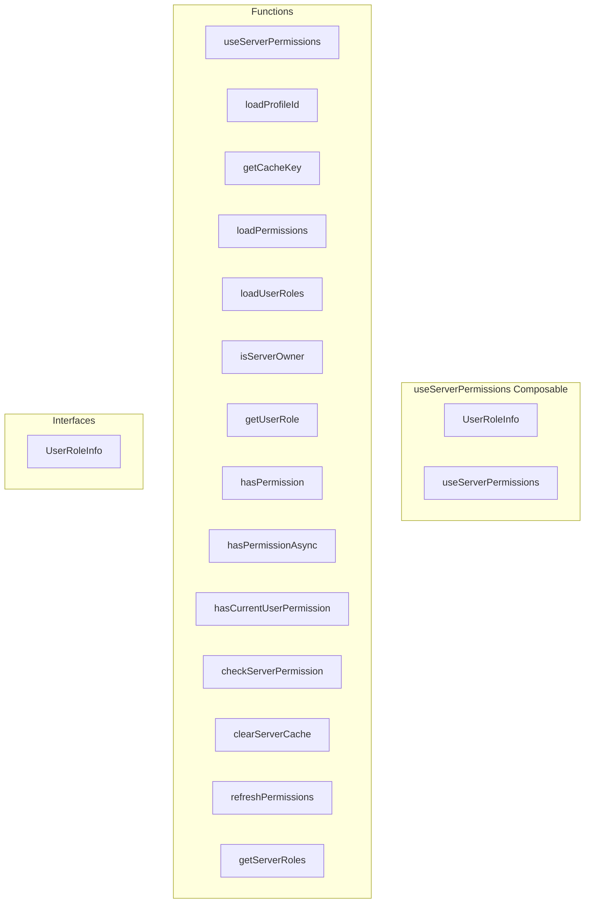

# useServerPermissions Composable

**File:** `src/composables/useServerPermissions.ts`

## Overview




## Exports

- **UserRoleInfo** - interface export
- **useServerPermissions** - function export

## Functions

### `useServerPermissions()`

No description available.

**Parameters:**
None

**Returns:** `void`

```typescript
export function useServerPermissions()
```

### `loadProfileId(_authId: string)`

No description available.

**Parameters:**
- `_authId: string`

**Returns:** `Unknown`

```typescript
const loadProfileId = async (_authId: string) =>
```

### `getCacheKey(userId: string, serverId: string)`

No description available.

**Parameters:**
- `userId: string`
- `serverId: string`

**Returns:** `Unknown`

```typescript
const getCacheKey = (userId: string, serverId: string) =>
```

### `loadPermissions(userId: string, serverId: string)`

No description available.

**Parameters:**
- `userId: string`
- `serverId: string`

**Returns:** `Promise&lt;Record&lt;Permission, boolean&gt;&gt;`

```typescript
const loadPermissions = async (userId: string, serverId: string): Promise<Record<Permission, boolean>> =>
```

### `loadUserRoles(userId: string, serverId: string)`

No description available.

**Parameters:**
- `userId: string`
- `serverId: string`

**Returns:** `Promise&lt;ServerRole[]&gt;`

```typescript
const loadUserRoles = async (userId: string, serverId: string): Promise<ServerRole[]> =>
```

### `isServerOwner(serverId: string, profileId?: string)`

No description available.

**Parameters:**
- `serverId: string`
- `profileId?: string`

**Returns:** `boolean`

```typescript
const isServerOwner = (serverId: string, profileId?: string): boolean =>
```

### `getUserRole(serverId: string, profileId?: string)`

No description available.

**Parameters:**
- `serverId: string`
- `profileId?: string`

**Returns:** `UserRoleInfo`

```typescript
const getUserRole = (serverId: string, profileId?: string): UserRoleInfo =>
```

### `hasPermission(serverId: string, profileId: string, permission: Permission)`

No description available.

**Parameters:**
- `serverId: string`
- `profileId: string`
- `permission: Permission`

**Returns:** `boolean`

```typescript
const hasPermission = (
    serverId: string, 
    profileId: string, 
    permission: Permission
  ): boolean =>
```

### `hasPermissionAsync(serverId: string, profileId: string, permission: Permission, channelId?: string)`

No description available.

**Parameters:**
- `serverId: string`
- `profileId: string`
- `permission: Permission`
- `channelId?: string`

**Returns:** `Promise&lt;boolean&gt;`

```typescript
const hasPermissionAsync = async (
    serverId: string,
    profileId: string,
    permission: Permission,
    channelId?: string
  ): Promise<boolean> =>
```

### `hasCurrentUserPermission(permission: Permission)`

No description available.

**Parameters:**
- `permission: Permission`

**Returns:** `boolean`

```typescript
const hasCurrentUserPermission = (permission: Permission): boolean =>
```

### `checkServerPermission(serverId: string, permission: Permission, userId?: string)`

No description available.

**Parameters:**
- `serverId: string`
- `permission: Permission`
- `userId?: string`

**Returns:** `boolean`

```typescript
const checkServerPermission = (
    serverId: string, 
    permission: Permission, 
    userId?: string
  ): boolean =>
```

### `clearServerCache(serverId: string)`

No description available.

**Parameters:**
- `serverId: string`

**Returns:** `Unknown`

```typescript
const clearServerCache = (serverId: string) =>
```

### `refreshPermissions()`

No description available.

**Parameters:**
None

**Returns:** `Unknown`

```typescript
const refreshPermissions = async () =>
```

### `getServerRoles(serverId: string)`

No description available.

**Parameters:**
- `serverId: string`

**Returns:** `Promise&lt;ServerRole[]&gt;`

```typescript
const getServerRoles = async (serverId: string): Promise<ServerRole[]> =>
```


## Interfaces

### UserRoleInfo

No description available.

```typescript
interface UserRoleInfo {

  id: string
  name: string
  permissions: Permission[]
  isOwner: boolean
  isModerator: boolean
  isAdmin: boolean
  color?: string
  position: number
  roles: ServerRole[]

}
```


## Source Code Insights

**File Size:** 15661 characters
**Lines of Code:** 477
**Imports:** 8

## Usage Example

```typescript
import { UserRoleInfo, useServerPermissions } from '@/composables/useServerPermissions'

// Example usage
useServerPermissions()
```

---

*This documentation was automatically generated from the source code.*